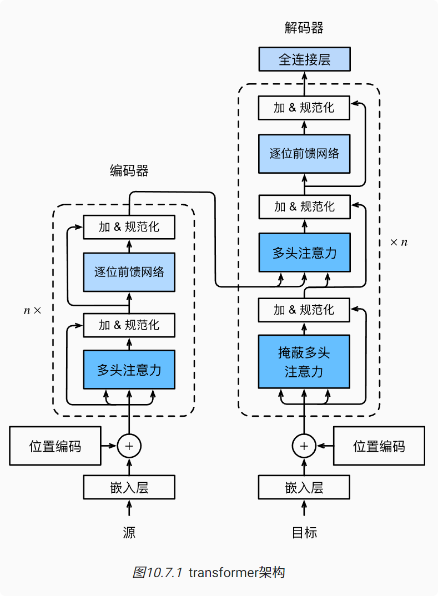

# Transformer
transformer模型完全基于注意力机制，没有任何卷积层或循环神经网络层，transformer最初是应用于在文本数据上的序列到序列学习，但现在已经推广到各种现代的深度学习中，例如语言、视觉、语音和强化学习领域。
### 模型架构

transformer的编码器和解码器是基于自注意力的模块叠加而成的，源（输入）序列和目标（输出）序列的嵌入（embedding）表示将加上位置编码（positional encoding），再分别输入到编码器和解码器中。

* 从宏观角度来看：transformer的编码器是由多个相同的层叠加而成的，每个层都有两个子层（子层表示为sublayer）。第一个子层是多头自注意力（multi-head self-attention）汇聚；第二个子层是基于位置的前馈网络（positionwise feed-forward network）。
* 在计算编码器的自注意力时，查询、键和值都来自前一个编码器层的输出。
* Transformer解码器也是由多个相同的层叠加而成的，并且层中使用了残差连接和层规范化。
* 除了编码器中描述的两个子层之外，解码器还在这两个子层之间插入了第三个子层，称为编码器－解码器注意力（encoder-decoder attention）层。
* 在编码器－解码器注意力中，查询来自前一个解码器层的输出，而键和值来自整个编码器的输出。在解码器自注意力中，查询、键和值都来自上一个解码器层的输出。

### 编码器
有了组成transformer编码器的基础组件，现在可以先实现编码器中的一个层。下面的EncoderBlock类包含两个子层：多头自注意力和基于位置的前馈网络，这两个子层都使用了残差连接和紧随的层规范化。

### 解码器
1. transformer解码器也是由多个相同的层组成。在DecoderBlock类中实现的每个层包含了三个子层：解码器自注意力、“编码器-解码器”注意力和基于位置的前馈网络。这些子层也都被残差连接和紧随的层规范化围绕。
2. 在掩蔽多头解码器自注意力层（第一个子层）中，查询、键和值都来自上一个解码器层的输出。关于序列到序列模型（sequence-to-sequence model），在训练阶段，其输出序列的所有位置（时间步）的词元都是已知的
3. 在预测阶段，其输出序列的词元是逐个生成的。
### 小结
* transformer是编码器－解码器架构的一个实践，尽管在实际情况中编码器或解码器可以单独使用。

* 在transformer中，多头自注意力用于表示输入序列和输出序列，不过解码器必须通过掩蔽机制来保留自回归属性。

* transformer中的残差连接和层规范化是训练非常深度模型的重要工具。

* transformer模型中基于位置的前馈网络使用同一个多层感知机，作用是对所有序列位置的表示进行转换。