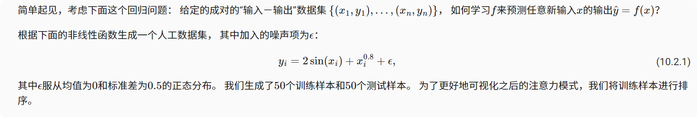

# 注意力汇聚：Nadaraya-Watson核回归
注意力机制的主要成分：查询（自主提示）和键（非自主提示）之间的交互形成了注意力汇聚， 注意力汇聚有选择地聚合了值（感官输入）以生成最终的输出。
### 生成数据集

```python
n_train = 50  # 训练样本数
x_train, _ = torch.sort(torch.rand(n_train) * 5)   # 排序后的训练样本

def f(x):
    return 2 * torch.sin(x) + x**0.8

y_train = f(x_train) + torch.normal(0.0, 0.5, (n_train,))  # 训练样本的输出
x_test = torch.arange(0, 5, 0.1)  # 测试样本
y_truth = f(x_test)  # 测试样本的真实输出
n_test = len(x_test)  # 测试样本数
n_test

绘制所有的训练样本（样本由圆圈表示）
def plot_kernel_reg(y_hat):
    d2l.plot(x_test, [y_truth, y_hat], 'x', 'y', legend=['Truth', 'Pred'],
             xlim=[0, 5], ylim=[-1, 5])
    d2l.plt.plot(x_train, y_train, 'o', alpha=0.5);
```

### 小结
* Nadaraya-Watson核回归是具有注意力机制的机器学习范例。

* Nadaraya-Watson核回归的注意力汇聚是对训练数据中输出的加权平均。从注意力的角度来看，分配给每个值的注意力权重取决于将值所对应的键和查询作为输入的函数。

* 注意力汇聚可以分为非参数型和带参数型。