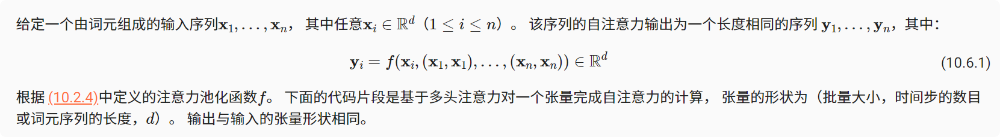
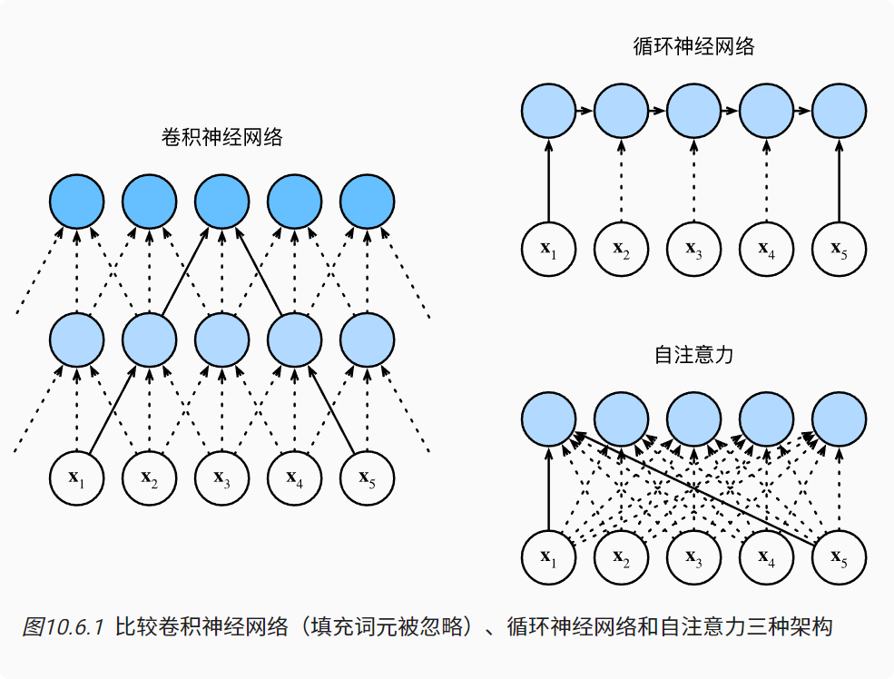
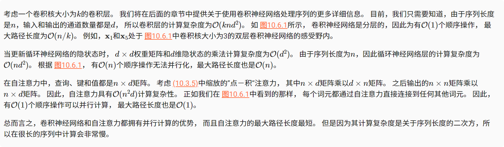
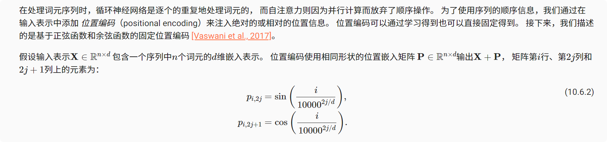
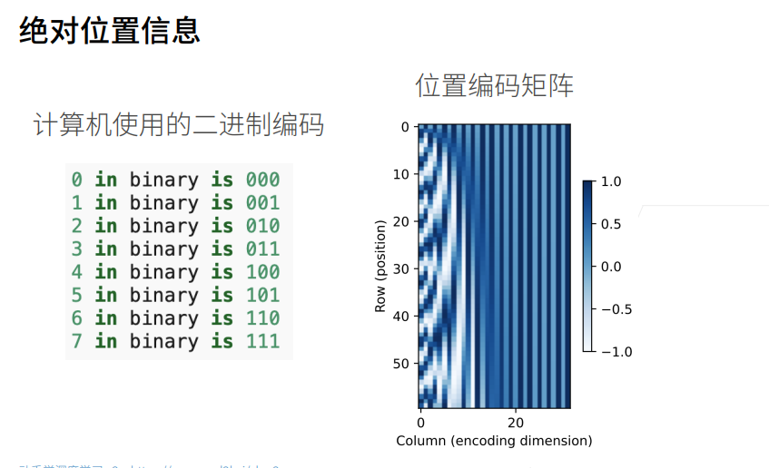
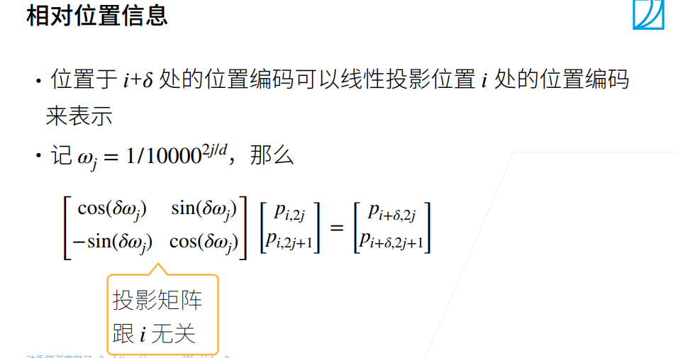

# 自身位置和注意力编码
有了注意力机制之后，我们将词元序列输入注意力池化中， 以便同一组词元同时充当查询、键和值。 具体来说，每个查询都会关注所有的键－值对并生成一个注意力输出。 由于查询、键和值来自同一组输入，因此被称为 自注意力（self-attention）也被称为内部注意力（intra-attention）
### 自注意力

### 比较卷积神经网络、循环神经网络和自注意力
让我们比较下面几个架构，目标都是将由n个词元组成的序列映射到另一个长度相等的序列，其中的每个输入词元或输出词元都由d维向量表示。具体来说，我们将比较的是卷积神经网络、循环神经网络和自注意力这几个架构的计算复杂性、顺序操作和最大路径长度。请注意，顺序操作会妨碍并行计算，而任意的序列位置组合之间的路径越短，则能更轻松地学习序列中的远距离依赖关系

### 位置编码

#### 绝对位置信息

位置编码是在-1到1之间实数的变换。x轴是特征，y轴是样本，所以看到对每一行位置信息进行了编码，就把第i个样本用长为d的向量来进行编码。最前的维是用频率比较高的编码，可以看到频率变化比较快，越到后面频率变化越来越慢，类似于计算机的二进制编码。核心思想是一样的，就是对每一个位置每一个样本i，也就是序列中的第i个样本，给你一个独一无二的长为d的位置信息，把它加入数据中去，作为输入，就能看到位置信息了。
#### 相对位置信息
用sin、cos的好处就是它编码的是一个相对的位置信息，投影矩阵跟i无关。

### 小结
* 在自注意力中，查询、键和值都来自同一组输入。
* 卷积神经网络和自注意力都拥有并行计算的优势，而且自注意力的最大路径长度最短。但是因为其计算复杂度是关于序列长度的二次方，所以在很长的序列中计算会非常慢。
* 为了使用序列的顺序信息，我们可以通过在输入表示中添加位置编码，来注入绝对的或相对的位置信息。