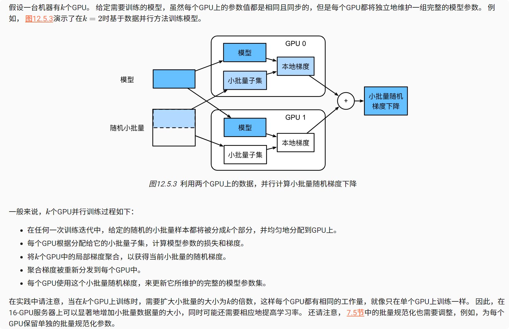

# 多GPU训练
### 方法
1. 第一种方法，在多个GPU之间拆分网络。 也就是说，每个GPU将流入特定层的数据作为输入，跨多个后续层对数据进行处理，然后将数据发送到下一个GPU。 与单个GPU所能处理的数据相比，我们可以用更大的网络处理数据。 此外，每个GPU占用的显存（memory footprint）可以得到很好的控制，虽然它只是整个网络显存的一小部分。

2. 第二种方法，拆分层内的工作。 例如，将问题分散到4个GPU，每个GPU生成16个通道的数据，而不是在单个GPU上计算64个通道。 对于全连接的层，同样可以拆分输出单元的数量。

3. 第三种方法，跨多个GPU对数据进行拆分。 这种方式下，所有GPU尽管有不同的观测结果，但是执行着相同类型的工作。 在完成每个小批量数据的训练之后，梯度在GPU上聚合。 这种方法最简单，并可以应用于任何情况，同步只需要在每个小批量数据处理之后进行。 也就是说，当其他梯度参数仍在计算时，完成计算的梯度参数就可以开始交换。 而且，GPU的数量越多，小批量包含的数据量就越大，从而就能提高训练效率。 但是，添加更多的GPU并不能让我们训练更大的模型。

### 数据并行性


### 简洁实现
```python
import torch
from torch import nn
from d2l import torch as d2l

#@save
def resnet18(num_classes, in_channels=1):
    """稍加修改的ResNet-18模型"""
    def resnet_block(in_channels, out_channels, num_residuals,
                     first_block=False):
        blk = []
        for i in range(num_residuals):
            if i == 0 and not first_block:
                blk.append(d2l.Residual(in_channels, out_channels,
                                        use_1x1conv=True, strides=2))
            else:
                blk.append(d2l.Residual(out_channels, out_channels))
        return nn.Sequential(*blk)

    # 该模型使用了更小的卷积核、步长和填充，而且删除了最大汇聚层
    net = nn.Sequential(
        nn.Conv2d(in_channels, 64, kernel_size=3, stride=1, padding=1),
        nn.BatchNorm2d(64),
        nn.ReLU())
    net.add_module("resnet_block1", resnet_block(
        64, 64, 2, first_block=True))
    net.add_module("resnet_block2", resnet_block(64, 128, 2))
    net.add_module("resnet_block3", resnet_block(128, 256, 2))
    net.add_module("resnet_block4", resnet_block(256, 512, 2))
    net.add_module("global_avg_pool", nn.AdaptiveAvgPool2d((1,1)))
    net.add_module("fc", nn.Sequential(nn.Flatten(),
                                       nn.Linear(512, num_classes)))
    return net


net = resnet18(10)
# 获取GPU列表
devices = d2l.try_all_gpus()
# 我们将在训练代码实现中初始化网络


def train(net, num_gpus, batch_size, lr):
    train_iter, test_iter = d2l.load_data_fashion_mnist(batch_size)
    devices = [d2l.try_gpu(i) for i in range(num_gpus)]
    def init_weights(m):
        if type(m) in [nn.Linear, nn.Conv2d]:
            nn.init.normal_(m.weight, std=0.01)
    net.apply(init_weights)
    # 在多个GPU上设置模型
    net = nn.DataParallel(net, device_ids=devices)
    trainer = torch.optim.SGD(net.parameters(), lr)
    loss = nn.CrossEntropyLoss()
    timer, num_epochs = d2l.Timer(), 10
    animator = d2l.Animator('epoch', 'test acc', xlim=[1, num_epochs])
    for epoch in range(num_epochs):
        net.train()
        timer.start()
        for X, y in train_iter:
            trainer.zero_grad()
            X, y = X.to(devices[0]), y.to(devices[0])
            l = loss(net(X), y)
            l.backward()
            trainer.step()
        timer.stop()
        animator.add(epoch + 1, (d2l.evaluate_accuracy_gpu(net, test_iter),))
    print(f'测试精度：{animator.Y[0][-1]:.2f}，{timer.avg():.1f}秒/轮，'
          f'在{str(devices)}')


train(net, num_gpus=1, batch_size=256, lr=0.1)

train(net, num_gpus=2, batch_size=512, lr=0.2)
```

### 小结

* 有多种方法可以在多个GPU上拆分深度网络的训练。拆分可以在层之间、跨层或跨数据上实现。前两者需要对数据传输过程进行严格编排，而最后一种则是最简单的策略。

* 数据并行训练本身是不复杂的，它通过增加有效的小批量数据量的大小提高了训练效率。

* 在数据并行中，数据需要跨多个GPU拆分，其中每个GPU执行自己的前向传播和反向传播，随后所有的梯度被聚合为一，之后聚合结果向所有的GPU广播。

* 小批量数据量更大时，学习率也需要稍微提高一些。  

* 神经网络可以在（可找到数据的）单GPU上进行自动评估。
* 优化算法在多个GPU上自动聚合。
* 每台设备上的网络需要先初始化，然后再尝试访问该设备上的参数，否则会遇到错误。