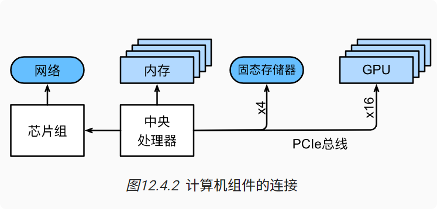
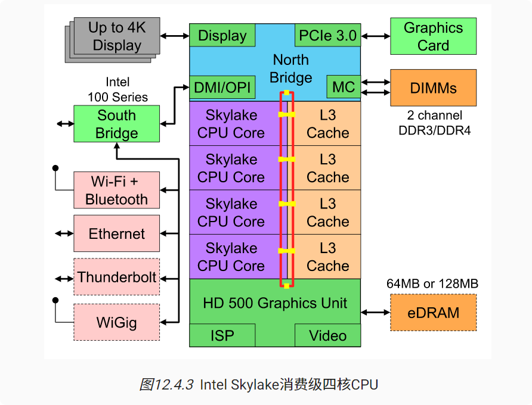
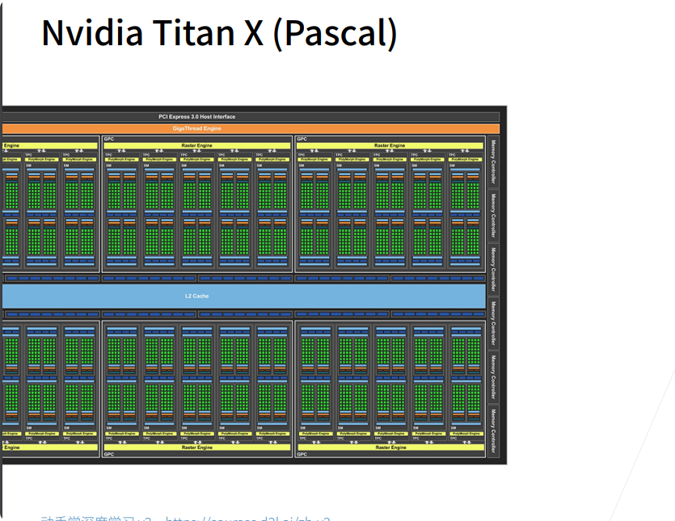
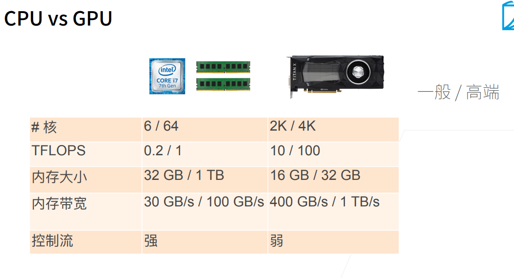

# 硬件、CPU、GPU
### 概念
* 一个处理器（也被称为CPU），它除了能够运行操作系统和许多其他功能之外，还能够执行我们给它的程序，通常由8个或更多个核心组成。  
* 内存（随机访问存储，RAM）用于存储和检索计算结果，如权重向量和激活参数，以及训练数据。  
* 一个或多个以太网连接，速度从1GB/s到100GB/s不等。在高端服务器上可能用到更高级的互连。  
* 高速扩展总线（PCIe）用于系统连接一个或多个GPU。服务器最多有个加速卡，通常以更高级的拓扑方式连接，而桌面系统则有个或个加速卡，具体取决于用户的预算和电源负载的大小。  
* 持久性存储设备，如磁盘驱动器、固态驱动器，在许多情况下使用高速扩展总线连接。它为系统需要的训练数据和中间检查点需要的存储提供了足够的传输速度。  

### CPU组成
中央处理器（central processing unit，CPU）是任何计算机的核心。它们由许多关键组件组成：处理器核心（processor cores）用于执行机器代码的、总线（bus）用于连接不同组件（注意，总线会因为处理器型号、各代产品和供应商之间的特定拓扑结构有明显不同）和缓存（cach）相比主内存实现更高的读取带宽和更低的延迟内存访问。最后，因为高性能线性代数和卷积运算常见于媒体处理和机器学习中，所以几乎所有的现代CPU都包含向量处理单元（vector processing unit）为这些计算提供辅助。

### GPU和其他加速卡

一个绿点可开一个线程 上千个线程
### GPU VS CPU

### 小结
* 设备有运行开销。因此，数据传输要争取量大次少而不是量少次多。这适用于RAM、固态驱动器、网络和GPU。

* 矢量化是性能的关键。确保充分了解你的加速器的特定功能。例如，一些Intel Xeon CPU特别适用于INT8操作，NVIDIA Volta GPU擅长FP16矩阵操作，NVIDIA Turing擅长FP16、INT8和INT4操作。

* 在训练过程中数据类型过小导致的数值溢出可能是个问题（在推断过程中则影响不大）。

* 数据混叠现象会导致严重的性能退化。位CPU应该按照位边界进行内存对齐。在GPU上建议保持卷积大小对齐，例如：与张量核对齐。

* 将算法与硬件相匹配（例如，内存占用和带宽）。将命中参数装入缓存后，可以实现很大数量级的加速比。

* 在验证实验结果之前，我们建议先在纸上勾勒出新算法的性能。关注的原因是数量级及以上的差异。

* 使用调试器跟踪调试寻找性能的瓶颈。

* 训练硬件和推断硬件在性能和价格方面有不同的优点。