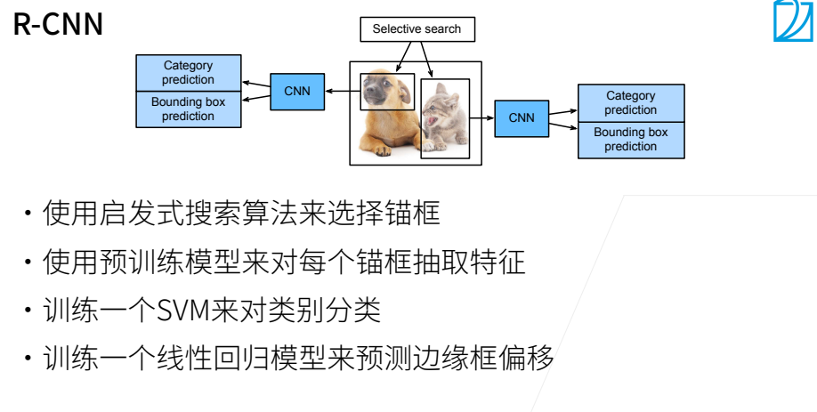
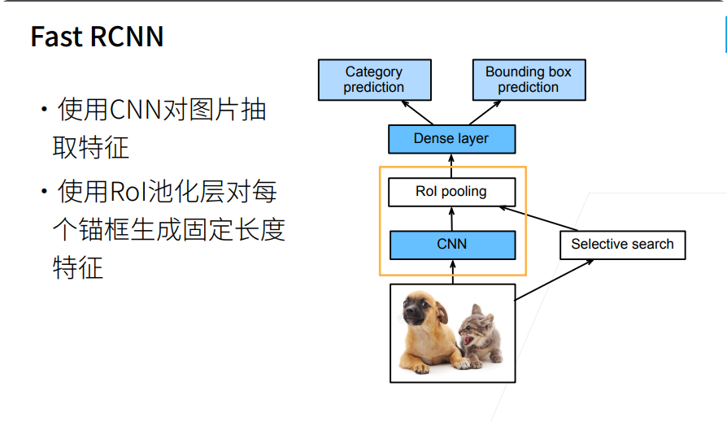
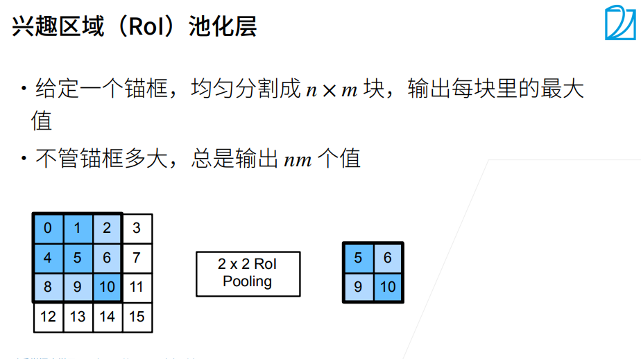
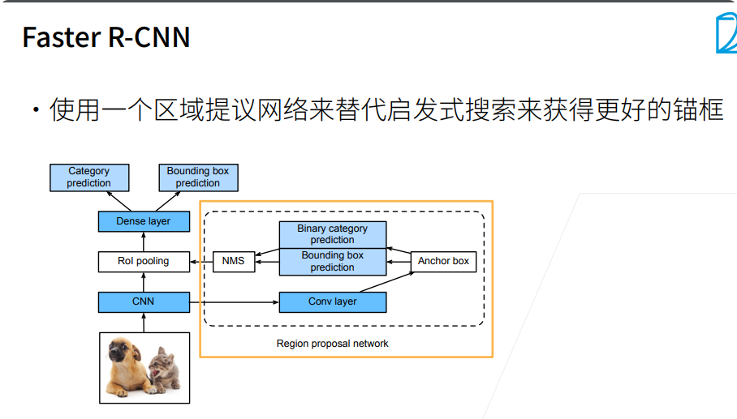
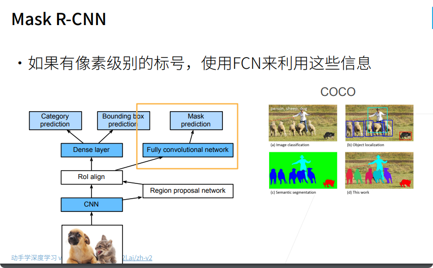

# 区域卷积神经网络（R-CNN）系列
区域卷积神经网络（region-based CNN或regions with CNN features，R-CNN）
### R-CNN
1. R-CNN首先从输入图像中选取若干（例如2000个）提议区域（如锚框也是一种选取方法），并标注它们的类别和边界框（如偏移量）。
2. 然后，用卷积神经网络对每个提议区域进行前向传播以抽取其特征。 
3. 用每个提议区域的特征来预测类别和边界框。

---
R-CNN的主要性能瓶颈在于，对每个提议区域，卷积神经网络的前向传播是独立的，而没有共享计算。 由于这些区域通常有重叠，独立的特征抽取会导致重复的计算。

### Fast R-CNN
仅在整张图象上执行卷积神经网络的前向传播

### Faster R-CNN
将选择性搜索替换为区域提议网络（region proposal network），从而减少提议区域的生成数量，并保证目标检测的精度。
与Fast R-CNN相比，Faster R-CNN只将生成提议区域的方法从选择性搜索改为了区域提议网络，模型的其余部分保持不变。

1. 使用填充为1的3*3的卷积层变换卷积神经网络的输出，并将输出通道数记为c。这样，卷积神经网络为图像抽取的特征图中的每个单元均得到一个长度为的新特征。
2. 以特征图的每个像素为中心，生成多个不同大小和宽高比的锚框并标注它们。
3. 使用锚框中心单元长度为c的特征，分别预测该锚框的二元类别（含目标还是背景）和边界框。
4. 使用非极大值抑制，从预测类别为目标的预测边界框中移除相似的结果。最终输出的预测边界框即是兴趣区域汇聚层所需的提议区域。
### Mask R-CNN
如果在训练集中还标注了每个目标在图像上的像素级位置，那么Mask R-CNN能够有效地利用这些详尽的标注信息进一步提升目标检测的精度。

Mask R-CNN是基于Faster R-CNN修改而来的。 具体来说，Mask R-CNN将兴趣区域汇聚层替换为了 兴趣区域对齐层，使用双线性插值（bilinear interpolation）来保留特征图上的空间信息，从而更适于像素级预测。 兴趣区域对齐层的输出包含了所有与兴趣区域的形状相同的特征图。 它们不仅被用于预测每个兴趣区域的类别和边界框，还通过额外的全卷积网络预测目标的像素级位置。 

### 小结
* R-CNN对图像选取若干提议区域，使用卷积神经网络对每个提议区域执行前向传播以抽取其特征，然后再用这些特征来预测提议区域的类别和边界框。
* Fast R-CNN对R-CNN的一个主要改进：只对整个图像做卷积神经网络的前向传播。它还引入了兴趣区域汇聚层，从而为具有不同形状的兴趣区域抽取相同形状的特征。
* Faster R-CNN将Fast R-CNN中使用的选择性搜索替换为参与训练的区域提议网络，这样后者可以在减少提议区域数量的情况下仍保证目标检测的精度。
* Mask R-CNN在Faster R-CNN的基础上引入了一个全卷积网络，从而借助目标的像素级位置进一步提升目标检测的精度。