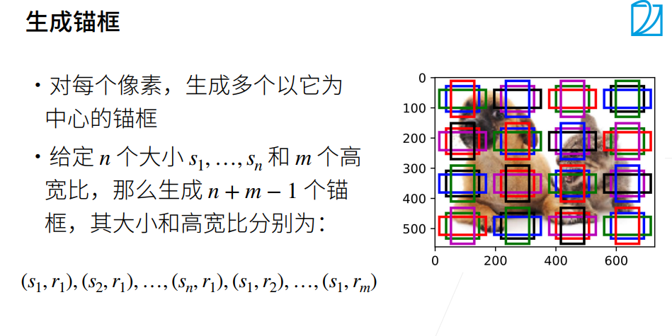
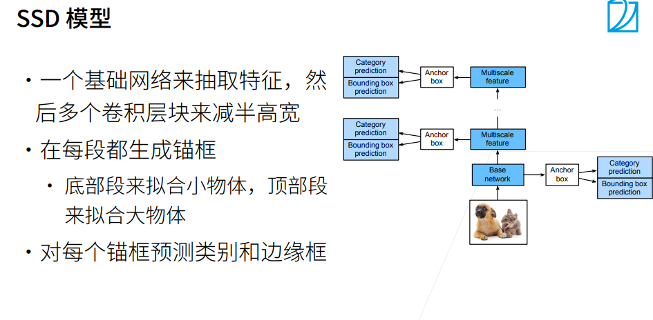
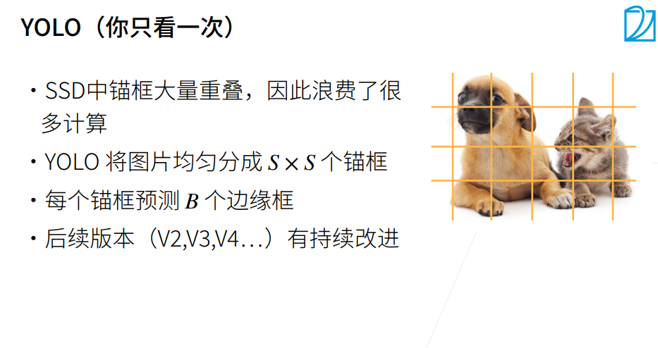

# 单发多框检测（SSD）与yolo
通过多尺度特征块，单发多框检测生成不同大小的锚框，并通过预测边界框的类别和偏移量来检测大小不同的目标

---

yolo 也是一个 single-stage 的算法，只有一个单神经网络来做预测
yolo 也需要锚框，这点和 SSD 相同，但是 SSD 是对每个像素点生成多个锚框，所以在绝大部分情况下两个相邻像素的所生成的锚框的重叠率是相当高的，这样就会导致很大的重复计算量。
yolo 的想法是尽量让锚框不重叠：首先将图片均匀地分成 S * S 块，每一块就是一个锚框，每一个锚框预测 B 个边缘框（考虑到一个锚框中可能包含多个物体），所以最终就会产生 S ^ 2 * B 个样本，因此速度会远远快于 SSD
yolo 在后续的版本（V2,V3,V4...）中有持续的改进，但是核心思想没有变，真实的边缘框不会随机的出现，真实的边缘框的比例、大小在每个数据集上的出现是有一定的规律的，在知道有一定的规律的时候就可以使用聚类算法将这个规律找出来（给定一个数据集，先分析数据集中的统计信息，然后找出边缘框出现的规律，这样之后在生成锚框的时候就会有先验知识，从而进一步做出优化）
