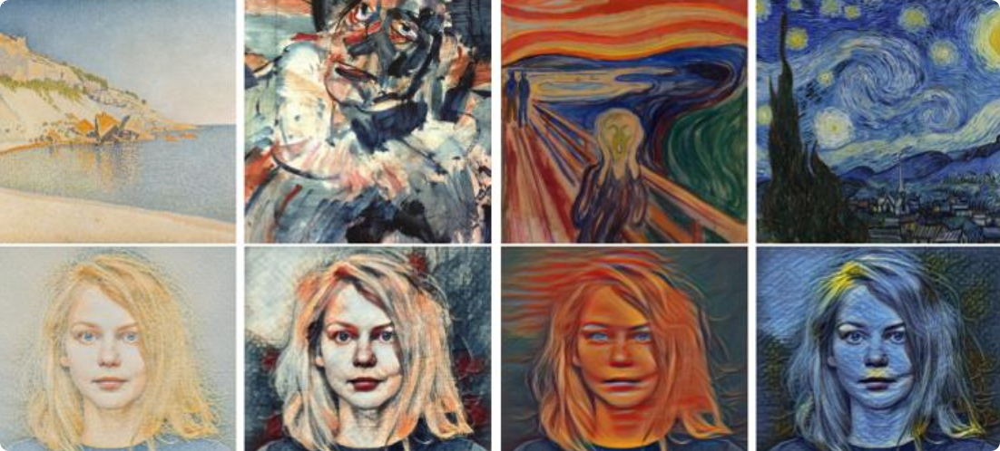
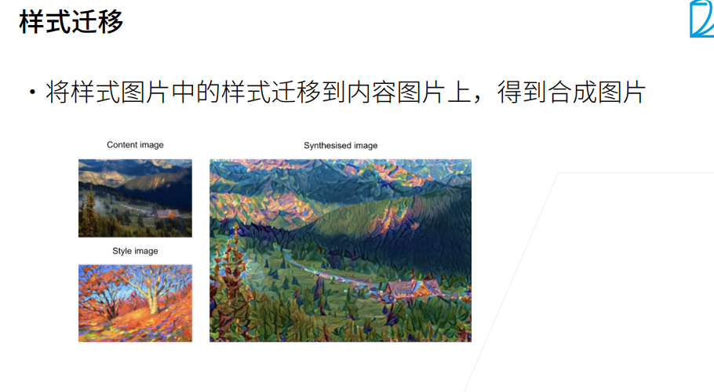
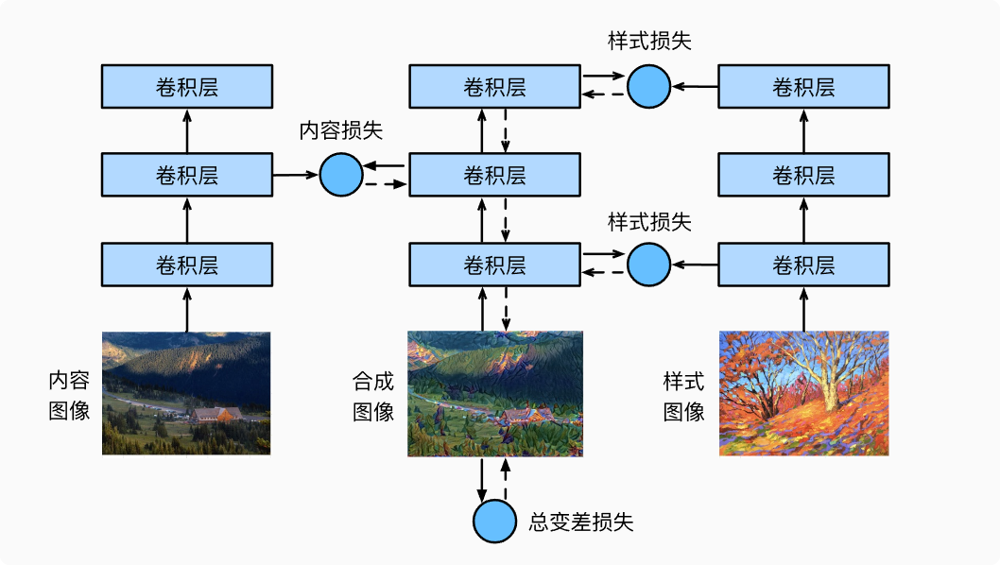
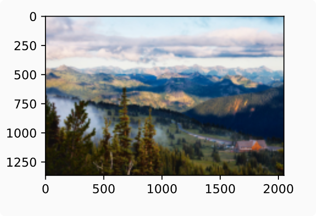
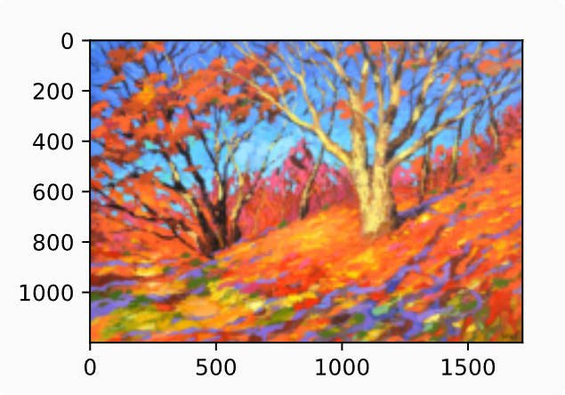

# 样式迁移

### 什么是样式迁移
自动将一个图像中的风格应用在另一图像之上


一张是内容图像，另一张是风格图像，使用神经网络修改内容图像，使其在风格上接近风格图像

### 样式迁移方法
正向传播（实线箭头方向）  
反向传播（虚线箭头方向）  
第一层和第三层的输出被作为图像的样式特征  
第二层输出图像的内容特征  

损失函数构成：
**内容损失**（content loss）使合成图像与内容图像在内容特征上接近
**样式损失**（style loss）令合成图像与样式图像在样式特征上接近
**总变差损失**（total variation loss）有助于减少合成图像中的噪点

###  阅读内容和风格图像
首先，我们分别读取内容图像和样式图像。从打印出的图像坐标轴可以看出，它们的尺寸并不一样。
```python
%matplotlib inline
import torch
import torchvision
from torch import nn
from d2l import torch as d2l

d2l.set_figsize()
content_img = d2l.Image.open('../img/rainier.jpg')
d2l.plt.imshow(content_img);
```

```python
style_img = d2l.Image.open('../img/autumn-oak.jpg')
d2l.plt.imshow(style_img);
```


### 预处理和后处理
下面定义图像的预处理函数和后处理函数。预处理函数preprocess对输入图像在RGB三个通道分别做标准化，并将结果变换成卷积神经网络接受的输入格式。后处理函数postprocess则将输出图像中的像素值还原回标准化之前的值。由于图像打印函数要求每个像素的浮点数值在0到1之间，我们使用clamp函数对小于0和大于1的值分别取0和1。
```python
rgb_mean = torch.tensor([0.485, 0.456, 0.406])
rgb_std = torch.tensor([0.229, 0.224, 0.225])

def preprocess(img, image_shape):
    transforms = torchvision.transforms.Compose([
        torchvision.transforms.Resize(image_shape),
        torchvision.transforms.ToTensor(),
        torchvision.transforms.Normalize(mean=rgb_mean, std=rgb_std)])
    return transforms(img).unsqueeze(0)

def postprocess(img):
    img = img[0].to(rgb_std.device)
    img = torch.clamp(img.permute(1, 2, 0) * rgb_std + rgb_mean, 0, 1)
    return torchvision.transforms.ToPILImage()(img.permute(2, 0, 1))
```

### 抽取特征
使用基于ImageNet数据集预训练的VGG-19模型来抽取图像特征
```
pretrained_net = torchvision.models.vgg19(pretrained=True)
```


为了抽取图像的内容特征和样式特征，我们可以选择VGG网络中某些层的输出。一般来说，**越靠近输入层**的输出越容易抽取图像的**细节信息**，反之则越容易抽取图像的**全局信息**。  

为了避免合成图像过多保留内容图像的细节，我们选择VGG较靠近输出的层，也称**内容层**，**来输出图像的内容特征**。我们还从VGG中**选择不同层的输出来匹配局部和全局的样式**，这些层也叫**样式层**。VGG网络使用了5个卷积块。实验中，我们选择第四卷积块的最后一个卷积层作为内容层，以及每个卷积块的第一个卷积层作为样式层。  

`style_layers, content_layers = [0, 5, 10, 19, 28], [25]`

面构建一个新的网络net，它只保留需要用到的VGG的所有层(从输入层到最靠近输出层的内容层或风格层之间的所有层)。  
`net = nn.Sequential(*[pretrained_net.features[i] for i in range(max(content_layers + style_layers) + 1)])`

给定输入X，如果我们简单地调用前向传播net(X)，只能获得最后一层的输出。 由于我们还需要中间层的输出，因此这里我们逐层计算，并保留内容层和风格层的输出。
```
def extract_features(X, content_layers, style_layers):
    contents = []
    styles = []
    for i in range(len(net)):
        X = net[i](X)
        if i in style_layers:
            styles.append(X)
        if i in content_layers:
            contents.append(X)
    return contents, styles
```

get_contents函数对内容图像抽取内容特征； get_styles函数对风格图像抽取风格特征
```python
def get_contents(image_shape, device):
    content_X = preprocess(content_img, image_shape).to(device)
    contents_Y, _ = extract_features(content_X, content_layers, style_layers)
    return content_X, contents_Y

def get_styles(image_shape, device):
    style_X = preprocess(style_img, image_shape).to(device)
    _, styles_Y = extract_features(style_X, content_layers, style_layers)
    return style_X, styles_Y
```

### 定义损失函数
内容损失、风格损失和全变分损失3部分组成
#### 内容损失
内容损失通过平方误差函数衡量合成图像与内容图像在内容特征上的差异
```python
def content_loss(Y_hat, Y):
    # 我们从动态计算梯度的树中分离目标：
    # 这是一个规定的值，而不是一个变量。
    return torch.square(Y_hat - Y.detach()).mean()
```
#### 风格损失
风格损失与内容损失类似，也通过平方误差函数衡量合成图像与风格图像在风格上的差异
```def gram(X):
    num_channels, n = X.shape[1], X.numel() // X.shape[1]
    X = X.reshape((num_channels, n))
    return torch.matmul(X, X.T) / (num_channels * n)
```
### 全变分损失

```python
def tv_loss(Y_hat):
    return 0.5 * (torch.abs(Y_hat[:, :, 1:, :] - Y_hat[:, :, :-1, :]).mean() +
                  torch.abs(Y_hat[:, :, :, 1:] - Y_hat[:, :, :, :-1]).mean())
```

### 初始化合成图像
合成的图像是训练期间唯一需要更新的变量

可以定义一个简单的模型SynthesizedImage，并将合成的图像视为模型参数。模型的前向传播只需返回模型参数即可。
```python
class SynthesizedImage(nn.Module):
    def __init__(self, img_shape, **kwargs):
        super(SynthesizedImage, self).__init__(**kwargs)
        self.weight = nn.Parameter(torch.rand(*img_shape))

    def forward(self):
        return self.weight
```

定义get_inits函数。该函数创建了合成图像的模型实例，并将其初始化为图像X。
```python
def get_inits(X, device, lr, styles_Y):
    gen_img = SynthesizedImage(X.shape).to(device)
    gen_img.weight.data.copy_(X.data)
    trainer = torch.optim.Adam(gen_img.parameters(), lr=lr)
    styles_Y_gram = [gram(Y) for Y in styles_Y]
    return gen_img(), styles_Y_gram, trainer
```
### 小结
* **风格迁移常用的损失函数由3部分组成：（i）内容损失使合成图像与内容图像在内容特征上接近；（ii）风格损失令合成图像与风格图像在风格特征上接近；（iii）全变分损失则有助于减少合成图像中的噪点。**
* **通过预训练的卷积神经网络来抽取图像的特征，并通过损失函数来不断更新模型参数，也即是不断更新合成图像像素值。**
* **在训练模型进行风格迁移时不断抽取合成图像的内容特征和风格特征，然后与内容图像的内容特征以及风格图像的风格特征计算损失函数，同时计算合成图像的全变分损失，三者损失求和来更新迭代权重参数（也即是更新合成图像的像素值从而达到使合成图像既包含内容图像的内容又包含风格图像的风格，同时使合成图像噪点比较低）。**
