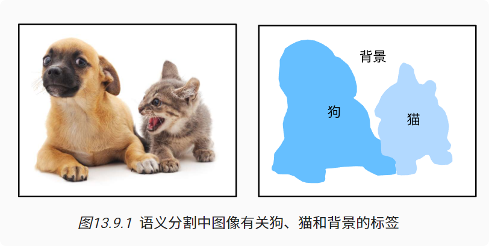
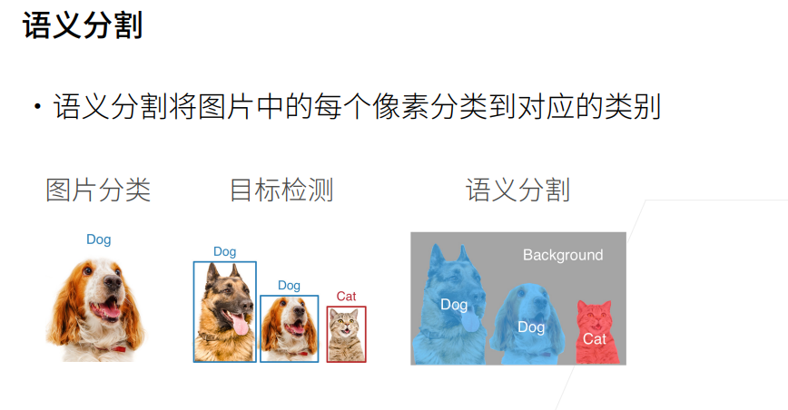
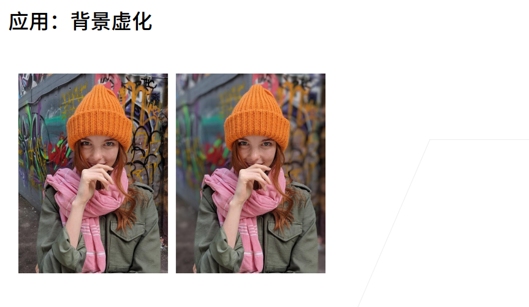
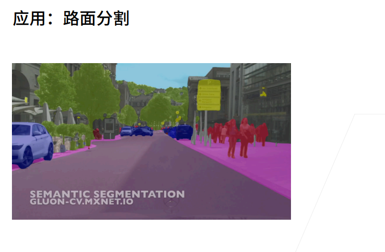
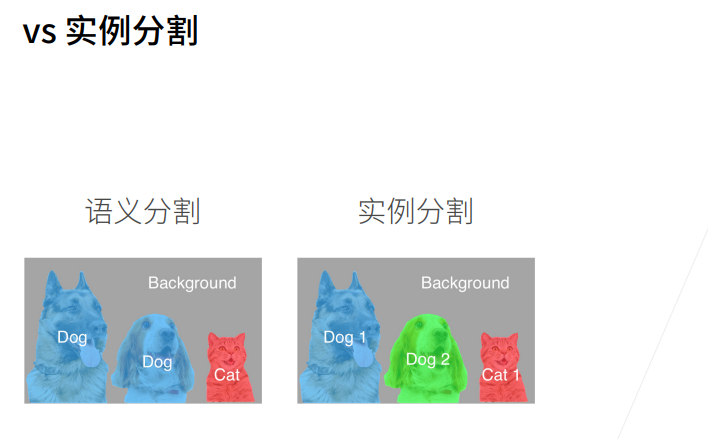

# 语义分割和数据集
语义分割可以识别并理解图像中每一个像素的内容：其语义区域的标注和预测是像素级的

### 语义分割与目标检测

#### 应用场景

### 小结

* 语义分割通过将图像划分为属于不同语义类别的区域，来识别并理解图像中像素级别的内容。

* 语义分割的一个重要的数据集叫做Pascal VOC2012。

* 由于语义分割的输入图像和标签在像素上一一对应，输入图像会被随机裁剪为固定尺寸而不是缩放。