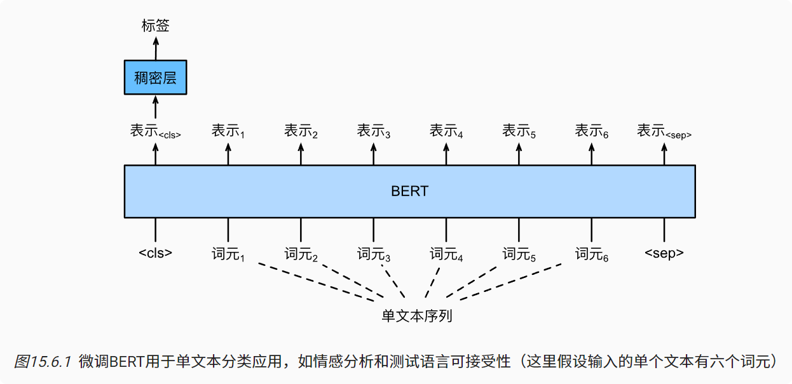
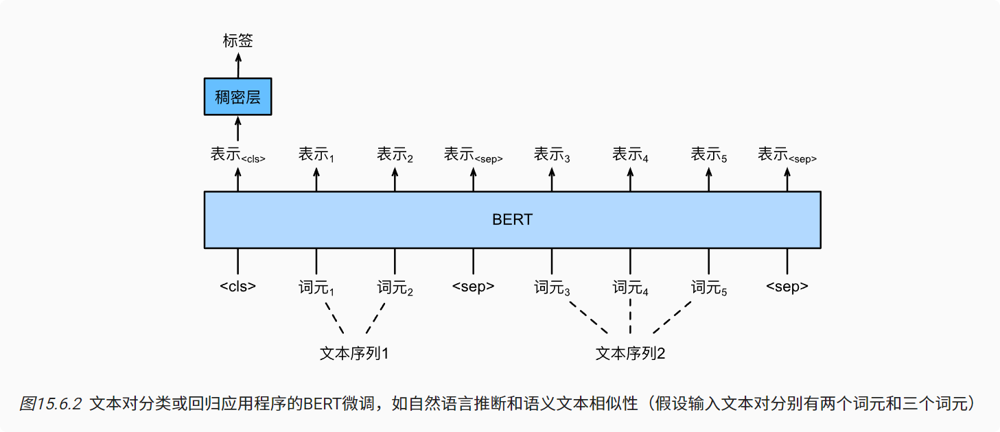
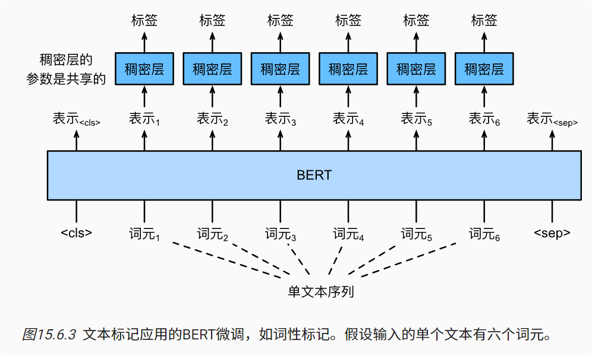
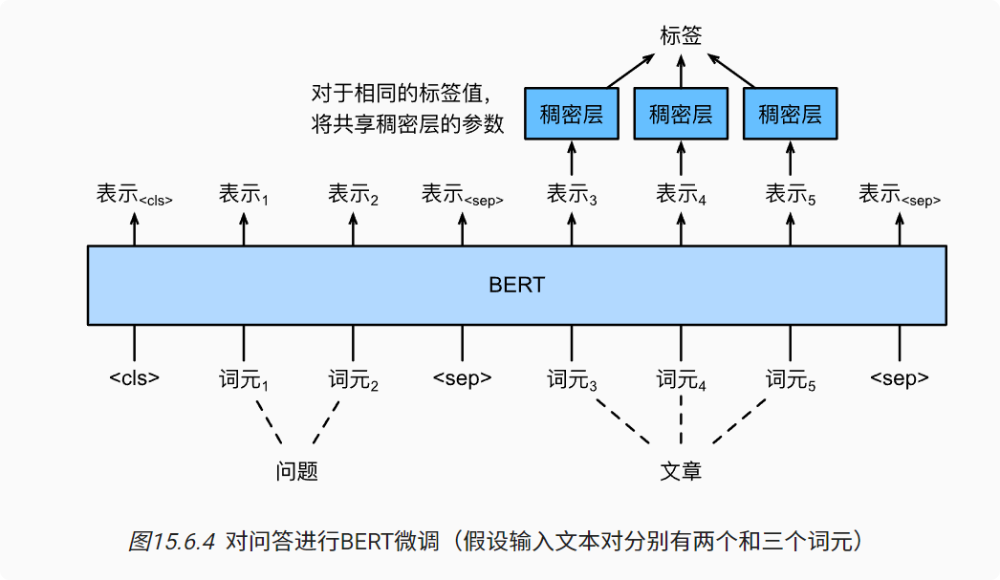

# 微调BERT
1. 一方面，在提出时，BERT改进了各种自然语言处理任务的技术水平。
2. 另一方面，原始BERT模型的两个版本分别带有1.1亿和3.4亿个参数。
3. 因此，当有足够的计算资源时，我们可以考虑为下游自然语言处理应用微调BERT。
  
### 单文本分类
单文本分类将单个文本序列作为输入，并输出其分类结果。
语言可接受性语料库（Corpus of Linguistic Acceptability，COLA）也是一个单文本分类的数据集，它的要求判断给定的句子在语法上是否可以接受。例如，“I should study.”是可以接受的，但是“I should studying.”不是可以接受的。

BERT输入序列明确地表示单个文本和文本对，其中特殊分类标记“<cls>”用于序列分类，而特殊分类标记“<sep>”标记单个文本的结束或分隔成对文本。
### 文本对分类或回归
以一对文本作为输入但输出连续值，语义文本相似度是一个流行的“文本对回归”任务。 这项任务评估句子的语义相似度。

例如，在语义文本相似度基准数据集（Semantic Textual Similarity Benchmark）中，句子对的相似度得分是从0（无语义重叠）到5（语义等价）的分数区间

我们的目标是预测这些分数。来自语义文本相似性基准数据集的样本包括（句子1，句子2，相似性得分）：
1. “A plane is taking off.”（“一架飞机正在起飞。”），”An air plane is taking off.”（“一架飞机正在起飞。”），5.000分;

2. “A woman is eating something.”（“一个女人在吃东西。”），”A woman is eating meat.”（“一个女人在吃肉。”），3.000分;

3. “A woman is dancing.”（一个女人在跳舞。），”A man is talking.”（“一个人在说话。”），0.000分。

对于文本对回归任务（如语义文本相似性），可以应用细微的更改，例如输出连续的标签值和使用均方损失：它们在回归中很常见。

### 文本标注
词元级任务：比如文本标注（text tagging），其中每个词元都被分配了一个标签。在文本标注任务中，词性标注为每个单词分配词性标记（例如，形容词和限定词）。

如，在Penn树库II标注集中，句子“John Smith‘s car is new”应该被标记为“NNP（名词，专有单数）NNP POS（所有格结尾）NN（名词，单数或质量）VB（动词，基本形式）JJ（形容词）”。

### 问答
词元级应用：问答反映阅读理解能力。

例如，斯坦福问答数据集（Stanford Question Answering Dataset，SQuAD v1.1）由阅读段落和问题组成，其中每个问题的答案只是段落中的一段文本（文本片段）

Some experts report that a mask’s efficacy is inconclusive.However,mask makers insist that their products,such as N95 respirator masks,can guard against the virus.”（“一些专家报告说面罩的功效是不确定的。然而，口罩制造商坚持他们的产品，如N95口罩，可以预防病毒。”）还有一个问题“Who say that N95 respirator masks can guard against the virus?”（“谁说N95口罩可以预防病毒？”）。答案应该是文章中的文本片段“mask makers”（“口罩制造商”）。因此，SQuAD v1.1的目标是在给定问题和段落的情况下预测段落中文本片段的开始和结束。

### 小结
对于序列级和词元级自然语言处理应用，BERT只需要最小的架构改变（额外的全连接层），如单个文本分类（例如，情感分析和测试语言可接受性）、文本对分类或回归（例如，自然语言推断和语义文本相似性）、文本标记（例如，词性标记）和问答。

在下游应用的监督学习期间，额外层的参数是从零开始学习的，而预训练BERT模型中的所有参数都是微调的。