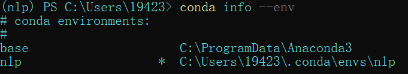
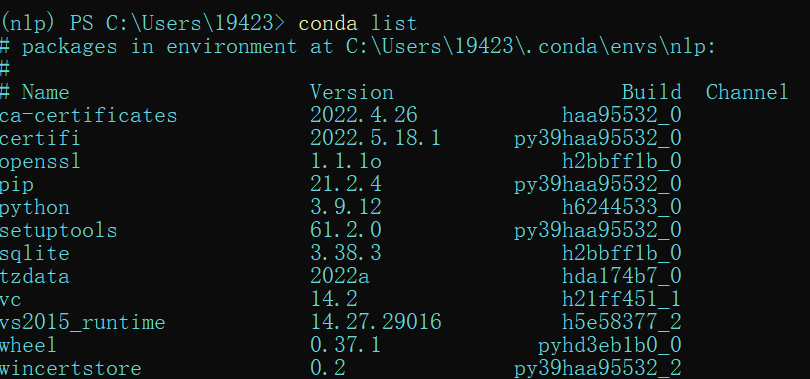

# conda、miniconda、anaconda的区别

## conda

conda是一种通用包管理系统，旨在构建和管理任何语言和任何类型的软件。包管理与pip的使用类似，环境管理则允许用户方便地安装不同版本的python并可以快速切换。

## Miniconda

只包含最基本的内容——python与conda，以及相关的必须依赖项，对于空间要求严格的用户，Miniconda是一种选择。就只包含最基本的东西，其他的库得自己装。

## Anaconda

一个打包的集合，里面预装好了conda、某个版本的python、众多packages、科学计算工具等等。

## conda常用命令

### 1. 创建虚拟环境 xxx（指定python版本，如python=3.6）

　　conda create -n xxx python=3.6

### 2. 激活虚拟环境

星号表示当前正在使用的虚拟环境环境

　　conda activate xxx　　 # for windows

### 3. 关闭虚拟环境

　　conda deactivate　　　　　 # for windows

### 4. 查看已安装的软件包、虚拟环境、版本

　　conda list

　　conda env list

　　conda --version　　# 查看conda的版本

　　python --version　　# 查看python解释器的版本

　　conda search --full-name tensorflow　　# 查看python对应的tensorflow软件版本

　　conda search tensorflow　　# 同上

　　anaconda search -t conda tensorflow

### 5. 添加/删除 镜像  与  设置搜索时显示通道地址
    添加镜像

　　conda config --add channels https://mirrors.tuna.tsinghua.edu.cn/anaconda/pkgs/free/　　  #  添加清华镜像2

　　conda config --add channels https://mirrors.tuna.tsinghua.edu.cn/anaconda/pkgs/main/　　# 添加清华镜像2

　　conda config --add channels https://mirrors.ustc.edu.cn/anaconda/pkgs/free/　　　　　　  # 添加中科大镜像：

    删除镜像

　　conda config --remove channels 'https://mirrors.tuna.tsinghua.edu.cn/anaconda/pkgs/free/'

### 6. 安装包

　　conda install  tensorflow=1.8.0 python=3.6（安装 conda search --full-name tensorflow 中显示的对应版本）

　　conda install -c https://conda.anaconda.org/anaconda tensorflow=1.8.0

　　conda install -n 虚拟机名称 -c 镜像地址 安装包名称　　# 若不指定 -n，默认在当前的虚拟环境中安装

### 7. 更新包

　　conda update -n 虚拟机名称  安装包名称

### 8. 删除包

　　conda remove -n 虚拟机名称 安装包名称

### 9. 删除虚拟环境

　　conda remove -n xxxx --all    //  删除xxxx虚拟环境

