# 线性代数、微积分、概率
## 线性代数

### 标量

标量变量由普通⼩写字⺟表⽰（例如，x、y和z）
定义两个标量与标量的运算
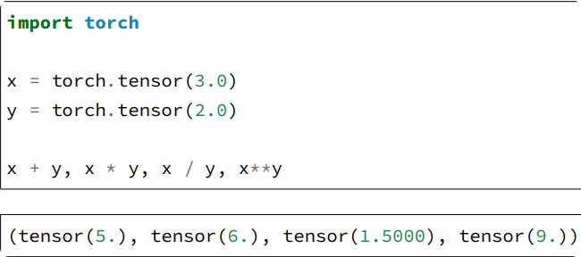

### 向量

将向量视为标量值组成的列表。标量的值称为向量的元素（element）或分量（component）。
例如：
`x = torch.arange(4)`

### ⻓度、维度和形状

* 向量只是⼀个数字数组，就像每个数组都有⼀个⻓度⼀样，每个向量也是如此。向量的⻓度通常称为向量维度（dimension）。
* `len(x)`输出向量长度，`x.shape`打印形状
* 向量或轴的维度被⽤来表⽰向量或轴的⻓度，即向量或轴的元素数量。张量的维度⽤来表⽰张量具有的轴。在这个意义上，张量的某个轴的维数就是这个轴的⻓度。

### 矩阵

向量将标量从零阶推⼴到⼀阶，矩阵将向量从⼀阶推⼴到⼆阶。矩阵，我们通常⽤粗体、⼤写字⺟来表
⽰（例如，**X、Y、Z**），在代码中表⽰为具有两个轴的张量。

`A = torch.arange(20).reshape(5, 4)`五行四列的矩阵
`A.T`打印矩阵的转置
对称矩阵（symmetric matrix）A等于其转置：A = A.⊤

### 张量

张量⽤特殊字体的⼤写字⺟表⽰（例如，X、Y和Z），它们的索引机制（例如xijk和[X]1,2i−1,3）
与矩阵类似。
例如：图像以n维数组形式出现，其中3个轴对应于⾼度、宽度，以及⼀个通道（channel）轴，⽤于表⽰颜⾊通道（红⾊、绿⾊和蓝⾊）。

`X = torch.arange(24).reshape(2, 3, 4)`

### 张量算法的基本性质

标量、向量、矩阵和任意数量轴的张量（本⼩节中的“张量”指代数对象）有⼀些实⽤的属性。

```
A = torch.arange(20, dtype=torch.float32).reshape(5, 4)
B = A.clone() # 通过分配新内存，将A的⼀个副本分配给B
A, A + B
```

运算结果：  
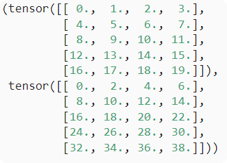

两个矩阵的按元素乘法称为Hadamard积（Hadamard product）（数学符号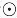）A * B运算结果：
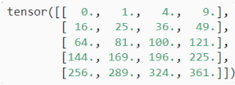
将张量乘以或加上一个标量不会改变张量的形状，其中张量的每个元素都将与标量相加或相乘。如下：
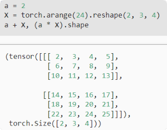  


### 降维
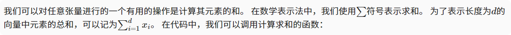

```
x = torch.arange(4, dtype=torch.float32)
x, x.sum()
```
运行结果：
`(tensor([0., 1., 2., 3.]), tensor(6.))`    
**默认情况下，调用求和函数会沿所有的轴降低张量的维度，使它变为一个标量。**  
我们还可以指定张量沿哪一个轴来通过求和降低维度。 以矩阵为例，为了通过求和所有行的元素来降维（轴0），我们可以在调用函数时指定axis=0。     
由于输入矩阵沿0轴降维以生成输出向量，因此输入轴0的维数在输出形状中消失。
``````
A_sum_axis0 = A.sum(axis=0)
A_sum_axis0, A_sum_axis0.shape
``````
运行结果：  
``(tensor([40., 45., 50., 55.]), torch.Size([4]))
``
指定axis=1将通过汇总所有列的元素降维（轴1）。因此，输⼊轴1的维数在输出形状中消失。
```
A_sum_axis1 = A.sum(axis=1)
A_sum_axis1, A_sum_axis1.shape
```
``(tensor([ 6., 22., 38., 54.,70.]),torch.Size([5]))``  

沿着⾏和列对矩阵求和，等价于对矩阵的所有元素进⾏求和。
```angular2html
A.sum(axis=[0, 1]) # SameasA.sum()
```
运行结果：
``tensor(190.)
``  
平均值的两种方法：`A.mean(), A.sum() / A.numel()`
### 非降维求和
```
sum_A = A.sum(axis=1, keepdims=True)
sum_A
```   
```angular2html
tensor([[ 6.],
[22.],
[38.],
[54.],
[70.]])
```
由于sum_A在对每⾏进⾏求和后仍保持两个轴，我们可以通过⼴播将A除以sum_A  
如果我们想沿某个轴计算A元素的累积总和，⽐如axis=0（按⾏计算），我们可以调⽤cumsum函数。此函数不会沿任何轴降低输⼊张量的维度。  
```A.cumsum(axis=0)
tensor([[ 0., 1., 2., 3.],
[ 4., 6., 8., 10.],
[12., 15., 18., 21.],
[24., 28., 32., 36.],
[40., 45., 50., 55.]])
```
### 点积（Dot Product）
```
y = torch.ones(4, dtype = torch.float32)
x, y, torch.dot(x, y)

运行结果：(tensor([0., 1., 2., 3.]), tensor([1., 1., 1., 1.]), tensor(6.))
```  
### 矩阵-向量积
们使⽤与点积相同的mv函数。当我们为矩阵A和向量x调⽤torch.mv(A, x)时，会执⾏矩阵-向量积。注意，A的列维数（沿轴1的⻓度）必须与x的维数（其⻓度）相同。
```
A.shape, x.shape, torch.mv(A, x)
(torch.Size([5, 4]), torch.Size([4]), tensor([ 14., 38., 62., 86., 110.]))
```  
### 矩阵-矩阵乘法
```
B = torch.ones(4, 3)
torch.mm(A, B)
运行结果：
tensor([[ 6., 6., 6.],
[22., 22., 22.],
[38., 38., 38.],
[54., 54., 54.],
[70., 70., 70.]])
```

### 范数
**L2范数：**向量元素平⽅和的平⽅根
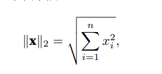  

```python
u = torch.tensor([3.0, -4.0])
torch.norm(u)
运行结果：tensor(5.)
```
**L1范数：**为向量元素的绝对值之和
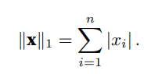  
```python
torch.abs(u).sum()
运行结果：tensor(7.)
```
### 范数与线代目标
最⼤化分配给观测数据的概率; 最⼩化预测和真实观测之间的距离。⽤向量表⽰物品（如单词、产品或新闻⽂章），以便最⼩化相似项⽬之间的距离，最⼤化不同项⽬之间的距离。⽬标，或许是深度学习算法最重要的组成部分（除了数据），通常被表达为范数。

## 微积分
### 导数和微分
#### 导数
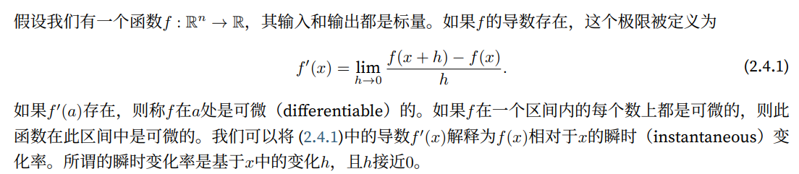
```python
import numpy as np
from d2l import torch as d2l
import os
os.environ["KMP_DUPLICATE_LIB_OK"]="TRUE"

def f(x):
    return 3 * x ** 2 - 4 * x

def numerical_lim(f, x, h):
    return (f(x + h) - f(x)) / h

h = 0.1
for i in range(5):
    print(f'h={h:.5f}, numerical limit={numerical_lim(f, 1, h):.5f}')
    h *= 0.1

x = np.arange(0, 3, 0.1)
d2l.plot(x, [f(x), 2 * x - 3], 'x', 'f(x)', legend=['f(x)', 'Tangent line (x=1)'])
d2l.plt.show();

x = np.arange(0.5, 3, 0.2)
d2l.plot(x, [x ** 3 - 1 / x, 4 * x - 4], 'x', 'f(x)', legend=['f(x)', 'Tangent line (x=1)'])
d2l.plt.show();

运行结果：
h=0.10000, numerical limit=2.30000
h=0.01000, numerical limit=2.03000
h=0.00100, numerical limit=2.00300
h=0.00010, numerical limit=2.00030
h=0.00001, numerical limit=2.00003
```
#### 微分
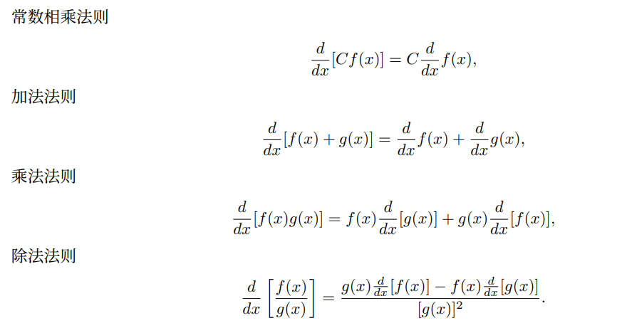  
前提是f、g均可微，C为常熟

### 偏导数
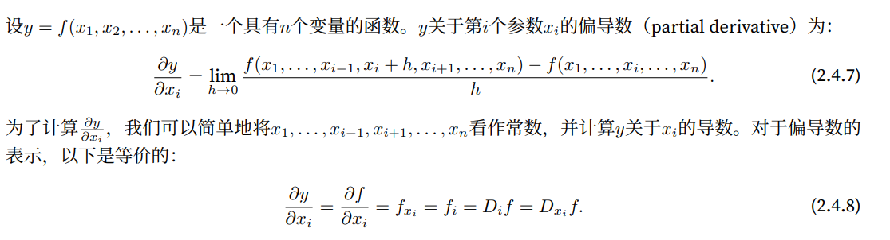

### 梯度
梯度讲解视频：[https://www.bilibili.com/video/BV1sW411775X](https://www.bilibili.com/video/BV1sW411775X)
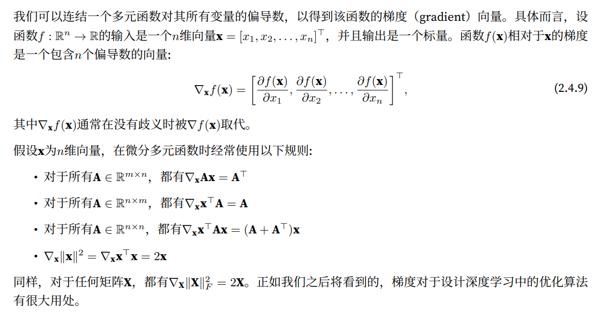

```python
import torch

print('1.自动梯度计算')
x = torch.arange(4.0, requires_grad=True)  # 1.将梯度附加到想要对其计算偏导数的变量
print('x:', x)
print('x.grad:', x.grad)
y = 2 * torch.dot(x, x)  # 2.记录目标值的计算
print('y:', y)
y.backward()  # 3.执行它的反向传播函数
print('x.grad:', x.grad)  # 4.访问得到的梯度
print('x.grad == 4*x:', x.grad == 4 * x)

## 计算另一个函数
x.grad.zero_()
y = x.sum()
print('y:', y)
y.backward()
print('x.grad:', x.grad)

# 非标量变量的反向传播
x.grad.zero_()
print('x:', x)
y = x * x
y.sum().backward()
print('x.grad:', x.grad)

def f(a):
    b = a * 2
    print(b.norm())
    while b.norm() < 1000:  # 求L2范数：元素平方和的平方根
        b = b * 2
    if b.sum() > 0:
        c = b
    else:
        c = 100 * b
    return c

print('2.Python控制流的梯度计算')
a = torch.tensor(2.0)  # 初始化变量
a.requires_grad_(True)  # 1.将梯度赋给想要对其求偏导数的变量
print('a:', a)
d = f(a)  # 2.记录目标函数
print('d:', d)
d.backward()  # 3.执行目标函数的反向传播函数
print('a.grad:', a.grad)  # 4.获取梯度
```
### 链式法则
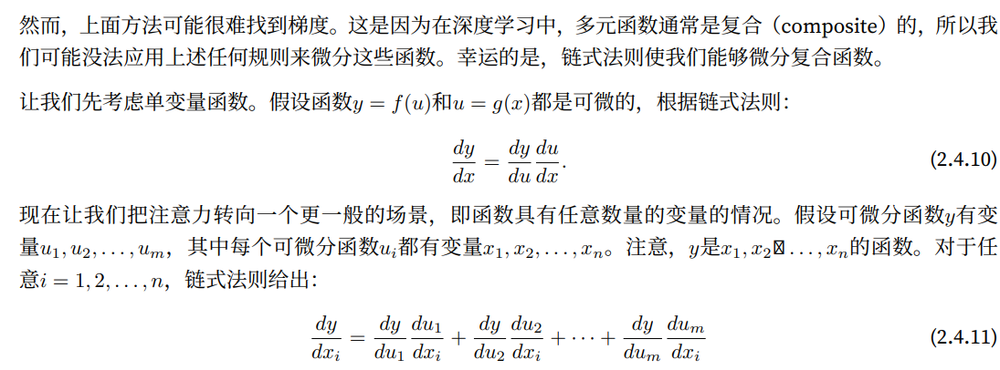