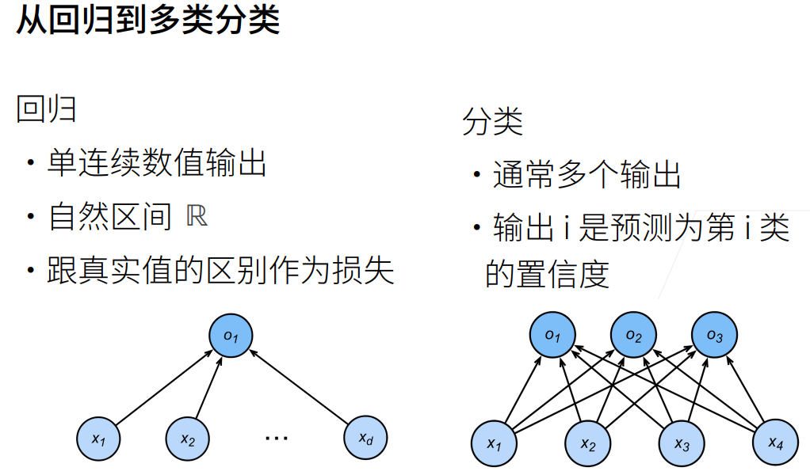
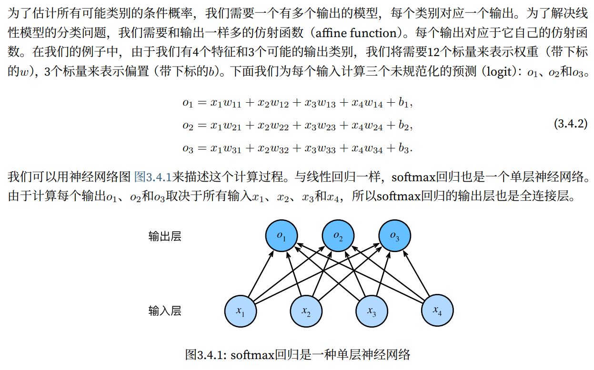
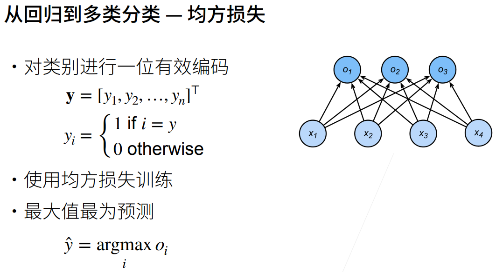
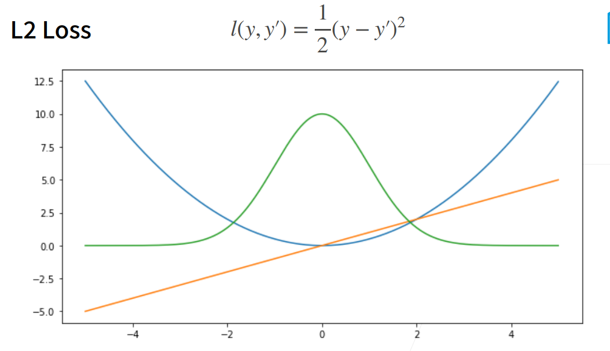
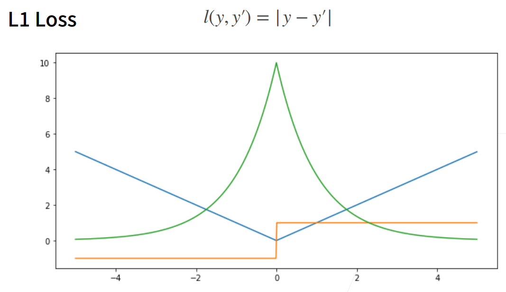
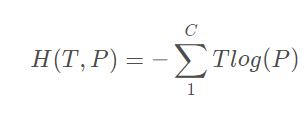

# SoftMax

### 疑点难点：
损失函数、代码实现
### 理解
* softmax运算获取一个向量并将其映射为概率。  
* softmax回归适用于分类问题，它使用了softmax运算中输出类别的概率分布。  
* 交叉熵是一个衡量两个概率分布之间差异的度量
### 回归与分类
* 回归估计一个连续值  
* 分类预测一个离散类别
* 
### 网络架构

权重放到3*4的矩阵中，对于给定数据样本的特征**x向量**，我们的输出是由权重与输⼊特征进⾏矩阵-向量乘法再加上偏置b得到的。
### 从回归过渡到多类分类
1. 均方损失

2. 无校验比例

3. 校验比例

### 损失函数
两种损失函数：  
L2 Loss：  
L1 Loss：  
### 交叉熵
交叉熵用来判定实际的输出与期望的输出的接近程度  
交叉熵刻画的是实际输出（概率）与期望输出（概率）的距离，也就是交叉熵的值越小，两个概率分布就越接近。  
在二分类的基础上，交叉熵有更通用的表达形式，因为二分类只是分类问题的特例，更多的还是多分类问题。通用的交叉熵要对应Softmax函数使用，所以有时候Softmax+交叉熵也被称为Softmax损失函数，它表达式为：

T TT为样本的期望输出，它是一个one-hot编码形式，比如二分类时label=0，one-hot应该为[1,0]；三分类时label=0，one-hot应该为[1,0,0]。

### 模型评估
在训练softmax回归模型后，给出任何样本特征，通常我们使用预测概率最高的类别作为输出类别。  
如果预测与实际类别（标签）一致，则预测是正确的。使用精度（accuracy）来评估模型的性能。    
精度等于正确预测数与预测总数之间的比率。