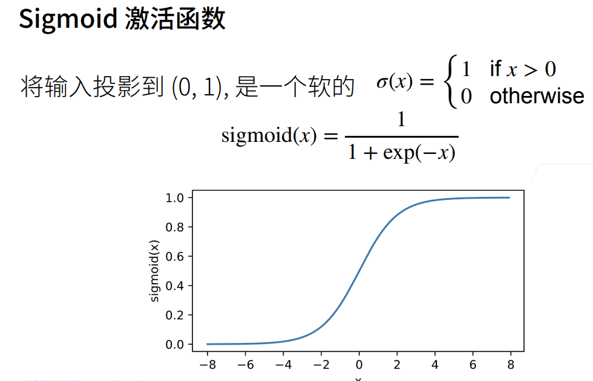

# 感知机
## 单层感知机
### 什么是感知机
  
* 感知机为二分类，非黑即白  
* softmax多分类，输出可能为某类别的概率  
### 感知机训练算法

这里的判断负负得正、正正得正。得正说明训练正常。同时也引出了异或的问题
### 收敛定理

### 异或问题

可用多层感知机解决此问题
## 多层感知机
### 解决异或问题

蓝黄两个分类器，先蓝后黄
### 隐藏层

1. 每个图层都可以应用您想要的任何函数到前一层（通常是线性变换，然后是压缩非线性）。  
2. 隐藏层的工作是将输入转换为输出层可以使用的东西。  
3. 输出层将隐藏层激活转换为您希望输出所在的任何比例。 
### 激活函数

