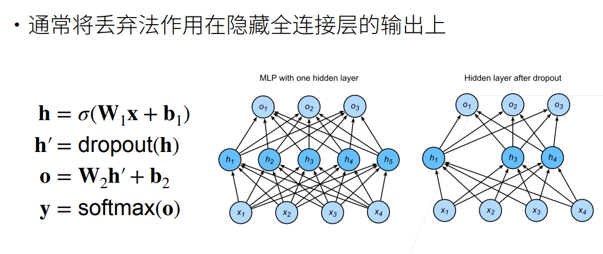
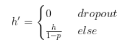
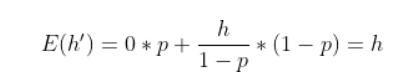

# Dropout暂退法
暂退法的思想是在隐藏层中丢弃某些单元，以减少模型对某些特征的依赖。

删除了h2和h5，因此输出的计算不再依赖于h2或h5，并且它们各⾃的梯度在执⾏反向传播时也会消失。这样，输出层的计算不能过度依赖于h1, . . . , h5的任何⼀个元素。
### 实现神经元的丢弃  
假设某个神经元被丢弃的概率为p，那么该神经元的输出可以表示为：    
    
计算h{}'期望值:    
    
这种插入方式使得在插入了噪声后，每一层的期望等于没有插入噪声时的值。   
---
  