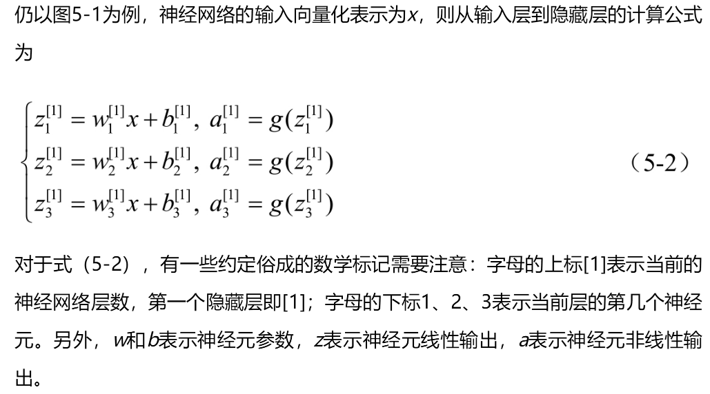
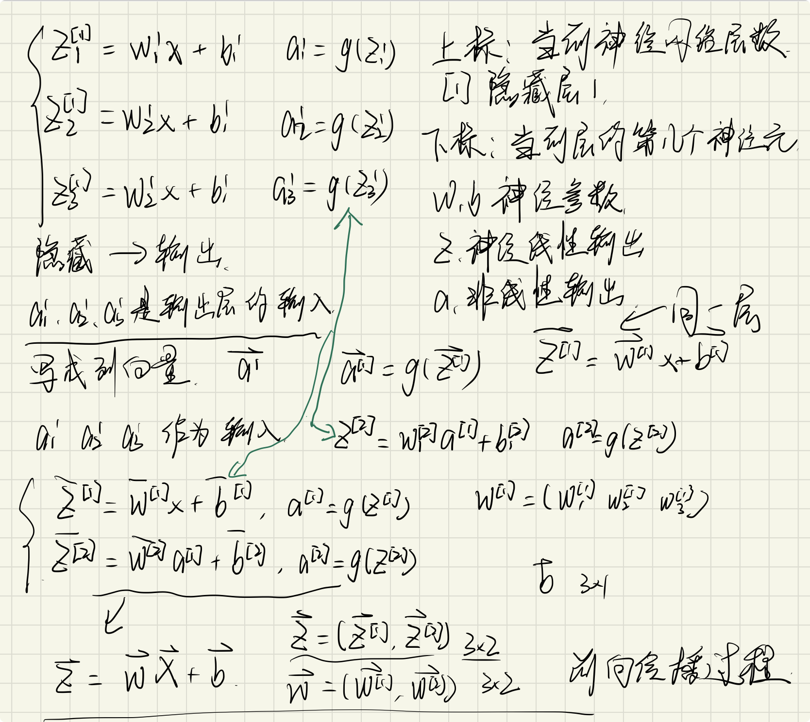
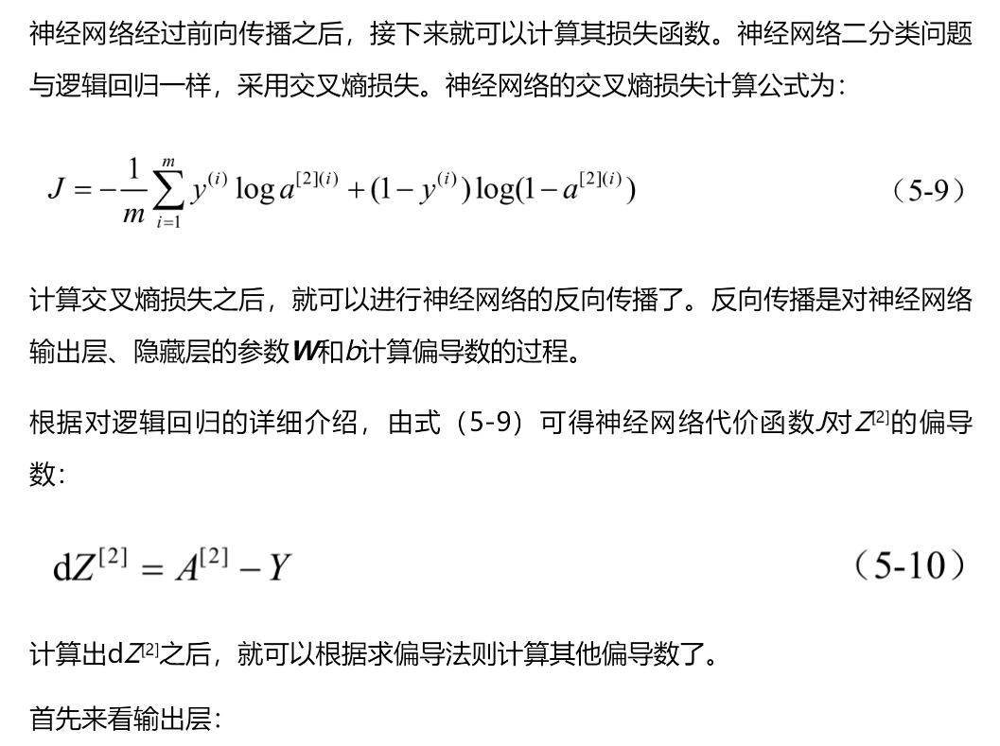
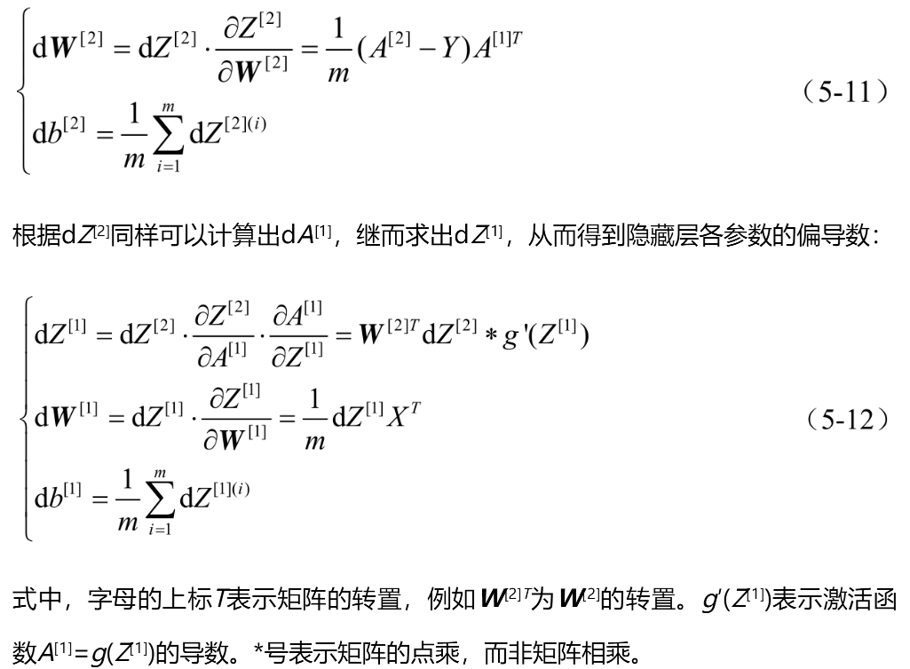
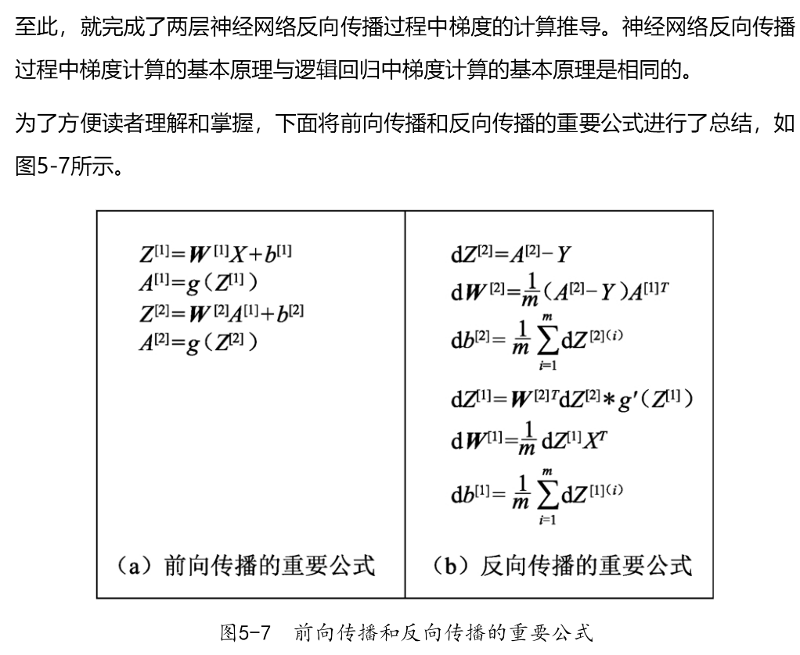

# 前向传播、反向传播
### 前向传播
前向传播过程，即神经网络从输入层到输出层的计算过程。
  
前向传播过程

### 反向传播
反向传播（backward propagation或backpropagation）指的是计算神经网络参数梯度的方法。  
该方法**根据微积分中的链式规则，按相反的顺序从输出层到输入层遍历网络。** 该算法**存储了计算某些参数梯度时所需的任何中间变量（偏导数）**。  
神经网络经过前向传播之后，接下来就可以计算其损失函数。

看不懂反向传播是咋计算的。。。。。。。。

### 前向传播与反向传播
深层神经网络前向传播过程的基本原理与浅层神经网络前向传播过程的基本原理是一致的。前向传播和反向传播相互依赖。**对于前向传播，我们沿着依赖的方向遍历计算图并计算其路径上的所有变量。 然后将这些用于反向传播，其中计算顺序与计算图的相反。**
在前向传播期间计算正则项取决于模型参数W1和W2的当前值。 它们是由优化算法根据最近迭代的反向传播给出的。 另一方面，反向传播期间参数的梯度计算， 取决于由前向传播给出的隐藏变量的当前值。