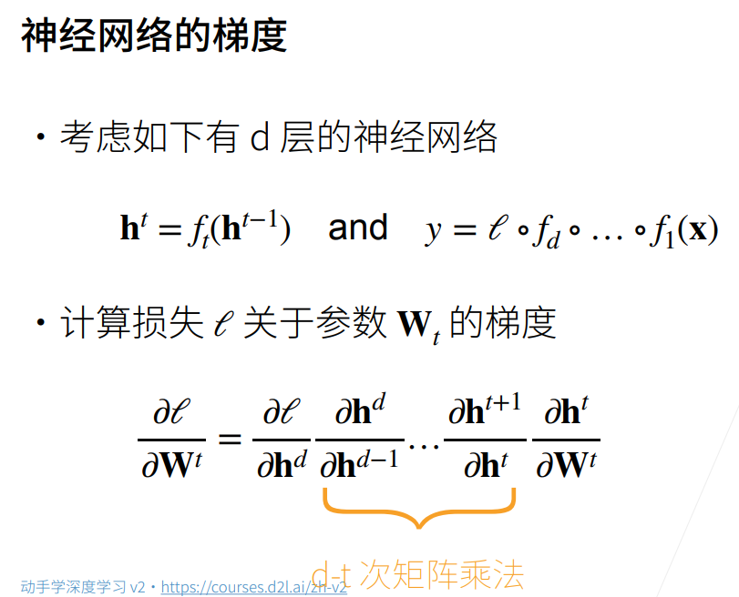
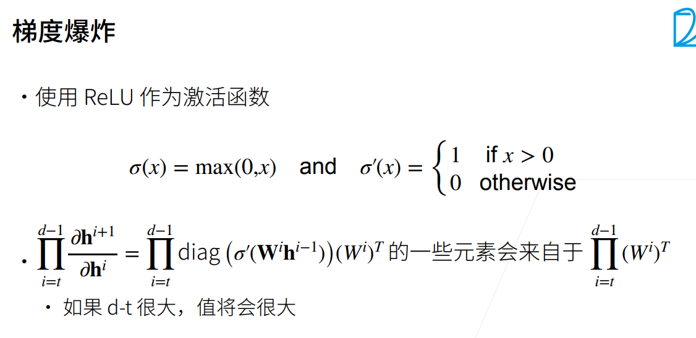
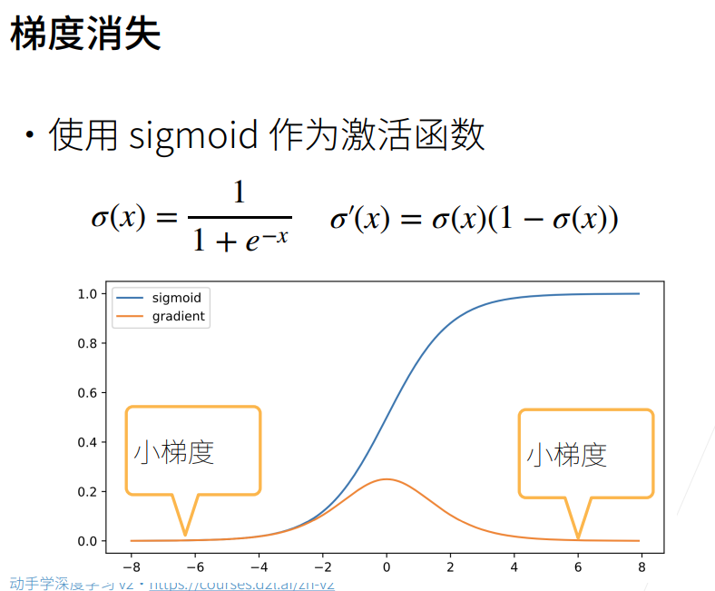
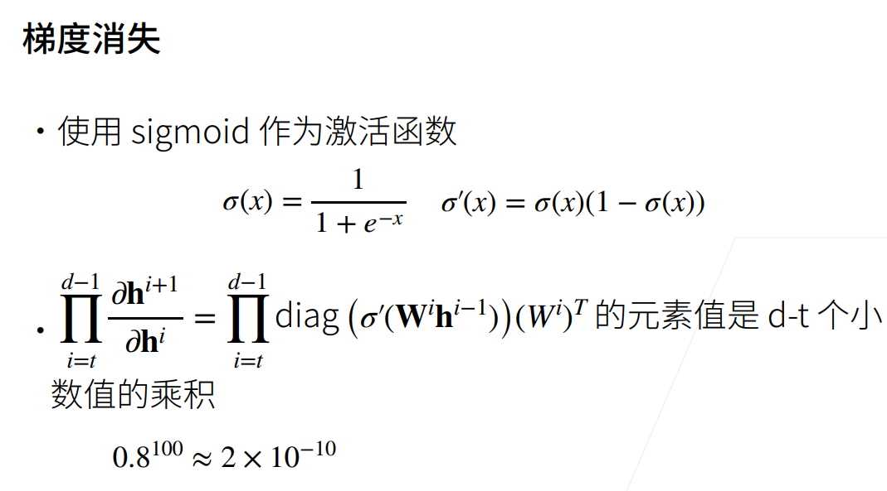
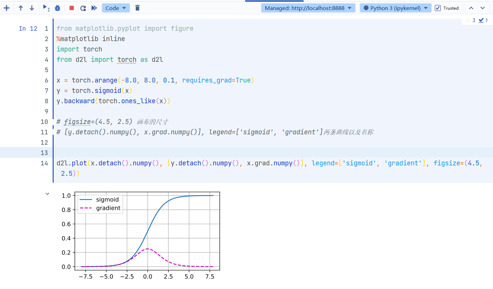
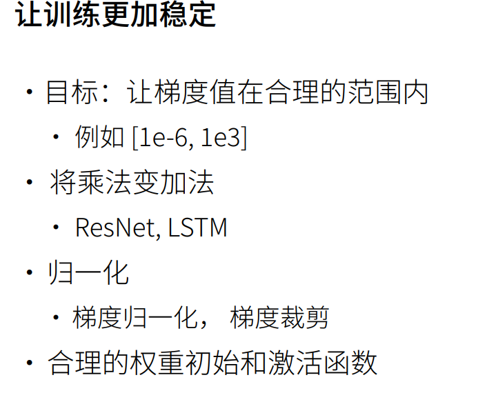
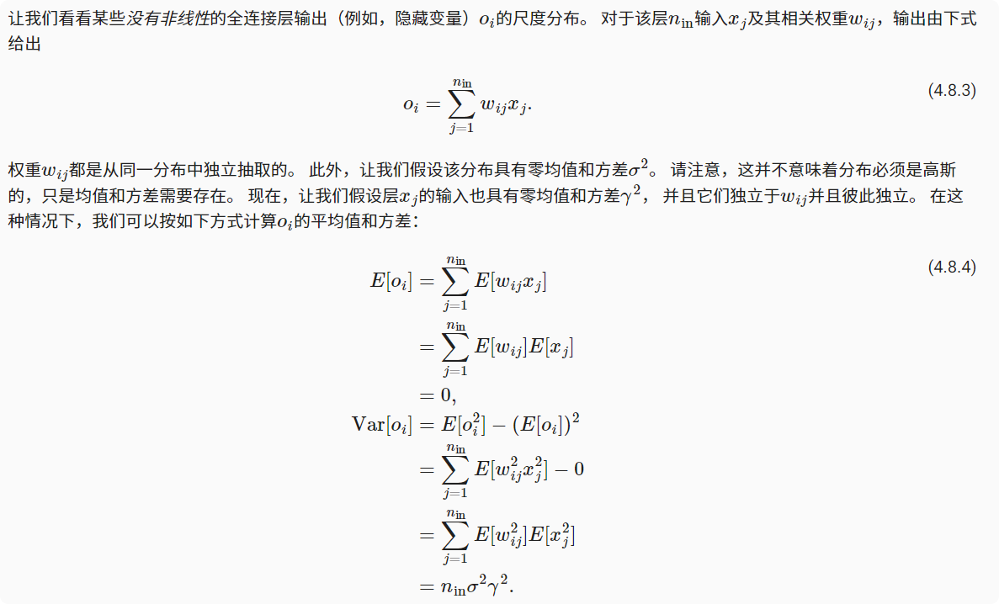
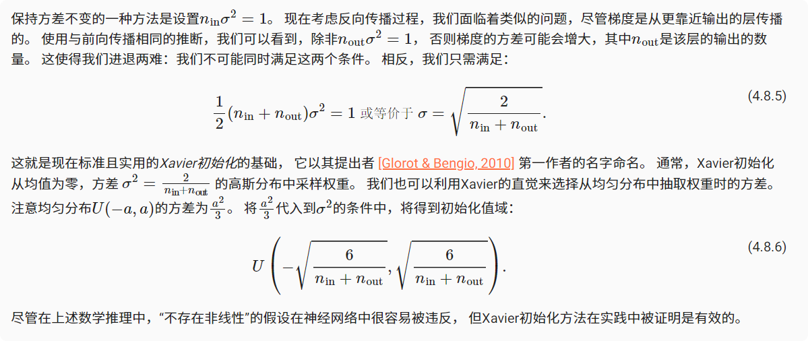

## 数值稳定性与参数初始化

### 神经网络的梯度

### 数值稳定性常见两个问题
1. 梯度爆炸：梯度是一个大于1的数，一百层求梯度之后会是一个很大的数字  
  
  
2. 梯度消失：与上面相反，当梯度小于1的时候……



```python
from matplotlib.pyplot import figure
%matplotlib inline
import torch
from d2l import torch as d2l

x = torch.arange(-8.0, 8.0, 0.1, requires_grad=True)
y = torch.sigmoid(x)
y.backward(torch.ones_like(x))

# figsize=(4.5, 2.5) 画布的尺寸
# [y.detach().numpy(), x.grad.numpy()], legend=['sigmoid', 'gradient']两条曲线以及名称


d2l.plot(x.detach().numpy(), [y.detach().numpy(), x.grad.numpy()], legend=['sigmoid', 'gradient'], figsize=(4.5, 2.5))

```

### 小结
1. 数值过大或者过小会导致数值问题
2. 常发生在深度模型中，因为会对n个数累乘

## 参数初始化

原因：解决（或至少减轻）上述问题的一种方法是进行参数初始化， 优化期间的注意和适当的正则化也可以进一步提高稳定性。

### 默认初始化
使用正态分布来初始化权重值。如果我们不指定初始化方法，框架将使用默认的随机初始化方法，对于中等难度的问题，这种方法通常很有效。
### Xavier初始化


### 小结
* 梯度消失和梯度爆炸是深度网络中常见的问题。在参数初始化时需要非常小心，以确保梯度和参数可以得到很好的控制。

* 需要用启发式的初始化方法来确保初始梯度既不太大也不太小。

* ReLU激活函数缓解了梯度消失问题，这样可以加速收敛。

* 随机初始化是保证在进行优化前打破对称性的关键。

* Xavier初始化表明，对于每一层，输出的方差不受输入数量的影响，任何梯度的方差不受输出数量的影响。