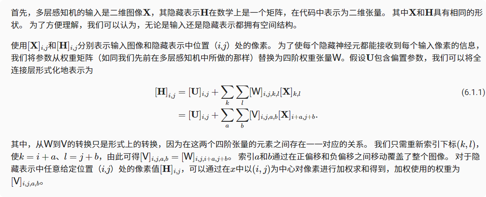
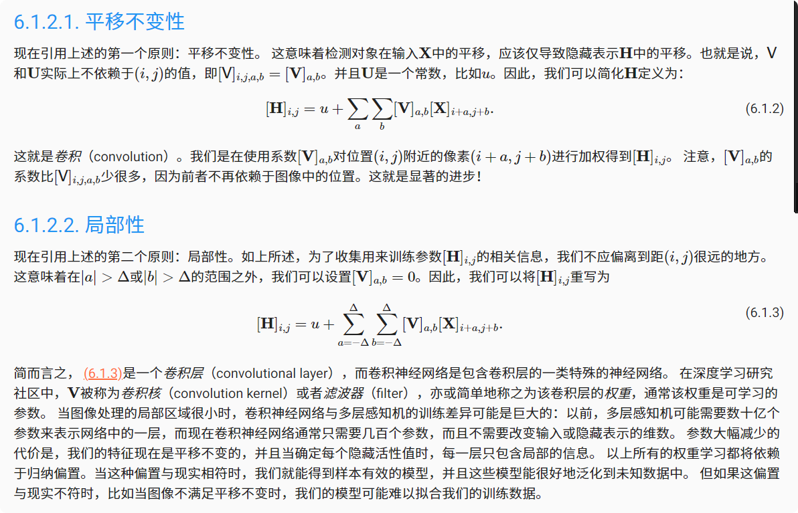
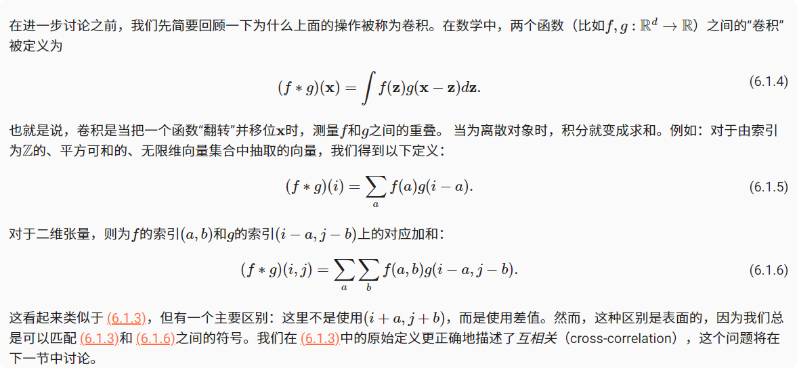
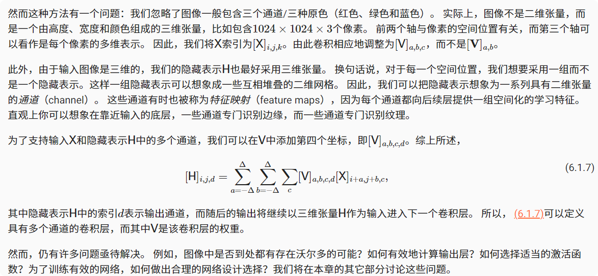

# 从全连接层到卷积

多层感知机适合处理表格数据，其中行对应样本，列对应特征。对于表格数据，我们寻找的模式可能涉及特征之间的交互，但是不能预先假设任何与特征交互相关的先验结构。 积神经网络（convolutional neural networks，CNN）是机器学习利用自然图像中一些已知结构的创造性方法。
## 不变性
* 平移不变性（translation invariance）：不管检测对象出现在图像中的哪个位置，神经网络的前面几层应该对相同的图像区域具有相似的反应，即为“平移不变性”。

* 局部性（locality）：神经网络的前面几层应该只探索输入图像中的局部区域，而不过度在意图像中相隔较远区域的关系，这就是“局部性”原则。最终，可以聚合这些局部特征，以在整个图像级别进行预测。
## 多层感知机的限制

## 卷积

## 通道

## 小结
* 图像的平移不变性使我们以相同的方式处理局部图像，而不在乎它的位置。
* 局部性意味着计算相应的隐藏表示只需一小部分局部图像像素。
* 在图像处理中，卷积层通常比全连接层需要更少的参数，但依旧获得高效用的模型。
* 卷积神经网络（CNN）是一类特殊的神经网络，它可以包含多个卷积层。
* 多个输入和输出通道使模型在每个空间位置可以获取图像的多方面特征。