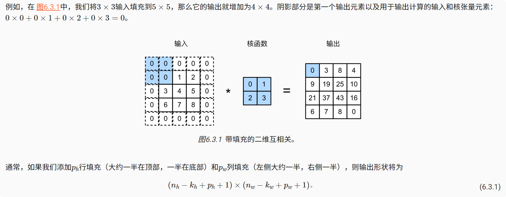
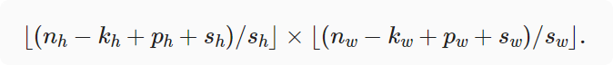
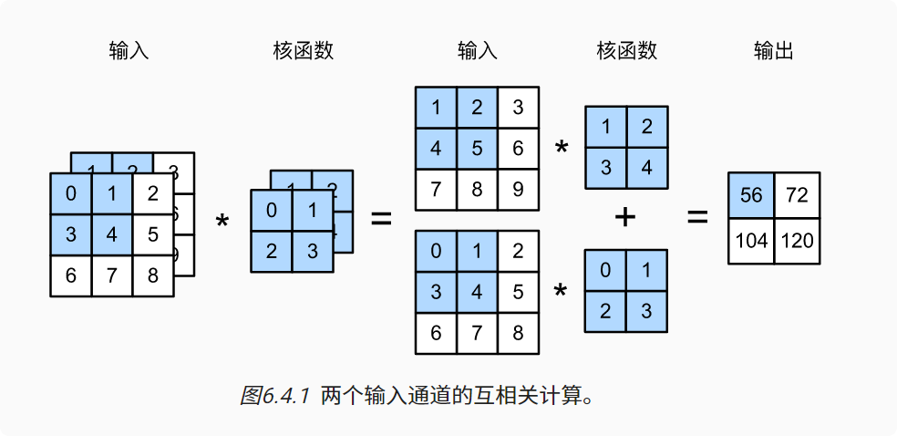
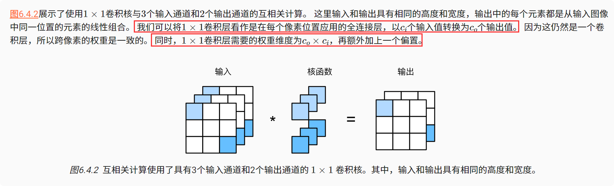

# 填充、步幅、多输入多输出通道
## 填充
### 为什么要填充
由于我们通常**使用小卷积核，因此对于任何单个卷积，我们可能只会丢失几个像素**。 但随着我们应用许多连续卷积层，累积丢失的像素数就多了。 解决这个问题的简单方法即为填充（padding）。
### 填充定义以及举例
在输入图像的边界填充元素（通常填充元素是0）。


输出大小：（输入-卷积核+步幅+填充）/ 步幅
```python
import torch

from torch import nn


# 重定义一个计算卷积层的函数
# 初始化卷积层权重，对输入输出提高和缩减相应的维数
def comp_conv2d(conv2d, X):

    X = X.reshape((1, 1) + X.shape) # 这里的（1，1）表示批量大小和通道数都是1
    Y = conv2d(X)
    # 省略前两个维度：批量大小和通道
    return Y.reshape(Y.shape[2:])


conv2d = nn.Conv2d(1, 1, kernel_size=5, padding=1)
X = torch.rand(size=(8, 8))
print(comp_conv2d(conv2d, X).shape)

X = torch.rand(size=(8, 8))
conv2d = nn.Conv2d(1, 1, kernel_size=(5, 3), padding=(2, 1))
print(comp_conv2d(conv2d, X).shape)

print("--------------------步幅---------------------")
X = torch.rand(size=(8, 8))
conv2d = nn.Conv2d(1, 1, kernel_size=(3,5),padding=(0,1),stride=(3,4))
print(comp_conv2d(conv2d, X).shape)  # 取整
```
输出结果：
```python
torch.Size([6, 6])
torch.Size([8, 8])
--------------------步幅---------------------
torch.Size([2, 2])
```
### 填充与步幅小结
* 填充可以增加输出的高度和宽度。这常用来使输出与输入具有相同的高和宽。

* 步幅可以减小输出的高和宽，例如输出的高和宽仅为输入的高和宽的（是一个大于的整数）。

* 填充和步幅可用于有效地调整数据的维度。

## 多输入多输出通道
### 多通道输入
当输入包含多个通道时，需要构造一个与输入数据具有相同输入通道数的卷积核，以便与输入数据进行互相关运算。

代码实现
```python
import torch
from d2l import torch as d2l
def corr2d_multi_in(X, K):
    """
    多输入通道计算
    :param X:
    :param K:
    :return:
    """
    # 先遍历“X”和“K”的第0个维度（通道维度），再把它们加在一起
    return sum(d2l.corr2d(x, k) for x, k in zip(X, K))

X = torch.tensor([[[0.0, 1.0, 2.0], [3.0, 4.0, 5.0], [6.0, 7.0, 8.0]],
                  [[1.0, 2.0, 3.0], [4.0, 5.0, 6.0], [7.0, 8.0, 9.0]]])
K = torch.tensor([[[0.0, 1.0], [2.0, 3.0]], [[1.0, 2.0], [3.0, 4.0]]])
print(corr2d_multi_in(X, K))
输出：
tensor([[ 56.,  72.],
        [104., 120.]])

```
### 多通道输出
在最流行的神经网络架构中，随着神经网络层数的加深，通常会增加输出通道的维数，通过减少空间分辨率以获得更大的通道深度。  
将**每个通道看作是对不同特征的响应**。而现实可能更为复杂一些，因为每个通道不是独立学习的，而是为了共同使用而优化的。因此，多输出通道并不仅是学习多个单通道的检测器。  
在互相关运算中，每个输出通道**先获取所有输入通道**，**再以对应该输出通道的卷积核计算出结果**。
```python
def corr2d_multi_in_out(X, K):
    """
    计算多通道输出的互相关
    :param X:
    :param K:
    :return:
    """
    return torch.stack([corr2d_multi_in(X, k) for k in K], 0)


K = torch.stack((K, K + 1, K + 2), 0)
print(K.shape)
print(corr2d_multi_in_out(X, K))

输出：
torch.Size([3, 2, 2, 2])
tensor([[[ 56.,  72.],
         [104., 120.]],

        [[ 76., 100.],
         [148., 172.]],

        [[ 96., 128.],
         [192., 224.]]])
```
### 1×1卷积
1×1卷积，即Kh = Kw = 1。 1×1卷积的唯一计算发生在通道上。 
卷积的**本质是有效提取相邻像素间的相关特征**

```python
def corr2d_multi_in_out_1x1(X, K):
    c_i, h, w = X.shape
    c_o = K.shape[0]
    X = X.reshape((c_i, h * w))
    K = K.reshape((c_o, c_i))
    # 全连接层中的矩阵乘法
    Y = torch.matmul(K, X)
    return Y.reshape((c_o, h, w))


X = torch.normal(0, 1, (3, 3, 3))
K = torch.normal(0, 1, (2, 3, 1, 1))

Y1 = corr2d_multi_in_out_1x1(X, K)
print(Y1)
Y2 = corr2d_multi_in_out(X, K)
print(Y2)
assert float(torch.abs(Y1 - Y2).sum()) < 1e-6

输出：
tensor([[[-1.9456,  0.7056,  0.1425],
         [-0.8588,  0.6740, -0.5521],
         [-0.5984, -1.6677, -1.9896]],

        [[-1.9540,  0.6081,  0.0851],
         [-1.5035,  1.1316,  0.8333],
         [-1.0508, -3.2961, -1.1431]]])
tensor([[[-1.9456,  0.7056,  0.1425],
         [-0.8588,  0.6740, -0.5521],
         [-0.5984, -1.6677, -1.9896]],

        [[-1.9540,  0.6081,  0.0851],
         [-1.5035,  1.1316,  0.8333],
         [-1.0508, -3.2961, -1.1431]]])

```
### 多输入多输出通道小结
* 多输入多输出通道可以用来扩展卷积层的模型。

* 当以每像素为基础应用时，卷积层相当于全连接层。

* 1×1卷积层通常用于调整网络层的通道数量和控制模型复杂性。
