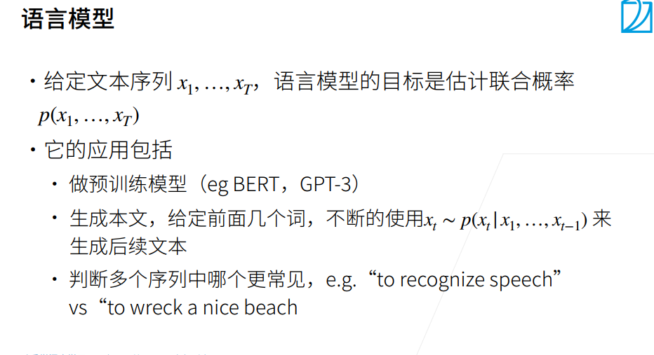
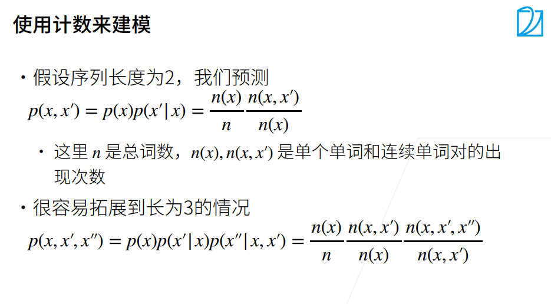
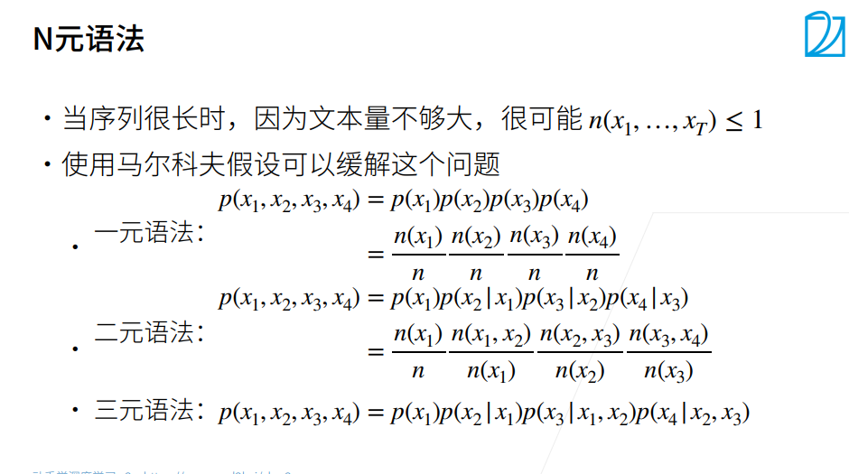

# 语言模型和数据集
### 语言模型

用途：
1. 预测文本出现的概率
2. 生成文本
3. 判断哪个序列更常见

### 小结
* 语言模型是自然语言处理的关键。

* n元语法通过截断相关性，为处理长序列提供了一种实用的模型。

* 长序列存在一个问题：它们很少出现或者从不出现。

* 齐普夫定律支配着单词的分布，这个分布不仅适用于一元语法，还适用于其他n元语法。

* 通过拉普拉斯平滑法可以有效地处理结构丰富而频率不足的低频词词组。

* 读取长序列的主要方式是随机采样和顺序分区。在迭代过程中，后者可以保证来自两个相邻的小批量中的子序列在原始序列上也是相邻的。