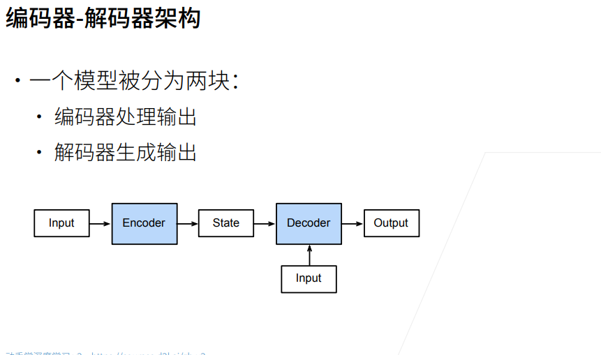

# 编码器-解码器结构
机器翻译是序列转换模型的一个核心问题， 其输入和输出都是长度可变的序列。 为了处理这种类型的输入和输出， 我们可以设计一个包含两个主要组件的架构： 第一个组件是一个编码器（encoder）： 它接受一个长度可变的序列作为输入， 并将其转换为具有固定形状的编码状态。 第二个组件是解码器（decoder）： 它将固定形状的编码状态映射到长度可变的序列。
### 架构


### 代码实现
```python
from torch import nn

# 在编码器接口中，我们只指定长度可变的序列作为编码器的输入X。 任何继承这个Encoder 基类的模型将完成代码实现。
#@save
class Encoder(nn.Module):
    """编码器-解码器架构的基本编码器接口"""
    def __init__(self, **kwargs):
        super(Encoder, self).__init__(**kwargs)

    def forward(self, X, *args):
        raise NotImplementedError

# init_state函数， 用于将编码器的输出（enc_outputs）转换为编码后的状态
    
#@save
class Decoder(nn.Module):
    """编码器-解码器架构的基本解码器接口"""
    def __init__(self, **kwargs):
        super(Decoder, self).__init__(**kwargs)

    def init_state(self, enc_outputs, *args):
        raise NotImplementedError

    def forward(self, X, state):
        raise NotImplementedError

# “编码器-解码器”架构包含了一个编码器和一个解码器， 并且还拥有可选的额外的参数。 在前向传播中，编码器的输出用于生成编码状态， 这个状态又被解码器作为其输入的一部分。
#@save
class EncoderDecoder(nn.Module):
    """编码器-解码器架构的基类"""
    def __init__(self, encoder, decoder, **kwargs):
        super(EncoderDecoder, self).__init__(**kwargs)
        self.encoder = encoder
        self.decoder = decoder

    def forward(self, enc_X, dec_X, *args):
        enc_outputs = self.encoder(enc_X, *args)
        dec_state = self.decoder.init_state(enc_outputs, *args)
        return self.decoder(dec_X, dec_state)
```

### 小结
* “编码器－解码器”架构可以将长度可变的序列作为输入和输出，因此适用于机器翻译等序列转换问题。

* 编码器将长度可变的序列作为输入，并将其转换为具有固定形状的编码状态。

* 解码器将具有固定形状的编码状态映射为长度可变的序列。