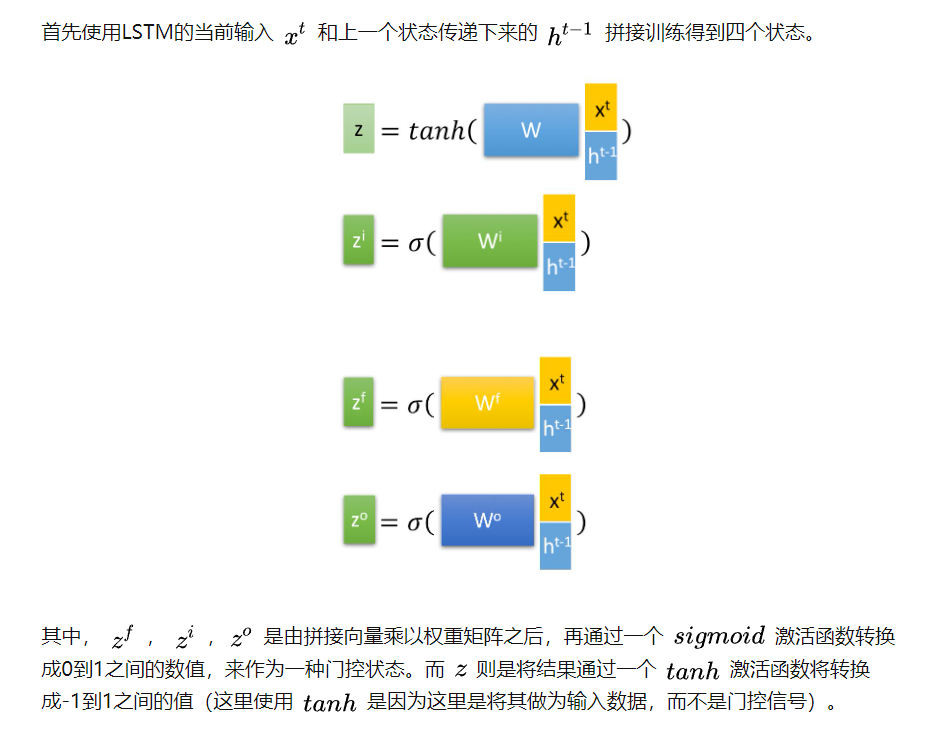

# 长短期记忆网络（LSTM）
长短期存储器（long short-term memory，LSTM） 是一种特殊的RNN，主要是为了解决长序列训练过程中的梯度消失和梯度爆炸问题。简单来说，就是相比普通的RNN，LSTM能够在更长的序列中有更好的表现。
### 门控记忆元
* 为了控制记忆元，我们需要许多门。
* 其中一个门用来从单元中输出条目，我们将其称为输出门（output gate）
* 一个门用来决定何时将数据读入单元，我们将其称为输入门（input gate）
* 一种机制来重置单元的内容，由遗忘门（forget gate）来管理。将值向0减少

### LSTM结构

### 小结
* 长短期记忆网络有三种类型的门：输入门、遗忘门和输出门。
* 长短期记忆网络的隐藏层输出包括“隐状态”和“记忆元”。只有隐状态会传递到输出层，而记忆元完全属于内部信息。
* 长短期记忆网络可以缓解梯度消失和梯度爆炸。