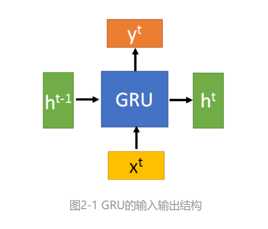
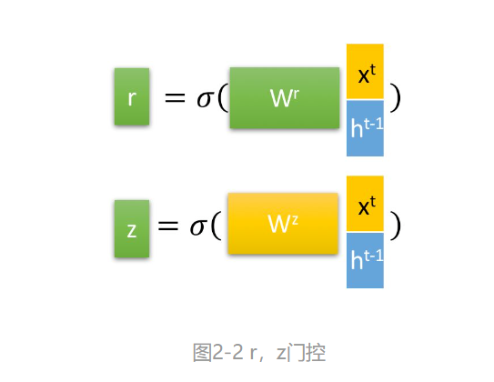
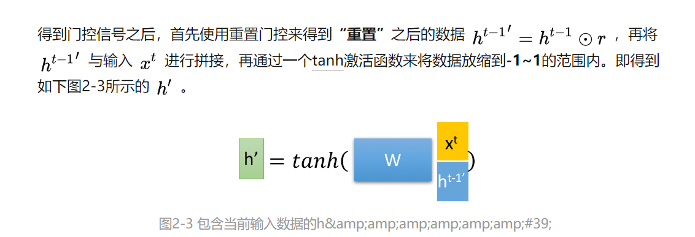
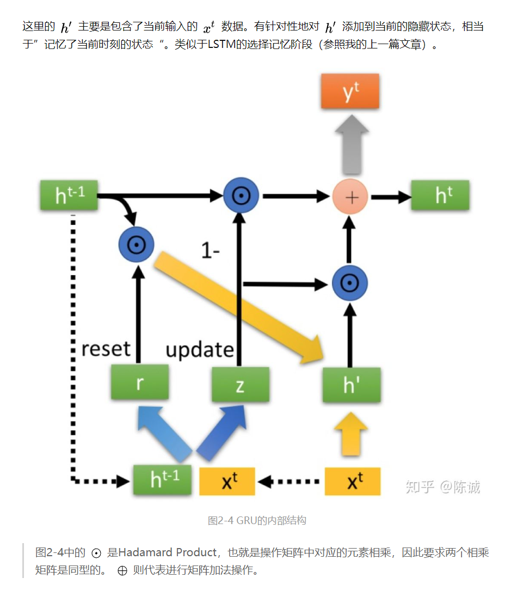

# 门控循环单元（GRU）
GRU（Gate Recurrent Unit）是循环神经网络（Recurrent Neural Network, RNN）的一种。

### GRU输入输出结构

GRU的输入输出结构与普通的RNN是一样的。

### GRU的内部结构

首先，我们先通过上一个传输下来的状态 h( t-1) 和当前节点的输入xt来获取两个门控状态。  
其中 r 控制重置的门控（reset gate）， z为控制更新的门控（update gate）。  

### 小结
* 门控循环神经网络可以更好地捕获时间步距离很长的序列上的依赖关系。
* 重置门有助于捕获序列中的短期依赖关系。
* 更新门有助于捕获序列中的长期依赖关系。
* 重置门打开时，门控循环单元包含基本循环神经网络；更新门打开时，门控循环单元可以跳过子序列。