# 机器学习-深度学习介绍
## 机器学习基本概念
**机器学习目标：**
寻找一个函数function，这个函数往往是人类计算起来很复杂的  
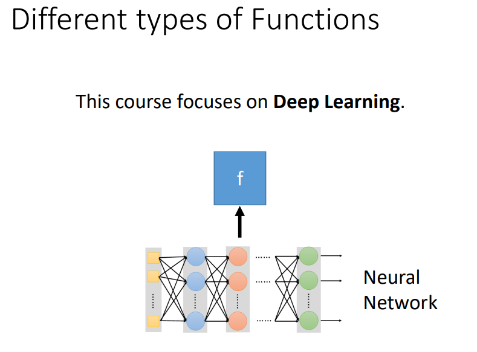
**输入：**
向量、矩阵、序列  
**输出：**
数值、类别、文档  
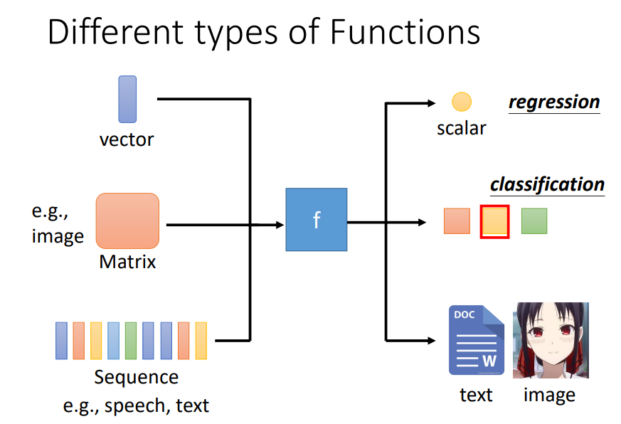
**任务：**
* Regression（回归）：函数输出一个标量
* Clssification（分类）：给一些类别，函数输出正确的类别 。阿尔法狗可以看作19×19类别的分类
* Structured learning（结构化学习）：创造一些结构（图片，文档）

**寻找function步骤：**
1、写出带有未知参数的函数 Model y+b + wx1 w- 权重 b-偏差
2、从训练数据中定义损失 L（b，w）
3、优化：找一个w*，b*，使得L最小

## 章节课程介绍
### HW1: COVID-19 Case Prediction
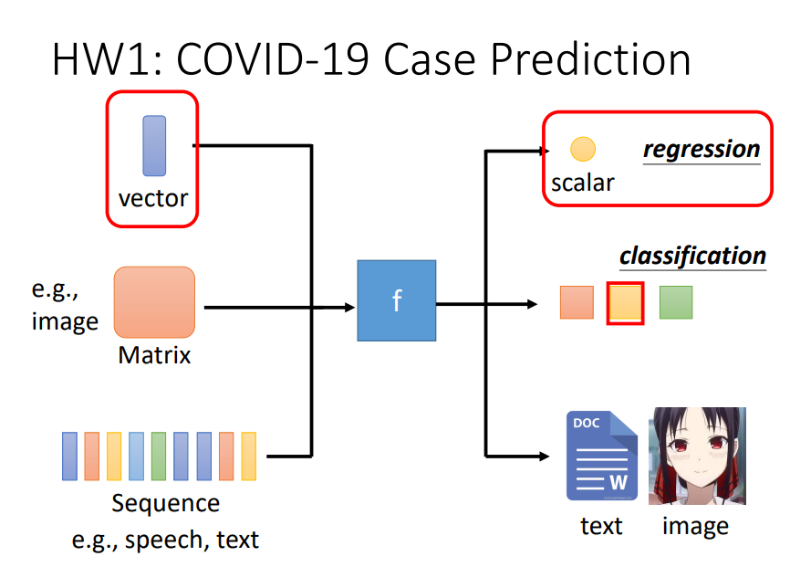

### HW2: Phoneme Classification
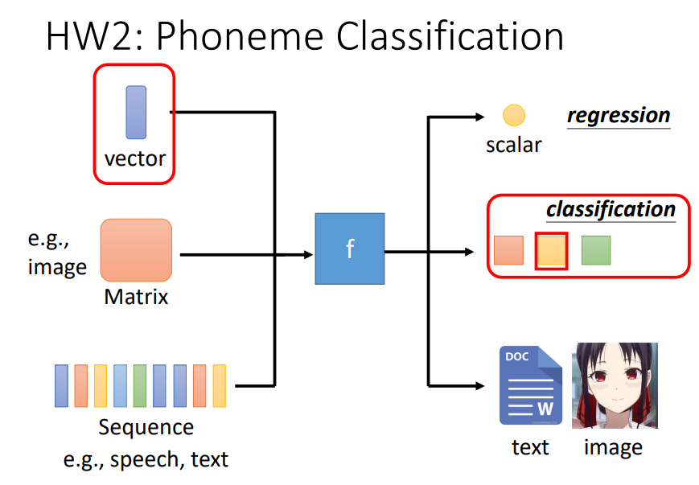

### HW3: Image Classification
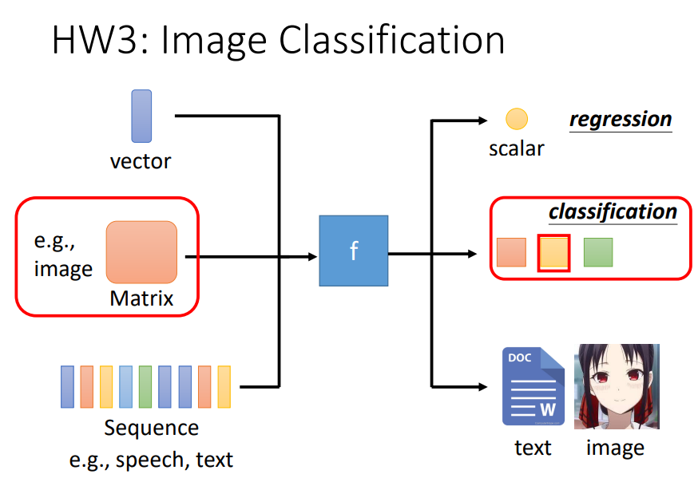

### HW4: Speaker Classification
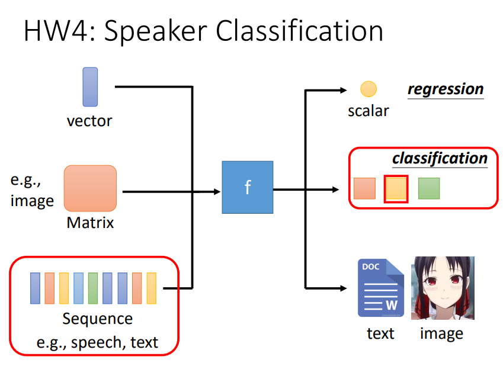

### HW5: Machine Translation
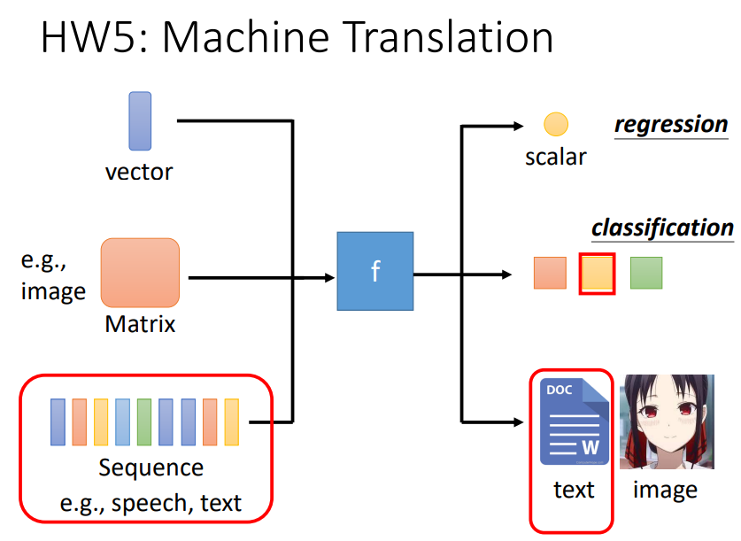

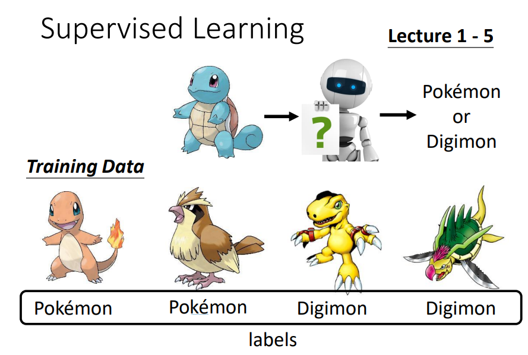
**监督学习：**
在训练模型之前先有一些基本功，可以理解为预训练模型，事先已经训练好了权重等参数。用于抽取特征。

### HW6: Anime Face Generation
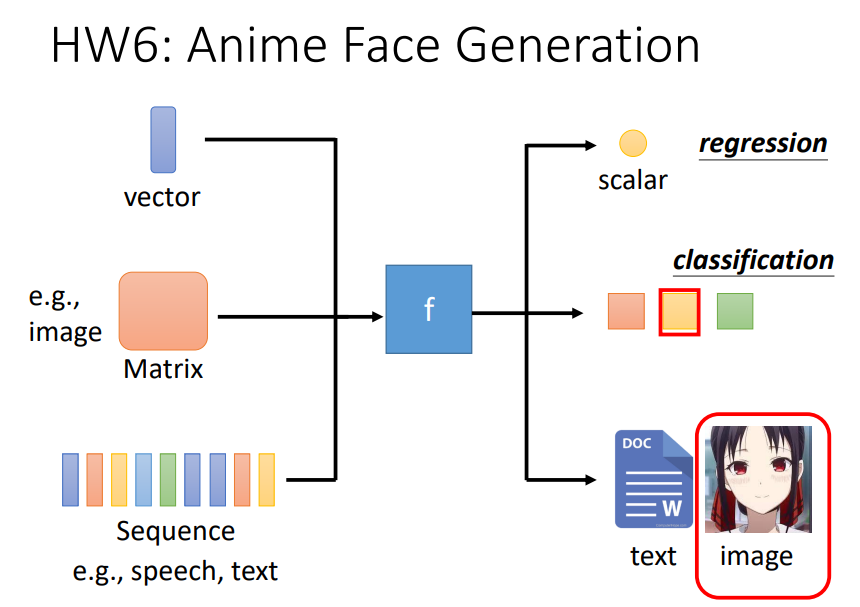

### Lecture 7: Self-supervised Learning
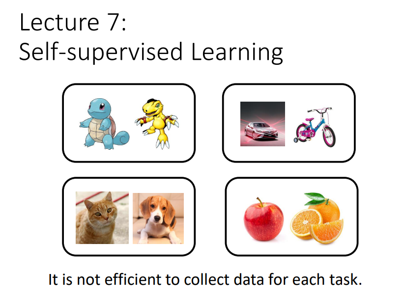
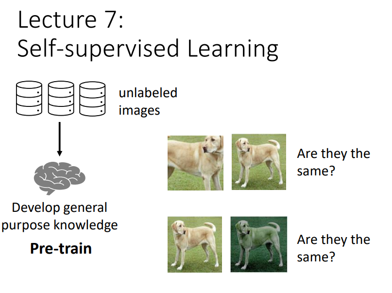
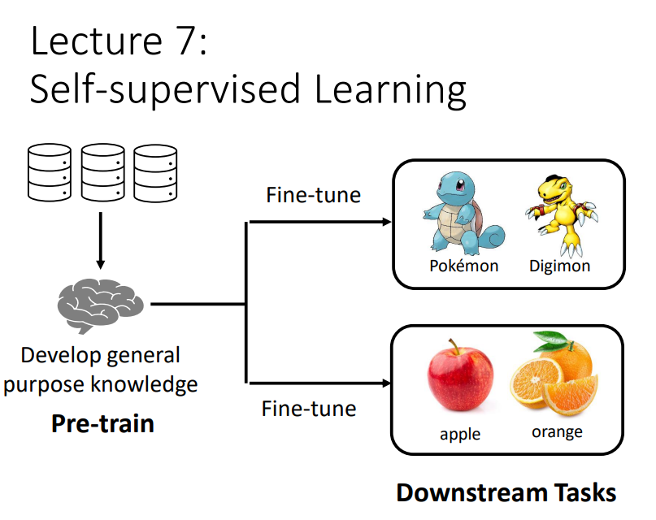
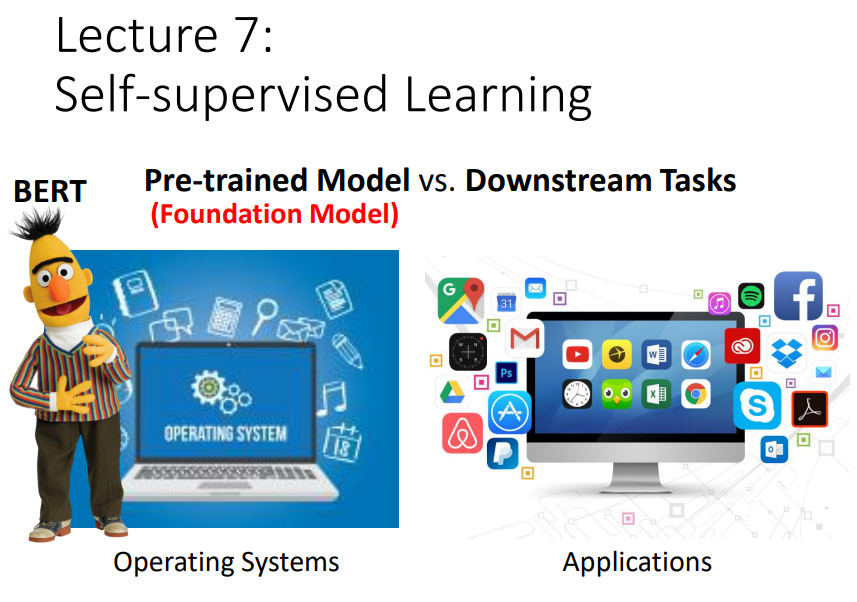

### Lecture 8: Anomaly Detection
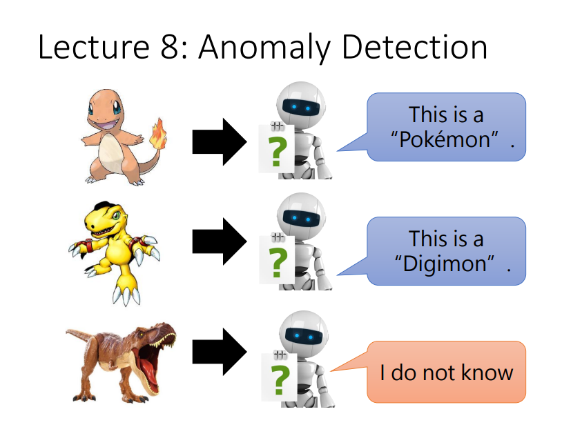

### Lecture 9: Explainable AI 
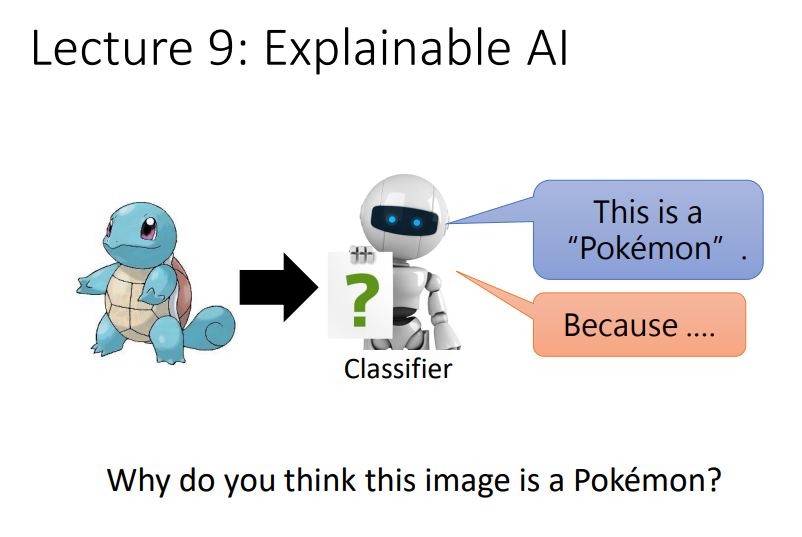

### Lecture 10: Model Attack
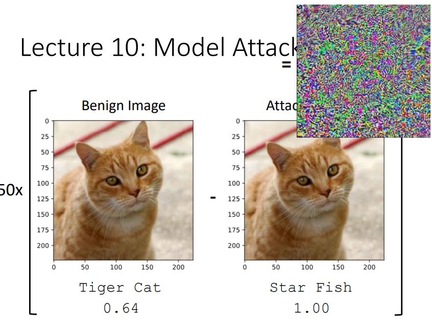

### Lecture 11: Domain Adaptation 
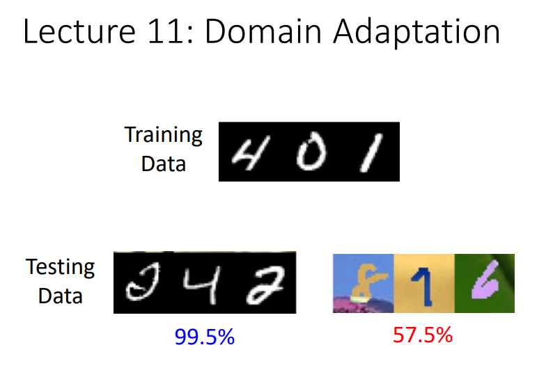

### Lecture 12: Reinforcement Learning (RL)

### Lecture 13: Network Compression
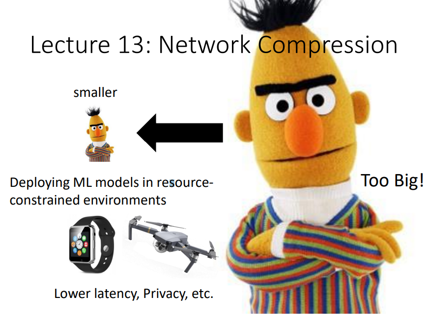

### Lecture 14: Life-long Learning

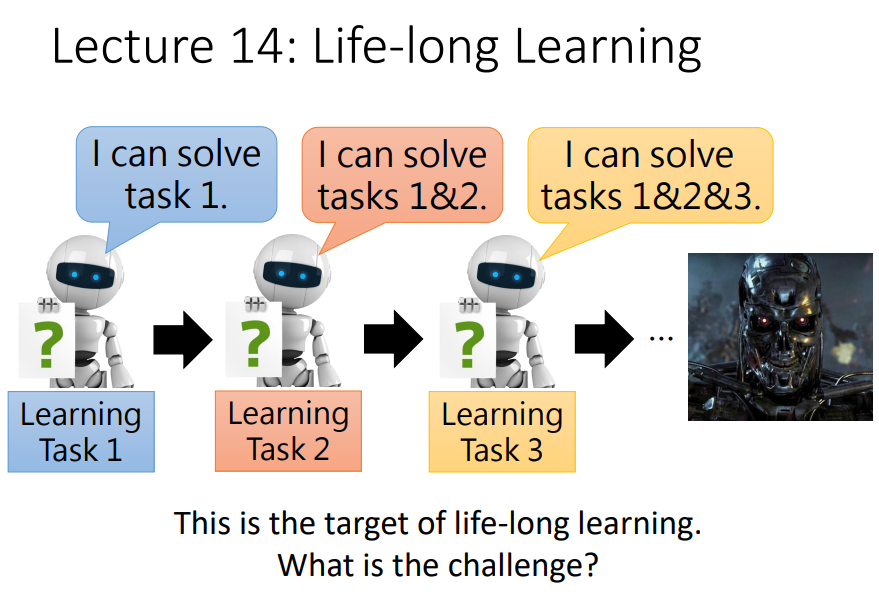

### Lecture 15: Meta learning
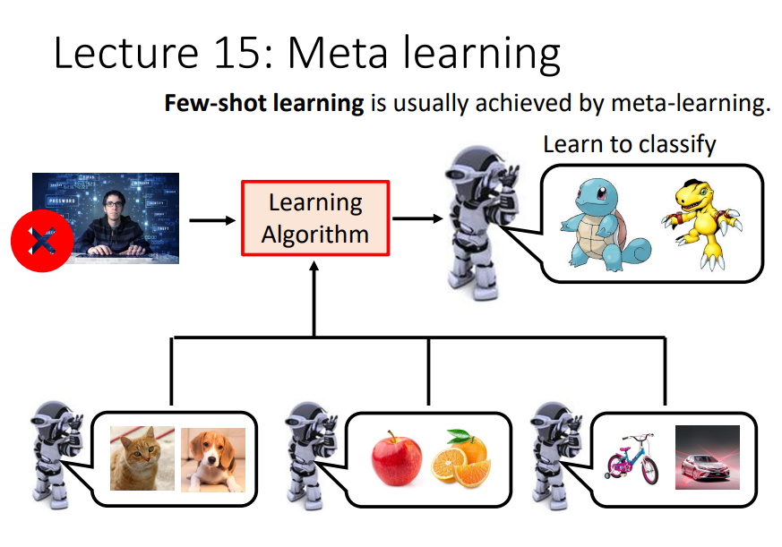

