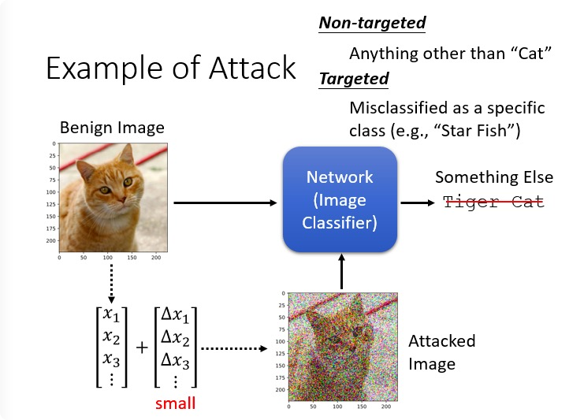
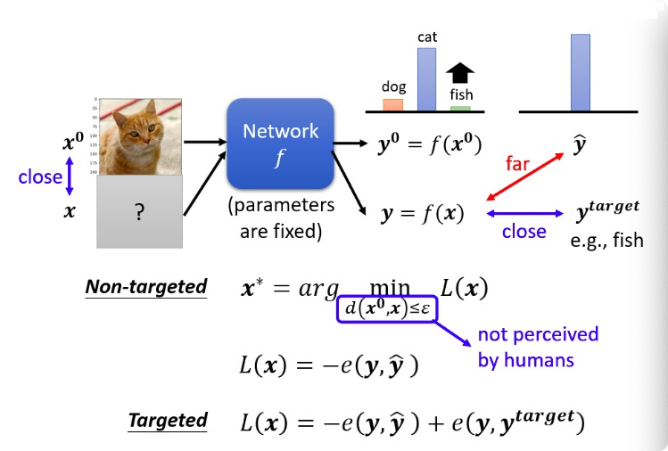

# HW10  Attact

## 任务描述
● Those are methodologies which you should be familiar with first  这些是您应该首先熟悉的方法

○ Attack objective: Non-targeted attack  攻击目标：非目标攻击

○ Attack constraint: L-infinity norm and Parameter ε  攻击约束

○ Attack algorithm: FGSM attack

○ Attack schema: Black box attack (perform attack on proxy network)  攻击模式：黑匣子攻击（对代理网络执行攻击）

○ Benign images vs Adversarial images  对抗图像

### 作业任务：

黑箱攻击（Black box Attack），对200张32*32像素的图片（来自cifar-10）进行修改完成黑箱攻击，使得模型准确率下降。

### How to attack？

- 一张照片可以被看作是一个非常长的每一个维度都加入一个小小的噪声，小到人眼看不出来。
    - 原始照片：**Benign Image**
    - 被攻击（加入噪声）的照片：**Attacked Image**
- Attacked Image丢到 Network 裡面,输出不可以是猫,要变成其他的东西

### 是否知道模型参数：

- **黑盒攻击（Black Box Attack）**：未知模型参数
- **白盒攻击（White Box Attack）**：已知模型参数

### 黑盒攻击(攻击非对角线的地方)
* [深入研究可转移的对抗性示例和黑盒攻击](https://arxiv.org/abs/1611.02770)

- **用同样的训练资料训练出来**的话,也许它们就会有一定程度的相似度
- 完全没有训练资料的话，把一堆图片丢进去得到输出，再把输入输出的成对资料作为训练数据,拿去训练一个模型，当做 Proxy Network 进行攻击

### 是否有攻击得到的目标：

- 没有目标的攻击（Non-targeted Attack）：原来的答案是猫,只要你能够让 Network 的输出不是猫,你就算是成功
- 有目标的攻击（Targeted Attack）：希望 Network,不止它输出不能是猫,还要输出某一指定的别的东西,比如说，把猫错误判断成一隻海星,才算是攻击成功。

## 代码修改
### 方法：FGSM方法。
* FGSM对抗样本算法实现
* FGSM只对图片进行一次攻击，对应助教代码中fgsm函数，无需修改。代理模型（proxy models）是resnet110_cifar10，在被攻击图片中的精度 **benign_acc=0.95, benign_loss=0.22678**。在攻击中，使用gen_adv_examples函数调用fgsm函数，精度降低：**fgsm_acc=0.59000， fgsm_loss=2.49272**。

* Fast Gradient Sign Attack（FGSM）快速梯度算法，其原理是，在白盒环境下，通过求出模型对输入数据的导数，用函数求得其梯度方向，再乘以步长，得到的就是其扰动量，将这个扰动量加在原来的输入上，就得到了在FGSM攻击下的样本，这个样本很大概率上可以使模型分类错误，这样就达到了攻击的目的。

令原始的输入为x，输出为y。则FGSM的攻击表达式为：

由公式1可知，FGSM实质上就是一种梯度上升算法，通过细微地改变输入，到达输出的预测值与实际值相差很大的目的。

假设x的维度为n，模型参数在每个维度的平均值为m,\eta的无穷范数为\varepsilon，每个维度的微小修改与梯度函数方向一致（个人觉得可以理解为梯度上升），则累积的改变量就是。例如，一张[16,16,3]的图片，则维度为768，通常很小，我们取0.01，m取1，那么累计的扰动就是7.68。

### 方法：I-FGSM方法 + Ensembel Attack。
* FGSM算法从梯度的角度做攻击，速度比较快，这是该算法比较创新的地方。但是FGSM算法只涉及单次梯度更新，有时候单次更新并不足以攻击成功，因此，在此基础上推出迭代式的FGSM，这就是I-FGSM（iterative FGSM）。
* ifgsm方法相比与fgsm相比，使用了多次的fgsm循环攻击。在攻击前测试的精度**benign_acc=0.95, benign_loss=0.15440**。在攻击中，使用gen_adv_examples函数调用emsebel_model和ifgsm，精度降低明显：**ensemble_ifgsm_acc = 0.00, emsemble_ifgsm_loss=13.40259**。

* I-FGSM公式中有几个参数和FGSM算法中的不一样，比如权重用α表示，论文中取1，同时迭代次数用N表示，论文中N取min(e+4, 1.25e)，这部分其实就是将总的噪声幅值分配到每一次迭代中，因此在给定噪声幅值e的前提下，还可以直接用α=e/N来设置α和N参数。

#### Ensemble attact 
* 另外使用了Ensemble attack，该方法使用多个代理模型攻击，这里我们需要改动ensembelNet这个类中的forward函数。

    def forward(self, x):

        emsemble_logits = None

        for i, m in enumerate(self.models):

            emsemble_logits = m(x) if i == 0 else emsemble_logits + m(x)

        return emsemble_logits/len(self.models)

### 方法：MI-FGSM + Ensemble Attack(pick right models)。
* mifgsm相比于ifgsm，加入了momentum，避免攻击陷入local maxima（这个与optimizer里面momentum的原理类似），修改mifgsm函数。在上一个方法中，随机挑选了一些代理模型，这样很盲目
* 根据文章<a href="https://arxiv.org/abs/2007.00806">Query-Free Adversarial Transfer via Undertrained Surrogates</a>描述，可以选择一些训练不充分的模型，训练不充分的意思包括两方面：一是模型的训练epoch少，二是模型在验证集（val set）未达到最小loss。选择resnet18模型，训练30个epoch（正常训练到达最好结果大约需要200个epoch），将其加入ensmbleNet中。攻击后的精度和loss:**ensemble_mifgsm_acc = 0.00, emsemble_mifgsm_loss = 12.79830**。

        #TODO: Momentum calculation
        grad = x_adv.grad.detach()
        grad = decay * momentum + grad/(grad.abs().sum() + 1e-8)
        momentum = grad
        x_adv = x_adv + alpha * grad.sign()
* <a href="https://blog.csdn.net/ygfrancois/article/details/97662305?ops_request_misc=&request_id=&biz_id=102&utm_term=MIFGSM&utm_medium=distribute.pc_search_result.none-task-blog-2~all~sobaiduweb~default-5-97662305.142^v40^pc_rank_34_1,185^v2^control&spm=1018.2226.3001.4187">对抗样本的创建和防御</a>

### DIM-MIFGSM + Ensemble Attack(pick right models)。
* 相对于上一个方法，我们将mifgsm替换为dim-mifgsm，后者在前者的基础上，对被攻击图片加入了transform来避免overfitting。
* 该技巧来自于文章<a href="https://arxiv.org/pdf/1803.06978.pdf">Improving Transferability of Adversarial Examples with Input Diversity</a>，文章中的transform是先随机的resize图片，然后随机padding图片到原size，我们在mifgsm函数的基础上写dim_mifgsm函数，后者添加的部分代码如下。在攻击中，使用gen_adv_examples函数调用emsebel_model和dim_mifgsm，攻击后的精度和loss:**ensemble_dmi_mifgsm_acc = 0.0100, emsemble_dim_mifgsm_loss = 12.79041**。

    if torch.rand(1).item() >= p:

        #resize img to rnd X rnd

        rnd = torch.randint(29, 33, (1,)).item()

        x_adv = transforms.Resize((rnd, rnd))(x_adv)

        #padding img to 32 X 32 with 0

        left = torch.randint(0, 32 - rnd + 1, (1,)).item()

        top = torch.randint(0, 32 - rnd + 1, (1,)).item()

        right = 32 - rnd - left

        bottom = 32 - rnd - top

        x_adv = transforms.Pad([left, top, right, bottom])(x_adv)

 
