# HW12
## 作业描述
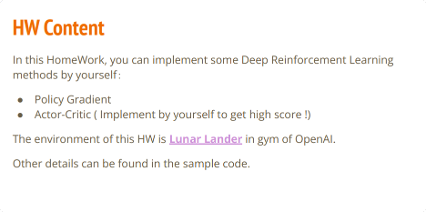
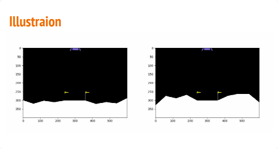
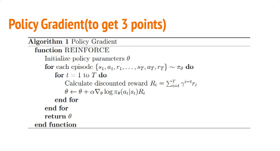
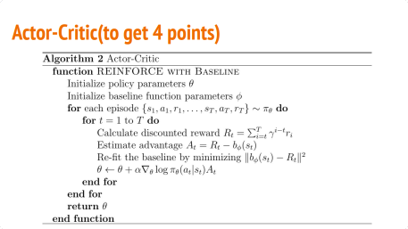


## Policy Gradient
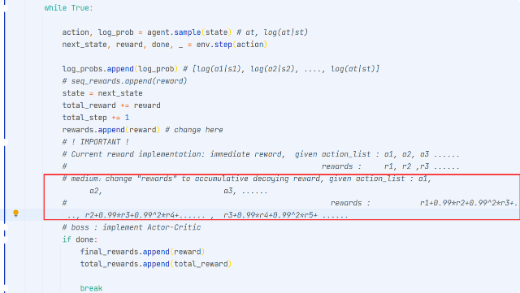
```
agent.network.train()  # Switch network into training mode 
EPISODE_PER_BATCH = 5  # update the  agent every 5 episode
NUM_BATCH = 500        # totally update the agent for 400 time

avg_total_rewards, avg_final_rewards = [], []

prg_bar = tqdm(range(NUM_BATCH))
for batch in prg_bar:

    log_probs, rewards = [], []
    total_rewards, final_rewards = [], []

    # collect trajectory
    for episode in range(EPISODE_PER_BATCH):
        
        state = env.reset()
        total_reward, total_step = 0, 0
        seq_rewards = []
        while True:

            action, log_prob = agent.sample(state) # at, log(at|st)
            next_state, reward, done, _ = env.step(action)

            log_probs.append(log_prob) # [log(a1|s1), log(a2|s2), ...., log(at|st)]
            # seq_rewards.append(reward)
            state = next_state
            total_reward += reward
            total_step += 1
            rewards.append(reward) # change here
            n_reward = reward
            for i in range(len(rewards)-1):
              n_reward *= 0.99
              rewards[len(rewards)-2-i] += n_reward
            if done:
                final_rewards.append(reward)
                total_rewards.append(total_reward)
                
                break

    print(f"rewards looks like ", np.shape(rewards))  
    print(f"log_probs looks like ", np.shape(log_probs))     
    # record training process
    avg_total_reward = sum(total_rewards) / len(total_rewards)
    avg_final_reward = sum(final_rewards) / len(final_rewards)
    avg_total_rewards.append(avg_total_reward)
    avg_final_rewards.append(avg_final_reward)
    prg_bar.set_description(f"Total: {avg_total_reward: 4.1f}, Final: {avg_final_reward: 4.1f}")

    # update agent
    # rewards = np.concatenate(rewards, axis=0)
    rewards = (rewards - np.mean(rewards)) / (np.std(rewards) + 1e-9)  # normalize the reward 
    agent.learn(torch.stack(log_probs), torch.from_numpy(rewards))
    print("logs prob looks like ", torch.stack(log_probs).size())
    print("torch.from_numpy(rewards) looks like ", torch.from_numpy(rewards).size())
```

对于实现这个方法，宏毅老师也在课堂上讲过，**当产生一个Action的时候，当前的Action会对未来的一些Action产生一定的影响**，假设现在产生了三个动作每个Action记a1,a2,a3，所得到的分数是r1,r2,r3，则a1所得到的最终分数是r1+0.99*r2+0.99^2*r3，a2所得到的分数是r2+0.99*r3...具体实现如下：

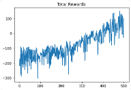

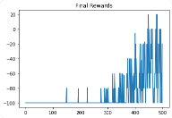

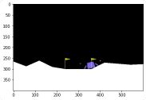


## Actor-Critic
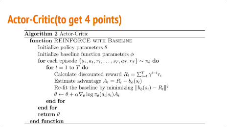

**将网络改成DQN模型，需要一个Action网络以及Critic网络，以及一个同时包含完整的Action-Critic的DQN网络**

```
class Action(nn.Module):
  def __init__(self):
    super().__init__()
    self.fc1 = nn.Linear(8, 64)
    self.fc2 = nn.Linear(64, 64)
    self.fc3 = nn.Linear(64, 4)

  def forward(self, state):
      hid = torch.tanh(self.fc1(state))
      hid = torch.tanh(self.fc2(hid))
      return F.softmax(self.fc3(hid), dim=-1)
class Critic(nn.Module):
  def __init__(self):
    super().__init__()
    self.fc1 = nn.Linear(8, 64)
    self.fc2 = nn.Linear(64, 64)
    self.fc3 = nn.Linear(64, 4)

  def forward(self, state):
      hid = torch.tanh(self.fc1(state))
      hid = torch.tanh(self.fc2(hid))
      return F.softmax(self.fc3(hid), dim=-1)

from torch.optim.lr_scheduler import StepLR
class DQN():
    def __init__(self,action,critic):
        self.action_net = action
        self.critic_net = critic
        self.optimizer = optim.Adam(self.action_net.parameters(), lr=5e-4)
        self.critic_net.load_state_dict(self.action_net.state_dict()) # 加载action_net的行为
        self.critic_net.eval() # 模型验证
    def forward(self, state):
        return self.action_net(state)
    def learn(self, state_action_values, expected_state_action_values,batch):
        loss = torch.zeros(1)
        for i in range(len(state_action_values)):
            loss += F.smooth_l1_loss(state_action_values[i], expected_state_action_values[i])
        self.optimizer.zero_grad()
        loss.backward()
        self.optimizer.step()
        # 每10个batch更新一次target_net
        if batch%10 == 9:
            self.critic_net.load_state_dict(self.action_net.state_dict())
    def sample(self, state):
        r = torch.randn(1)
        if r > 0.2:
            with torch.no_grad():
                state = torch.FloatTensor(state).to(device)
                return self.action_net(state).argmax().item()
        else:
            return torch.tensor([[random.randrange(4)]], device=device, dtype=torch.long).item()
```

```
agent.action_net.train()  # 确保网络处在trainning模式
EPISODE_PER_BATCH = 10  # 每收集五个episodes 更新一次 agent
NUM_BATCH = 400        # 一共更新400次
avg_total_rewards, avg_final_rewards = [], []
prg_bar = tqdm(range(NUM_BATCH))
for batch in prg_bar:
    state_action_values, expected_state_action_values = [], []
    total_rewards, final_rewards = [], []
    # 收集训练资料
    for episode in range(EPISODE_PER_BATCH):
        state = env.reset()
        total_reward = 0
        while True:
            action = agent.sample(state)
            next_state, reward, done, _ = env.step(action)
            state_action_value = agent.action_net(torch.FloatTensor(state).to(device))[action]
            state_action_values.append(state_action_value)
            state = next_state
            #Double DQN
            if done:
                next_state_value = 0
            else:
                next_state_value = agent.critic_net(torch.FloatTensor(state).to(device))[agent.action_net(torch.FloatTensor(state).to(device)).argmax().item()].detach()
            # 使用Policy Gradient
            expected_state_action_value = (next_state_value * 0.99) + reward
            expected_state_action_values.append(torch.FloatTensor([expected_state_action_value]))
            total_reward += reward
            if done:
                final_rewards.append(reward)
                total_rewards.append(total_reward)
                break

    # 记录训练过程
    avg_total_reward = sum(total_rewards) / len(total_rewards)
    avg_final_reward = sum(final_rewards) / len(final_rewards)
    avg_total_rewards.append(avg_total_reward)
    avg_final_rewards.append(avg_final_reward)
    prg_bar.set_description(f"Total: {avg_total_reward: 4.1f}, Final: {avg_final_reward: 4.1f}")
    # print(expected_state_action_values)
    # 更新网络
    agent.learn(state_action_values, expected_state_action_values, batch)
```

方法：使用Actor to Critic。相比于Policy Gradient，Actor to Critic的模型后端有两个分支，一个预测action，一个预测rewards，loss函数也需要加入了预测rewards的损失

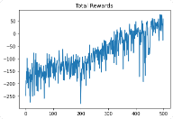
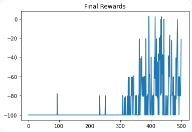
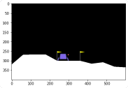
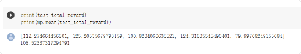


### DQN模型
[Human-level control through deep reinforcement learning](https://storage.googleapis.com/deepmind-media/dqn/DQNNaturePaper.pdf)  
[Playing Atari with Deep Reinforcement Learning](https://www.cs.toronto.edu/~vmnih/docs/dqn.pdf)

DQN算法是一种将Q_learning通过神经网络近似值函数的一种方法，一种无模型的强化学习技术，也是深度强化学习（Deep Reinforcement Learning，DRL）的开山之作，是将深度学习与强化学习结合起来从而实现从感知（Perception）到动作（ Action ）的端对端（End-to-end）学习的一种全新的算法。


DQN的核心将卷积神经网络（CNN）和Q-Learning结合起来，CNN的输入是原始图像数据（作为状态State），输出则是每个动作Action对应的价值评估Value Function（Q值）。

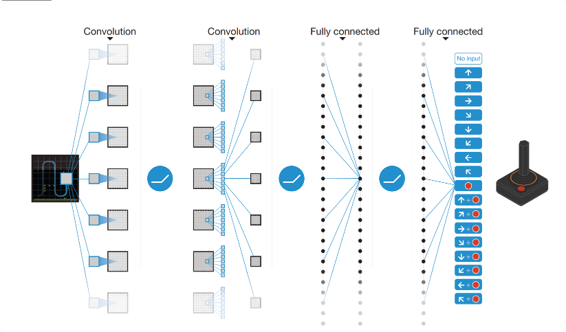

输入的是被处理成灰度图的最近4帧 图像，经过几个卷积层（没有池化层）后接两个全连接层，输出是所有动作的Q值。


## 强化学习思想

**强化学习算法主要涉及到两个组成部分：其一是通过与环境交互产生大量的数据，其二是利用这些数据去求解最佳策略。**

---
**如何利用这些数据计算出最佳策略？**

求解最优策略分为两大类方法：**基于价值的方法**与**基于策略的方法**。


* **基于策略：** 智能体会制定一套动作策略（确定在给定状态下需要采取何种动作），并根据这个策略进行操作。

* **基于价值：** 智能体不需要制定显式的策略，它维护一个价值表格或价值函数，并通过这个价值表格或价值函数来选取价值最大的动作。
* **二者结合可得到Actor-Critic的方法**，Actor对策略建模，Critic则对值函数建模。