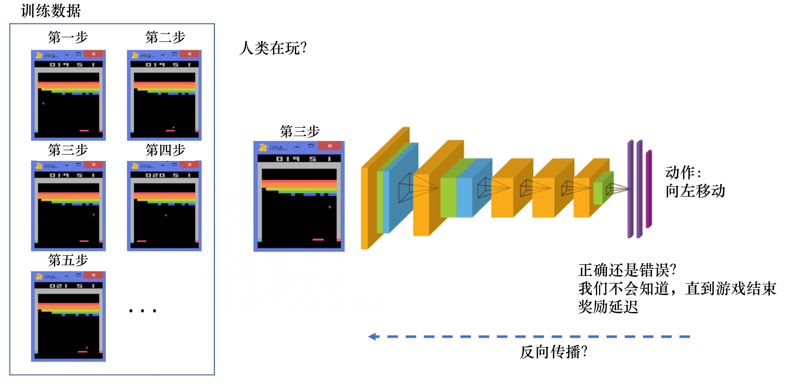
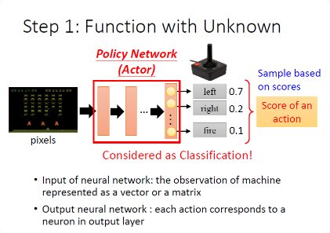
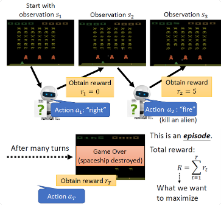
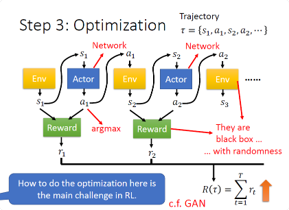

# Introduction of Deep Reinforcement Learning (RL)强化学习

## 强化学习与监督学习

### 监督学习
**监督学习（supervised learning）** 假设我们有大量被标注的数据，比如汽车、飞机、椅子这些被标注的图片，这些图片都要满足独立同分布，即它们之间是没有关联关系的。假设我们训练一个分类器，比如神经网络。为了分辨输入的图片中是汽车还是飞机，在训练过程中，需要把正确的标签信息传递给神经网络。 

当神经网络做出错误的预测时，比如输入汽车的图片，它预测出来是飞机，我们就会直接告诉它，该预测是错误的，正确的标签应该是汽车。最后我们根据类似错误写出一个损失函数（loss function），通过反向传播（back propagation）来训练神经网络。  

所以在监督学习过程中，有两个假设：
* 输入的数据（标注的数据）都应是没有关联的。因为如果输入的数据有关联，学习器（learner）是不好学习的。
* 需要告诉学习器正确的标签是什么，这样它可以通过正确的标签来修正自己的预测。

### 强化学习
在强化学习中，监督学习的两个假设其实都不能得到满足。

以雅达利（Atari） 游戏 Breakout 为例，一个打砖块的游戏，控制木板左右移 动从而把球反弹到上面来消除砖块。在玩游戏的过程中，我们可以发现智能体得到的观测（observation）不是独立同分布的，上一帧与下一帧间其实有非常强的 连续性。

我们得到的数据是相关的时间序列数据，不满足独立同分布。另外，我 们并没有立刻获得反馈，游戏没有告诉我们哪个动作是正确动作。比如现在把木板往右移，这只会使得球往上或者往左一点儿，我们并不会得到即时的反馈。

因此，强化学习之所以困难，是因为智能体不能得到即时的反馈，然而我们依然希望智能体在这个环境中学习。

强化学习的训练数据就是一个玩游戏的过程。我们从第 1 步开始，采取一个动作，比如我们把木板往右移，接到球。第 2 步我们又做出动作，得到的训练数据是一个玩游戏的序列。比如现在是在第 3 步，我们把这个序列放进网络，希望网络可以输出一个动作，即在当前的状态应该输出往右移或 者往左移。这里有个问题，我们没有标签来说明现在这个动作是正确还是错误的，必须等到游戏结束才可能知道，这个游戏可能 10s 后才结束。现在这个动作到底对最后游戏是否能赢有无帮助，我们其实是不清楚的。这里我们就面临延迟奖励（delayed reward）的问题，延迟奖励使得训练网络非常困难。

### 区别
1. 强化学习输入的样本是**序列数据**，而不像监督学习里面**样本独立**。

2. 学习器并没有告诉我们每一步正确的动作应该是什么，学习器需要自己去发现哪些动作可以带来最多的奖励，只能通过不停地尝试来发现最有利的动作。

3. 智能体获得自己能力的过程，其实是不断地**试错探索**（trial-and-error exploration）的过程。探索 （exploration）和利用（exploitation）是强化学习里面非常核心的问题。其中，探索指尝试一些新的动作， 这些新的动作有可能会使我们得到更多的奖励，也有可能使我们“一无所有”；利用指采取已知的可以获得最多奖励的动作，重复执行这个动作，因为我们知道这样做可以获得一定的奖励。因此，我们需要在探 索和利用之间进行权衡，这也是在监督学习里面没有的情况。

4. 强化学习过程中，没有非常强的监督者（supervisor），只有奖励信号（reward signal），并且奖励信号是延迟的，即环境会在很久以后告诉我们之前我们采取的动作到底是不是有效的。因为我们没有得到即时反馈，所以智能体使用强化学习来学习就非常困难。当我们采取一个动作后，如果我们使用监督学习，我们就可以立刻获得一个指导，比如，我们现在采取了一个错误的动作，正确的动作应该是什么。而在强化学习里面，环境可能会告诉我们这个动作是错误的，但是它并没有告诉我们正确的动作是什么。而且更困难的是，它可能是在一两分钟过后告诉我们这个动作是错误的。所以这也是强化学习和监督学习不同的地方。

### 强化学习的特征
1. 强化学习会试错探索，它通过探索环境来获取对环境的理解。
2. 强化学习智能体会从环境里面获得延迟的奖励。
3. 在强化学习的训练过程中，时间非常重要。因为我们得到的是有时间关联的数据（sequential data）， 而不是独立同分布的数据。在机器学习中，如果观测数据有非常强的关联，会使得训练非常不稳定。这也是为什么在监督学习中，我们希望数据尽量满足独立同分布，这样就可以消除数据之间的相关性。
4. 智能体的动作会影响它随后得到的数据，这一点是非常重要的。在训练智能体的过程中，很多时 候我们也是通过正在学习的智能体与环境交互来得到数据的。所以如果在训练过程中，智能体不能保持稳定，就会使我们采集到的数据非常糟糕。我们通过数据来训练智能体，如果数据有问题，整个训练过程就会失败。所以在强化学习里面一个非常重要的问题就是，怎么让智能体的动作一直稳定地提升。

## 强化学习的步骤
同机器学习一样，分为三步

### Step 1: Function with Unknown

Actor就是一个Network，称作Policy Network，
* 输入：游戏的画面像素pixels
* 输出：每个可采取行为的分数。就像分类一样（softmax）（向左 0.7 分,向右 0.2 分,开火 0.1 分）
* 架构：FC、CNN、Transformer……
* 操作：把输出的分数,就当做一个机率,然后按照这个机率,去 Sample随机决定要采取哪一个 Action（不用argmax⇒使用随机sample）

### Step 2: Define “Loss”

一整局游戏称为一个episode（片段），游戏中每个行为都可能得到Reward，把所有的 Reward加和，得到整场游戏的 Total Reward

取负的 Total Reward作为Loss

### Step 3: Optimization

1. 对环境的观察s1,会变成你的 Actor 的输入
2. 你的 Actor 接下来输出a1
3. a1又变成环境的输入
4. 环境看到a1以后,又输出s2
5. ......
6. 满足游戏中止的条件

