# Lecture 2:What to do if my network fails to train

## PRE1
### 训练的三个过程

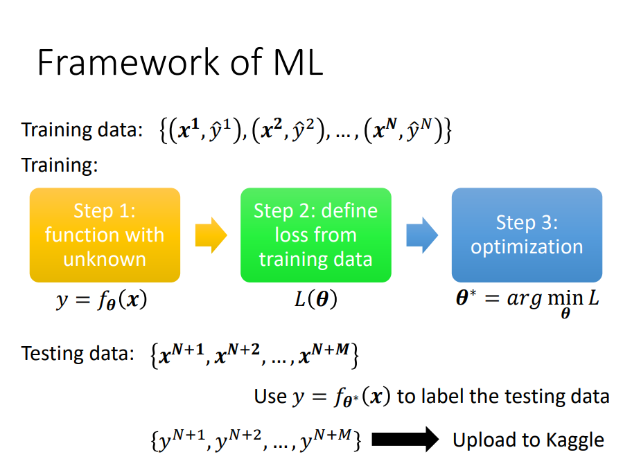
1. 写出有未知数的function： \theta表示未知的参数
2. 定义Loss：Loss的输入是一组参数，判断这组参数好不好
3. 找\theta：使得Loss的值越小越好

### 优化训练
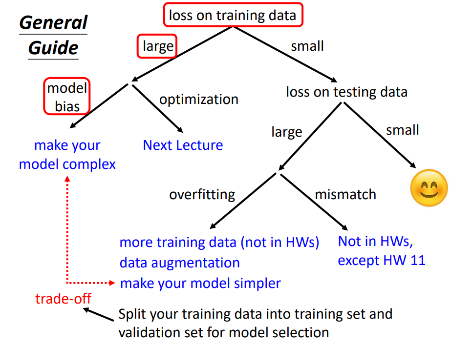
1. 检查training data的loss，loss值比较大
2. 分析在训练资料上没学好的原因
3. 如果是model Bais ，增加特征，让模型更具弹性
    
4. 如果是optimization，弹性够了但是梯度下降不给力
    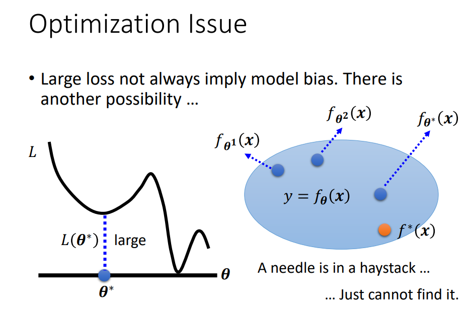
5. 检查training data的loss，loss值比较小且testing data 的loss也比较小，理想结果
6. training data的loss比较大，可能过拟合。增加训练集（Data augmentation）或者给model限制，不让其有很大的弹性。
   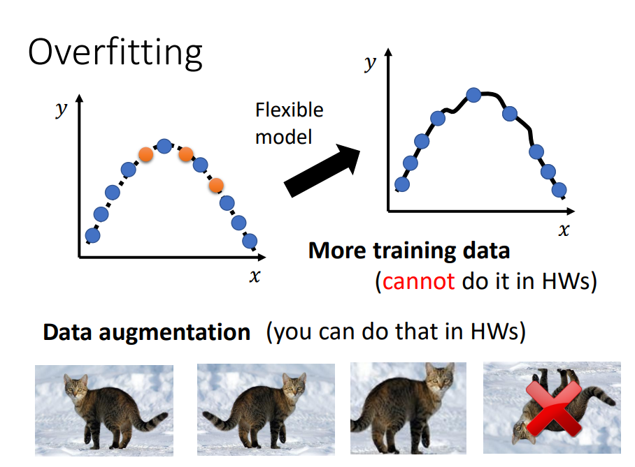
   
7. Mismatch:受到了其他因素干扰
   
## PRE2
### 为什么优化会失败
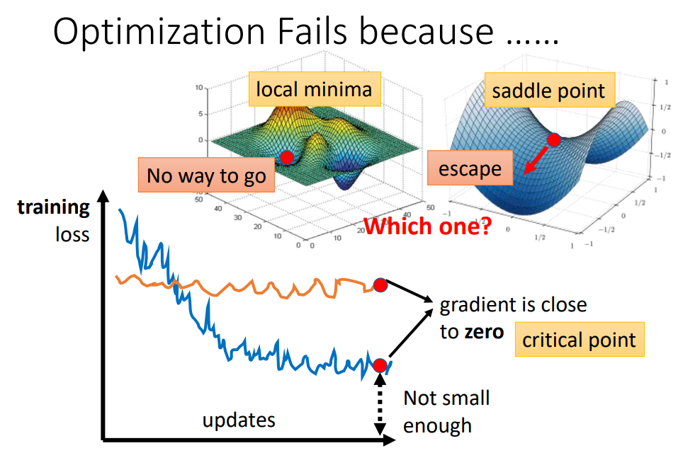

### 低点 鞍点等-----高等数学
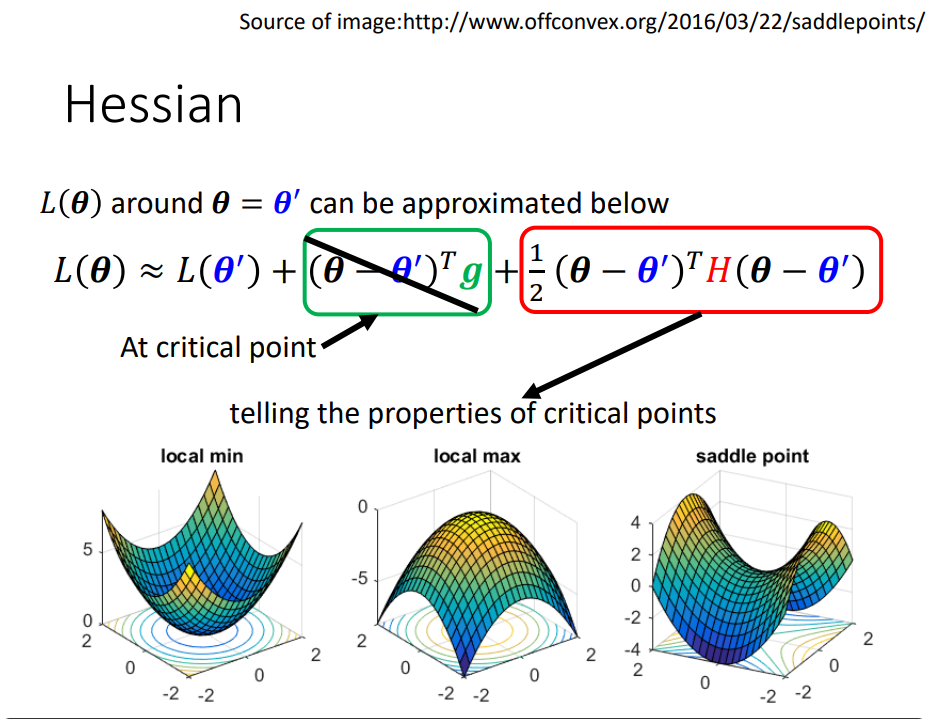
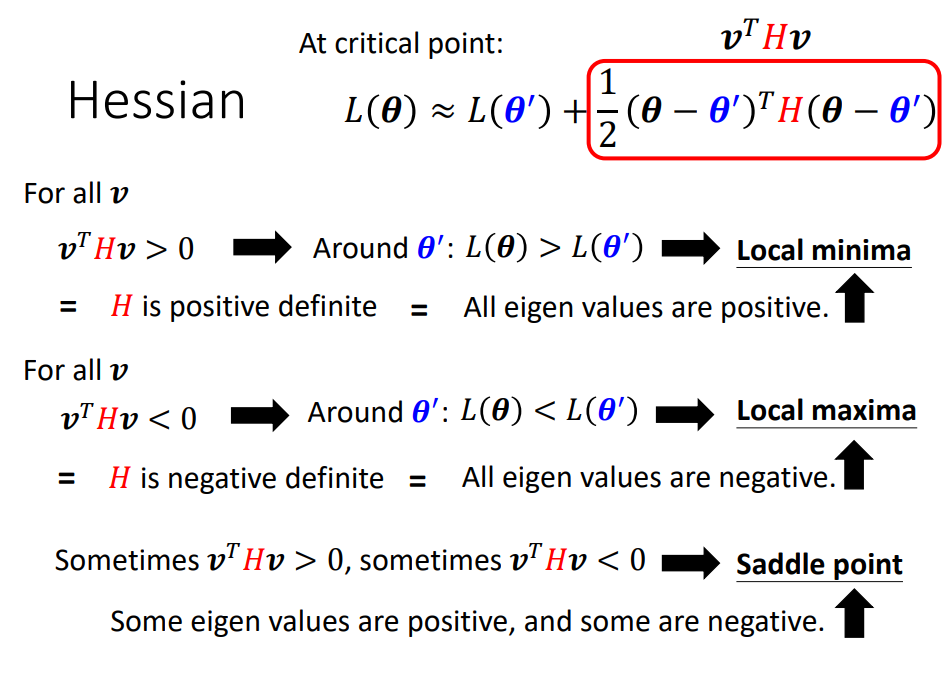
后面例子没听懂

## PRE3
### Batch
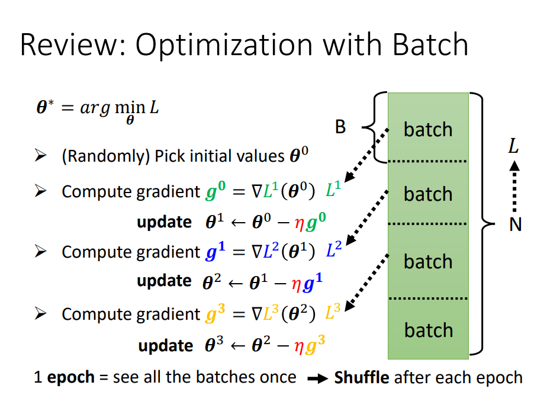
* 每次更新参数时，用一个batch算Loss、算梯度更新参数。所有的batch都算完一次是一个epoch。
* 每个epoch的batch都不一样，会重新分，也叫做shuffle。

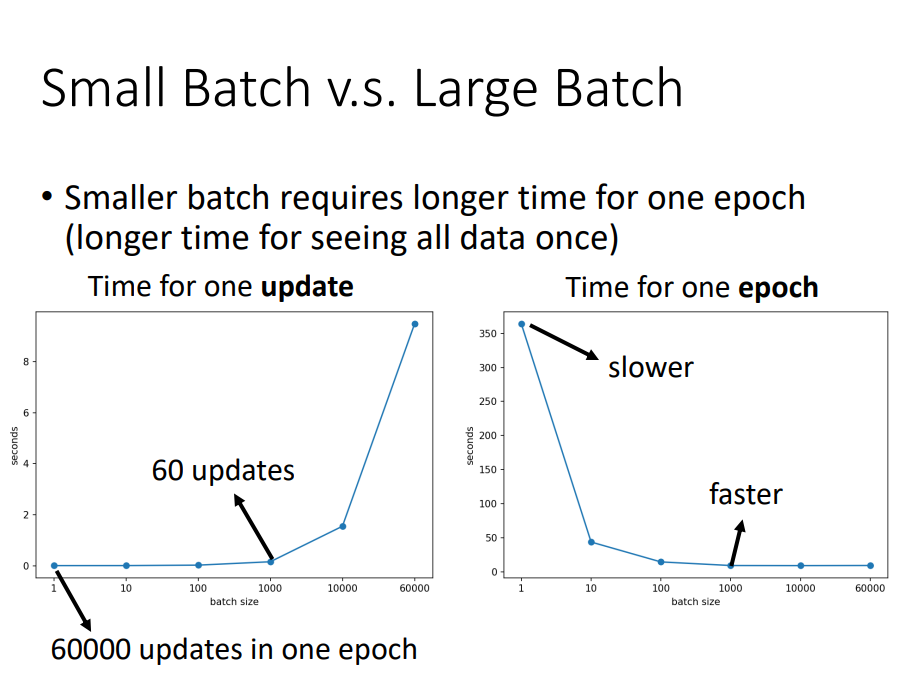
因为GPU平行运算的关系，选择合适的batch_size

### 梯度下降
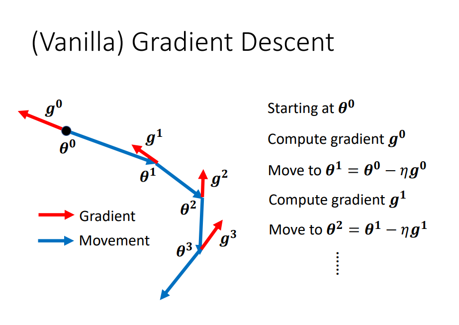
1. 初始\theta0
2. 计算梯度g0
3. 往梯度反方向更新参数\theta1
4. 计算梯度g1
5. 往梯度反方向更新参数\theta2
6. 计算梯度g2
7. ......

### Gradient Descent + Momentum
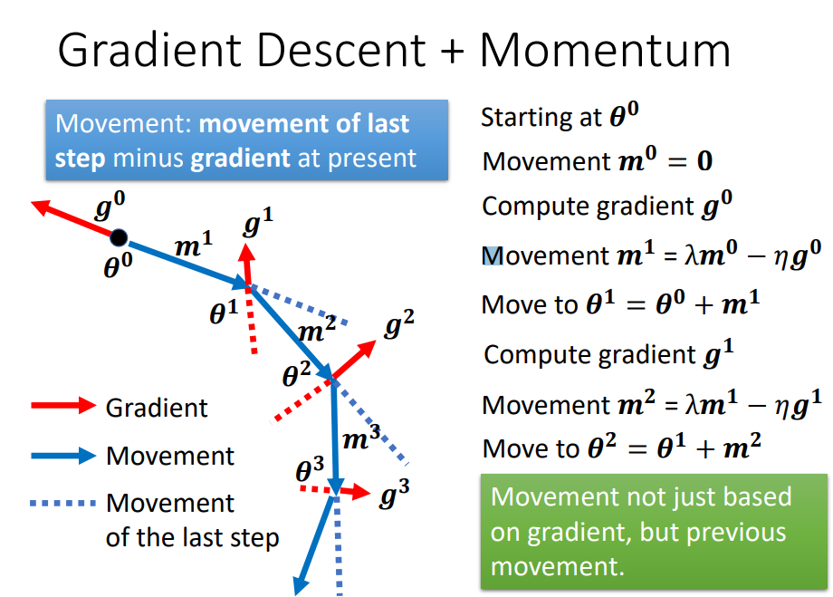
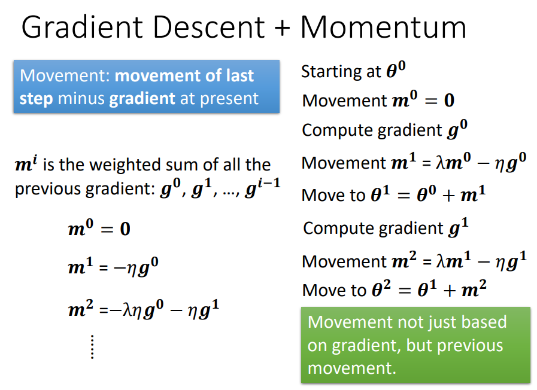
类似合成向量。运动不仅基于梯度，还基于先前的运动。

### 小结
* 临界点的梯度为零。 
* 临界点可以是鞍点或局部最小值。 
* 临界点可以由Hessian 矩阵确定。 
* 临界点可以沿Hessian 矩阵的特征向量方向逃逸鞍点。 
* 局部最小值可能很少见。 
* 较小的批量大小和动量有助于避开关键点。