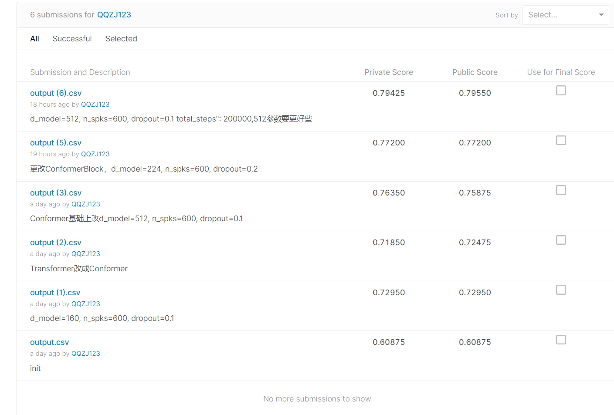

# 比赛记录


### 初始分数 0.60875
Conformer
d_model=80, n_spks=600, dropout=0.1

### 第一次修改 0.72950
更改模型参数 d_model=160, n_spks=600, dropout=0.1
使用TransformerEncoder层    self.encoder = nn.TransformerEncoder(self.encoder_layer, num_layers=2)

### 第二次修改 0.71850
Transformer改成Conformer
发现结果反而变低了。
conformer的思路很简单，就是将Transformer和CNN进行结合。原因：
1.Transformer中由于attention机制，拥有很好的全局性。
2.CNN拥有较好的局部性，可以对细粒度的信息进行提取。
两者结合在语音上有较好的效果。[论文](https://arxiv.org/abs/2005.08100)中阐述了具体的model架构。
```
self.conformer_block=ConformerBlock(
   	dim=d_model,
   	dim_head=64,
   	heads=8,
   	ff_mult=4,
   	conv_expansion_factor=2,
   	conv_kernel_size=31,
   	attn_dropout=dropout,
   	ff_dropout=dropout,
   	conv_dropout=dropout
    ) 
```
  
### 第三次修改 0.76350

Conformer基础上改d_model=512, n_spks=600, dropout=0.1
分数显著提高，看到文章说d_model不宜过高也不易过低

### 第四次修改 0.77200

论文：Conformer: Convolution-augmented Transformer for Speech Recognition
transoformerEncoder改为ConformerBlock，d_model=224, n_spks=600, dropout=0.2
分数提高一点，推测更改ConformerBlock有效
```
self.encoder = ConformerBlock(
        dim = d_model,
        dim_head = 4,
        heads = 4,
        ff_mult = 4,
        conv_expansion_factor = 2,
        conv_kernel_size = 20,
        attn_dropout = dropout,
        ff_dropout = dropout,
        conv_dropout = dropout,
    )
```

### 第五次修改 0.79425

修改参数并且增加训练次数
d_model=512, n_spks=600, dropout=0.1  total_steps": 200000
推测最佳d_model在224--512之间要好些

### 第六次修改 
更改维度 ConformerBlock self_Attentive_pooling  AMsoftmax 
self_Attentive_pooling对于每一个特征，根据他自己的特征算出该给他赋予的权重。
amsoftmax的功能是让类内的特征靠的更近，类外的离得更远。

```
 
class AMSoftmax(nn.Module):
    def __init__(self, in_feats, n_classes, m=0.3, s=15, annealing=False):
        super(AMSoftmax, self).__init__()
        self.linaer = nn.Linear(in_feats, n_classes, bias=False)
        self.m = m
        self.s = s
 
    def _am_logsumexp(self, logits):
        max_x = torch.max(logits, dim=-1)[0].unsqueeze(-1)
        term1 = (self.s*(logits - (max_x + self.m))).exp()
        term2 = (self.s * (logits - max_x)).exp().sum(-1).unsqueeze(-1) - (self.s*(logits-max_x)).exp()
        return self.s * max_x + (term2 + term1).log()
 
    def forward(self, *inputs):
 
        x_vector = F.normalize(inputs[0], p=2, dim=-1)
        self.linaer.weight.data = F.normalize(self.linaer.weight.data, p=2,dim=-1)
        logits = self.linaer(x_vector)
        scaled_logits = (logits-self.m)*self.s
        return scaled_logits - self._am_logsumexp(logits)
```

```
class self_Attentive_pooling(nn.Module):
    def __init__(self, dim):
        super(self_Attentive_pooling, self).__init__()
        self.sap_linaer = nn.Linear(dim, dim)
        self.attention = nn.Parameter(torch.FloatTensor(dim,1))
        torch.nn.init.normal_(self.attention, std=.02)
        print(1)
    def forward(self, x):
        # x = x.permute(0, 2, 1)
        h = torch.tanh(self.sap_linaer(x))
        w = torch.matmul(h, self.attention).squeeze(dim=2)
        w = F.softmax(w, dim=1).view(x.size(0), x.size(1), 1)
        x = torch.sum(x * w, dim=1)
        return x
```