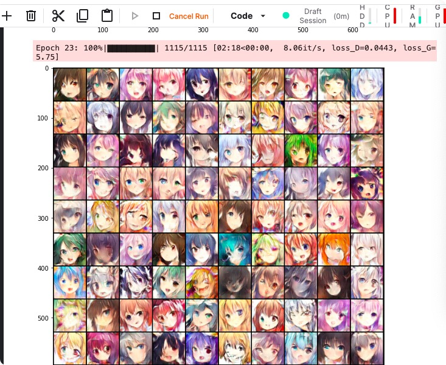

# 作业六：Homework 6 - Generative Adversarial Network——使用GAN生成动漫人物脸

This is the sample code for hw6 of 2022 Machine Learning course in National Taiwan University. 

In this sample code, there are 5 sections:

1. Environment setting

2. Dataset preparation

3. Model setting

4. Train

5. Inference

Your goal is to do anime face generation, if you have any question, please discuss at NTU COOL 

###  GAN
全称对抗生成网络，一种无监督算法，他能生成出非常逼真的照片，图像甚至视频。 下面举例来解释一下GAN的基本思想。假设一个城市治安混乱，很快，这个城市里就会出现无数的小偷。在这些小偷中，有的可能是盗窃高手，有的可能毫无技术可言。假如这个城市开始整饬其治安，突然开展一场打击犯罪的「运动」，警察们开始恢复城市中的巡逻，很快，一批「学艺不精」的小偷就被捉住了。之所以捉住的是那些没有技术含量的小偷，是因为警察们的技术也不行了，在捉住一批低端小偷后，城市的治安水平变得怎样倒还不好说，但很明显，城市里小偷们的平均水平已经大大提高了。警察们开始继续训练自己的破案技术，开始抓住那些越来越狡猾的小偷。随着这些职业惯犯们的落网，警察们也练就了特别的本事，他们能很快能从一群人中发现可疑人员，于是上前盘查，并最终逮捕嫌犯；小偷们的日子也不好过了，因为警察们的水平大大提高，如果还想以前那样表现得鬼鬼祟祟，那么很快就会被警察捉住。为了避免被捕，小偷们努力表现得不那么「可疑」，而魔高一尺、道高一丈，警察也在不断提高自己的水平，争取将小偷和无辜的普通群众区分开。随着警察和小偷之间的这种「交流」与「切磋」，小偷们都变得非常谨慎，他们有着极高的偷窃技巧，表现得跟普通群众一模一样，而警察们都练就了「火眼金睛」，一旦发现可疑人员，就能马上发现并及时控制——最终，我们同时得到了最强的小偷和最强的警察。

### 生成对抗网络（GAN）由2个重要的部分构成：
* 生成器从先验分布中采得随机信号，经过神经网络的变换，得到模拟样本；判别器既接受来自生成器的模拟样本，也接收来自实际数据集的真实样本，但是并不告诉判别器样本来源，需要它自己判断。

* 总之，生成器要尽可能造出样本迷惑判别器，而判别器则尽可能识别出来自生成器的样本。理想情况下，生成器和判别器最终达到一种平衡，双方都臻于完美，彼此都没有更进一步的空间。

* * 生成器(Generator)：通过机器生成数据（大部分情况下是图像），目的是“骗过”判别器
* 判别器(Discriminator)：判断这张图像是真实的还是机器生成的，目的是找出生成器做的“假数据”
* 详细过程：
* 第一阶段：固定「判别器D」，训练「生成器G」。使用一个还 OK 判别器，让一个「生成器G」不断生成“假数据”，然后给这个「判别器D」去判断。一开始，「生成器G」还很弱，所以很容易被揪出来。但是随着不断的训练，「生成器G」技能不断提升，最终骗过了「判别器D」。到了这个时候，「判别器D」基本属于瞎猜的状态，判断是否为假数据的概率为50%。
* 第二阶段：固定「生成器G」，训练「判别器D」。当通过了第一阶段，继续训练「生成器G」就没有意义了。这个时候我们固定「生成器G」，然后开始训练「判别器D」。「判别器D」通过不断训练，提高了自己的鉴别能力，最终他可以准确的判断出所有的假图片。到了这个时候，「生成器G」已经无法骗过「判别器D」。
* 最后不断循环一二阶段。

### 优缺点

* 优点：1、能更好建模数据分布（图像更锐利、清晰）

2、理论上，GANs 能训练任何一种生成器网络。其他的框架需要生成器网络有一些特定的函数形式，比如输出层是高斯的。

3、无需利用马尔科夫链反复采样，无需在学习过程中进行推断，没有复杂的变分下界，避开近似计算棘手的概率的难题。

* 缺点：1、难训练，不稳定。生成器和判别器之间需要很好的同步，但是在实际训练中很容易D收敛，G发散。D/G 的训练需要精心的设计。

2、模式缺失（Mode Collapse）问题。GANs的学习过程可能出现模式缺失，生成器开始退化，总是生成同样的样本点，无法继续学习。

### 问题解决
1、路径问题：这里的命名取决于训练中的时间戳，所以这个目录每次执行后会变化

解决方案：找到定义处，更改命名规则；或者取消该行代码，运行结束后手动执行该代码

2、数据集冲突：每次下载数据集时覆盖原有数据集会提示是否覆盖等内容，在colab与机器交互，在kaggle上似乎不能交互
解决方案：
在代码执行前删除当前目录下的所有内容

3、GPU资源供给不足

解决方案：开多个kaggle账户，colab与kaggle一起跑（多线程？）

### 代码改进

这个提交记录似乎有问题，每次刷新分值都会变动

#### 初始代码
AN需要定义Generator和Discriminator，Generator用于生成图片，Discriminator用来鉴别图片是生成的还是真实的

#### 第一次，增加epoch
初始代码epoch为1，增加到10简单测试结果   结果AFD：10.545

#### 第二次，修改n_epoch+n_critic
* 运行更多的epoch，在config中设置epoch=50。每更新一次generator，更新两次discriminator，即设置n_critic=2。来自[论文](https://arxiv.org/abs/1406.2661)

#### 第三次，修改discriminator+RMSprop optimizer+loss函数+weight clipping
* WGAN的思路是将discriminator训练为距离函数
* WGAN weight clipping的optimizer，一般使用RMSprop效果较好
* 将generator和discriminator中的loss函数改为距离

50epoch似乎仍然不够，应该可以继续增大

####第四次修改 WGAN-GP
用nn.InstanceNorm2d层代替nn.BatchNorm2d层，
将generator和discriminator中的loss函数改为距离，
WGAN-GP的optimizer是Adam

