# Explainable AI
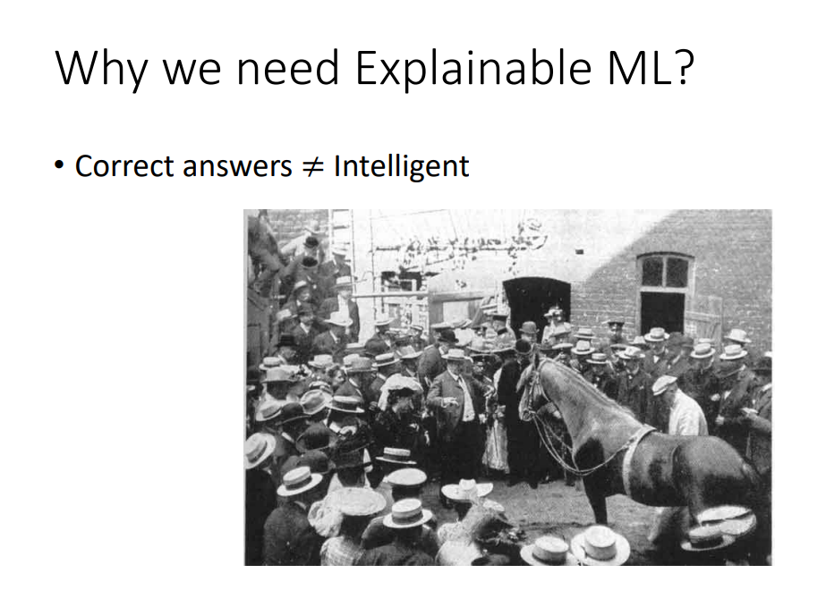
白马做出算术题是因为它察觉到周围观众的情绪而做对，并不是因为真的会做数学题

## Why we need Explainable ML?
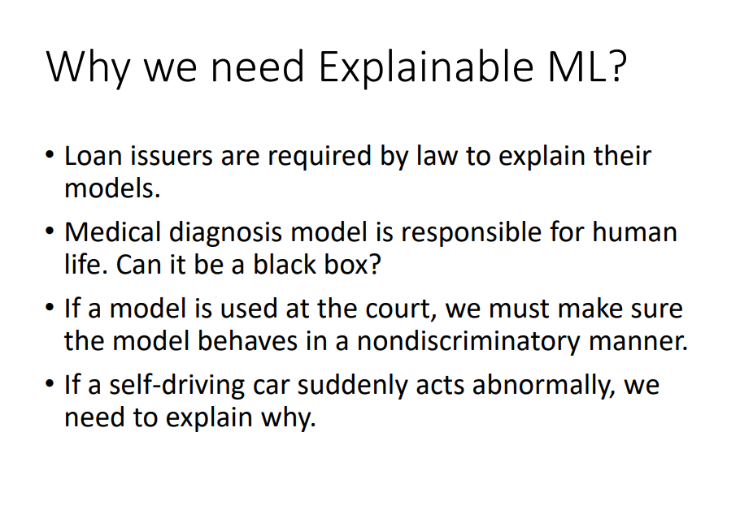

* 法律要求贷款发行人解释他们的模型。
* 医疗诊断模式对人的生命负责。 它可以是一个黑匣子吗？
* 如果在法庭上使用模型，我们必须确保模型以非歧视的方式行事
* 如果自动驾驶汽车突然出现异常，我们需要解释原因。

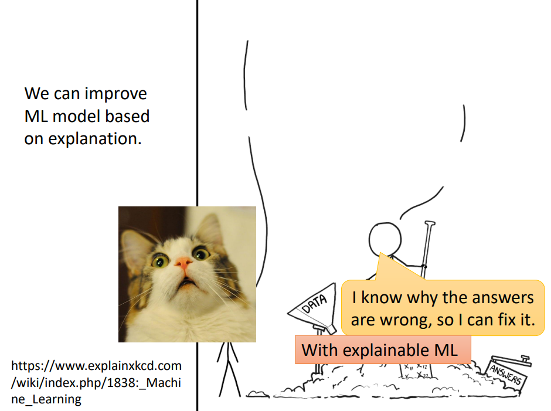

**模型如果具有解释力的话,那未来我们可以凭借着解释的结果,再去修正我们的模型**

## Interpretable v.s. Powerful

**Interpretable：** 一个东西它本来就不是黑箱,我们本来就可以知道它的内容
**Explainable：** 有一个东西它本来是个黑箱,我们想办法赋予它解释的能力,叫做 Explainable

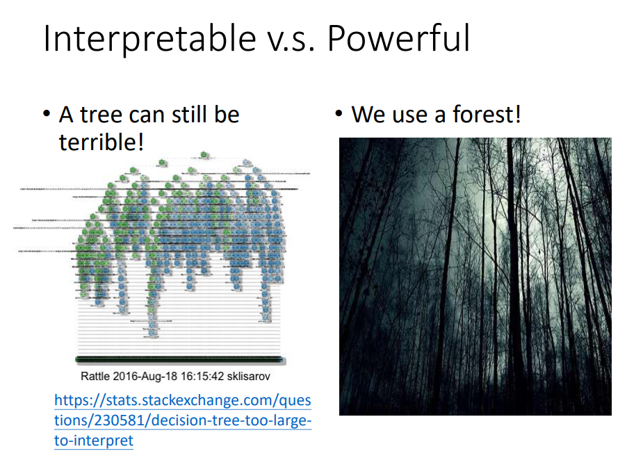  

Decision Tree,它既强大又 Interpretable

## Goal of Explainable ML
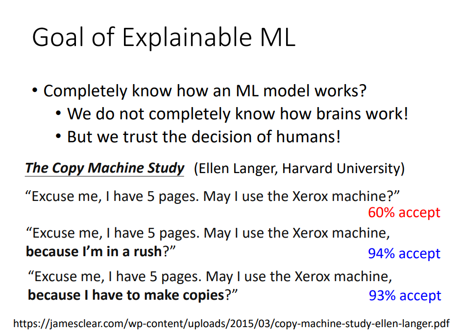
  

什么叫做好的 Explanation,好的 Explanation就是人能接受的 Explanation,人就是需要一个理由让我们觉得高兴,而到底是让谁高兴呢  

## Explainable ML
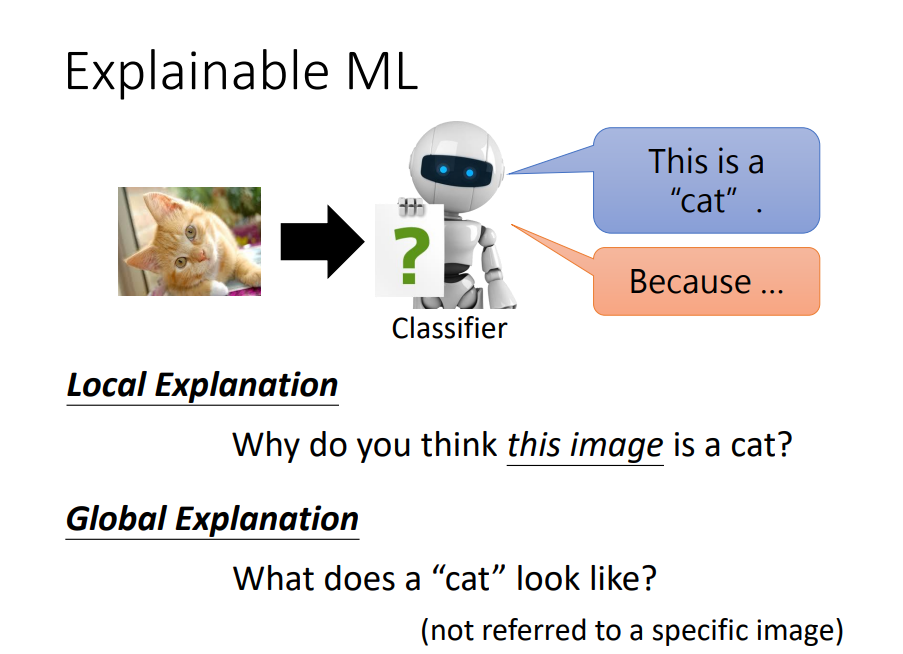

### Local Explanation
Local Explanation：假设我们有一个 Image 的 Classify,我们给它一张图片,它判断说它是一只猫,问题是,為什么,或者机器要回答问题是,為什么你觉得这张图片是一只猫,它根据某一张图片来回答问题  

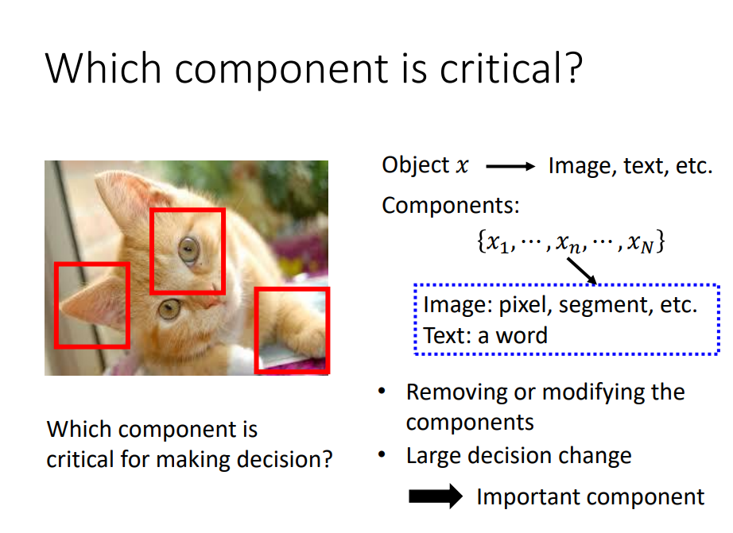
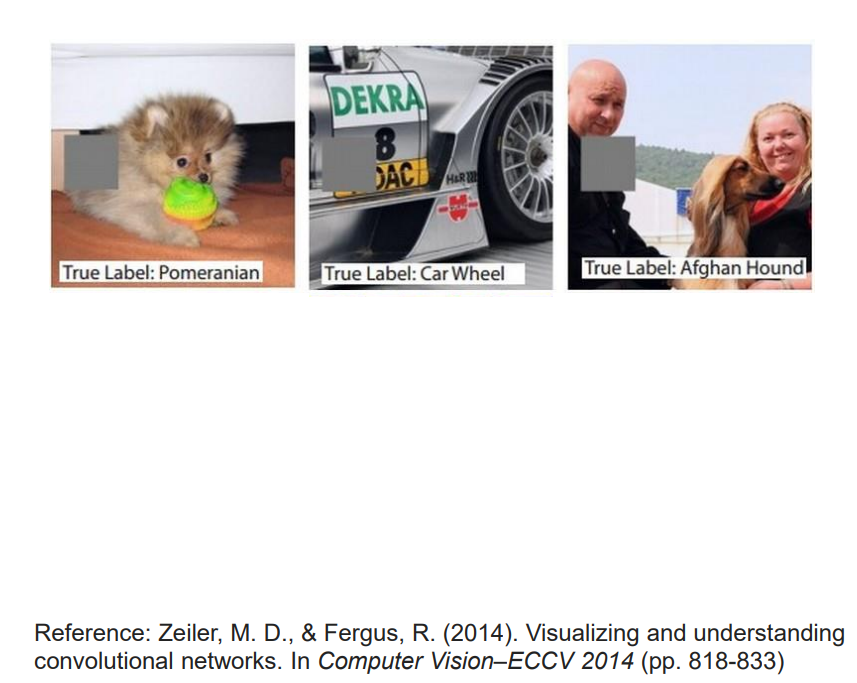
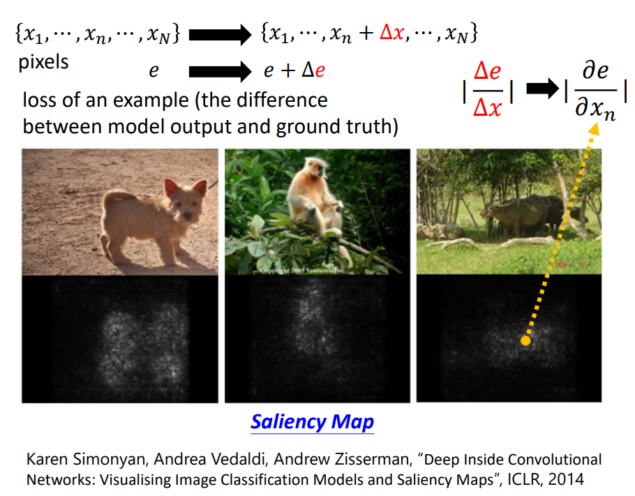

### Global Explanation

Global Explanation：现在还没有给我们的 Classifier任何图片，要问的是,对一个 Classifier 而言,什么样的图片叫做猫,我们并不是针对任何一张,特定的图片来进行分析,我们是想要知道说,当我们有一个 Model,它裡面有一堆参数的时候,对这堆参数而言,什么样的东西叫作一只猫

Global 的 Explanation 是什麼意思呢,我们在前一堂课讲的是 Local 的 Explanation,也就是给机器一张照片,那它告诉我们说,看到这张图片,它為什麼觉得裡面有一隻猫

#### What does a filter detect?
Convolutional 的 Neural Network，里面有很多Fileter、Convolutional Layer
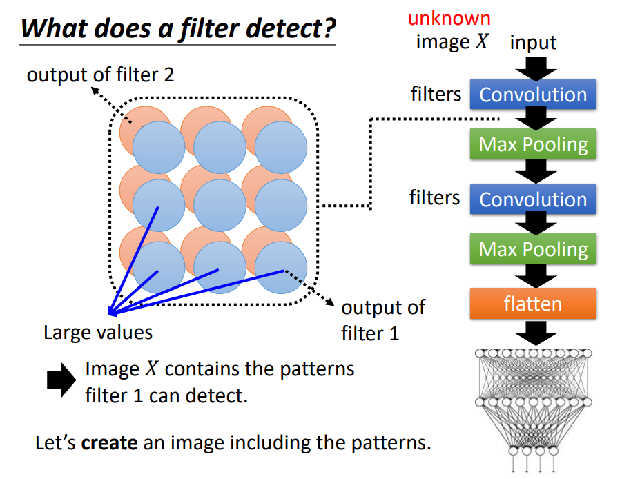

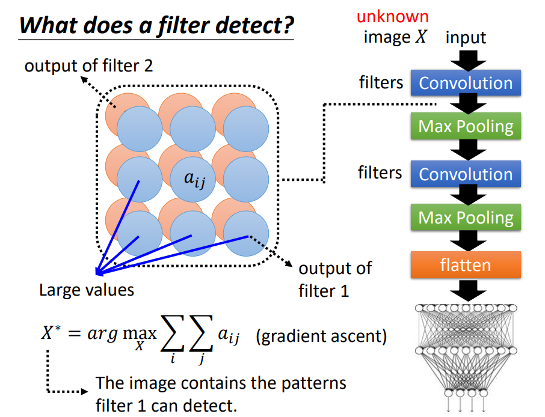

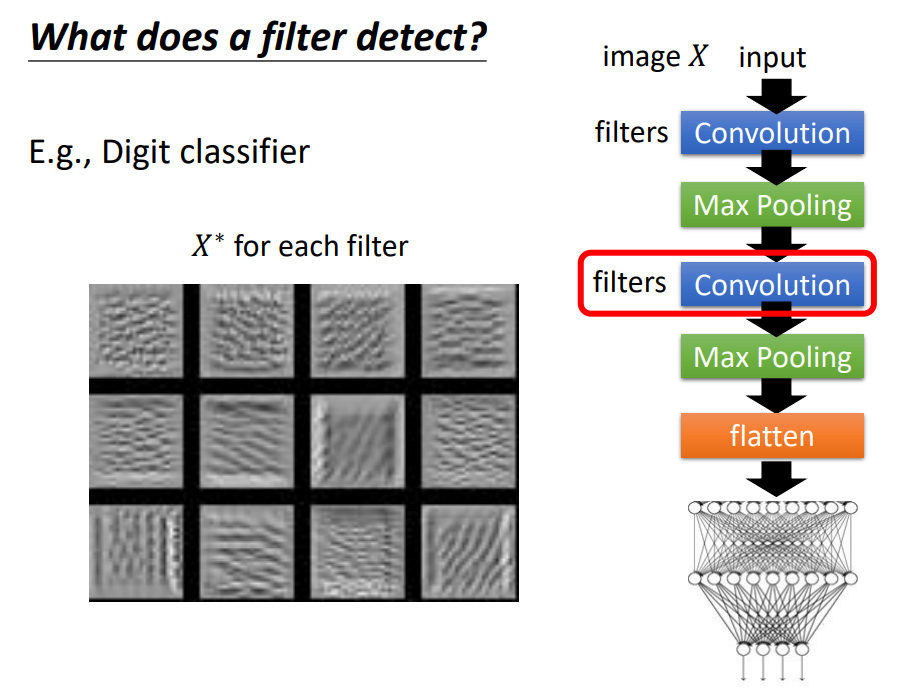

#### What does a digit look like for CNN?
