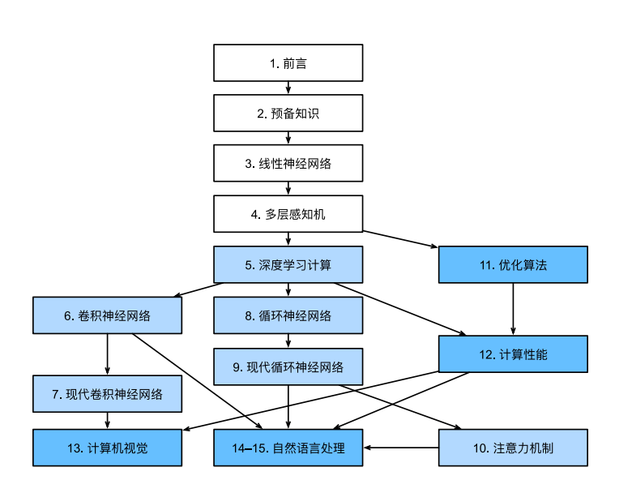

# DeepLearning

### 介绍

DeepLearning个人学习
学习地址[：https://courses.d2l.ai/zh-v2/](https://courses.d2l.ai/zh-v2/)
学习时间：6月1日---7月10日

### 全书结构

* ❤️ 第⼀部分包括基础知识和预备知识。1节提供深度学习的⼊⻔课程。然后在2节中，我们将快速向你介绍实践深度学习所需的前提条件，例如如何存储和处理数据，以及如何应⽤基于线性代数、微积分和概率基本概念的各种数值运算。3节和4节涵盖了深度学习的最基本概念和技术，例如线性回归、多层感知机和正则化。
* ❤️ 第二部分讨论现代深度学习技术。5节描述了**深度学习计算的各种关键组件**。在 6节和7节中，介绍**卷积神经⽹络**（convolutional neural network，CNN），这是构成⼤多数现代计算机视觉系统⻣⼲的强⼤⼯具。在8节和9节 中，引⼊**循环神经⽹络**(recurrent neural network，RNN)，这是⼀种利⽤数据中的时间或序列结构的模型，通常⽤于⾃然语⾔处理和时间序列预测。在10节中，我们介绍了⼀类新的模型，采⽤⼀种称为**注意⼒机制**的技术，最近它们已经开始在⾃然语⾔处理中取代循环神经⽹络。这⼀部分将 帮助你快速了解⼤多数现代深度学习应⽤背后的基本⼯具。
* ❤️ 第三部分讨论可伸缩性、效率和应⽤程序。11节中，讨论⽤于训练深度学习模型的**⼏种常⽤优化算法**。12节探讨影响深度学习代码计算**性能的⼏个关键因素**。13节展深度学习在计算机视觉中的主要应⽤。14节15节中，展⽰如何预训练语⾔表⽰模型并 将其应⽤于⾃然语⾔处理任务。

---

### 目录章节

1. 准备工作与安装
2. 预备知识  
   2.1. 数据操作  
   2.2. 数据预处理  
   2.3. 线性代数  
   2.4. 微积分  
   2.5. 自动微分  
   2.6. 概率  
   2.7. 查阅文档  
3. 线性神经网络  
   3.1. 线性回归  
   3.2. 线性回归的从零开始实现  
   3.3. 线性回归的简洁实现  
   3.4. softmax回归  
   3.5. 图像分类数据集  
   3.6. softmax回归的从零开始实现  
   3.7. softmax回归的简洁实现  
4. 多层感知机  
   4.1. 多层感知机  
   4.2. 多层感知机的从零开始实现  
   4.3. 多层感知机的简洁实现  
   4.4. 模型选择、欠拟合和过拟合  
   4.5. 权重衰减  
   4.6. 暂退法（Dropout）  
   4.7. 前向传播、反向传播和计算图  
   4.8. 数值稳定性和模型初始化  
   4.9. 环境和分布偏移  
   4.10. 实战Kaggle比赛：预测房价  
5. 深度学习计算
   5.1. 层和块  
   5.2. 参数管理  
   5.3. 延后初始化  
   5.4. 自定义层  
   5.5. 读写文件  
   5.6. GPU  
6. 卷积神经网络  
6.1. 从全连接层到卷积  
6.2. 图像卷积  
6.3. 填充和步幅  
6.4. 多输入多输出通道  
6.5. 汇聚层  
6.6. 卷积神经网络（LeNet）  
7. 现代卷积神经网络    
7.1. 深度卷积神经网络（AlexNet）  
7.2. 使用块的网络（VGG）  
7.3. 网络中的网络（NiN）  
7.4. 含并行连结的网络（GoogLeNet）  
7.5. 批量规范化  
7.6. 残差网络（ResNet）  
7.7. 稠密连接网络（DenseNet）  
8. 循环神经网络  
8.1. 序列模型  
8.2. 文本预处理  
8.3. 语言模型和数据集  
8.4. 循环神经网络  
8.5. 循环神经网络的从零开始实现  
8.6. 循环神经网络的简洁实现  
8.7. 通过时间反向传播  
9. 现代循环神经网络  
10. 注意力机制
11. 优化算法
12. 计算性能  
12.1. 编译器和解释器  
12.2. 异步计算  
12.3. 自动并行  
12.4. 硬件  
12.5. 多GPU训练  
12.6. 多GPU的简洁实现  
12.7. 参数服务器  
13. 计算机视觉  
13.1. 图像增广  
13.2. 微调  
13.3. 目标检测和边界框  
13.4. 锚框  
13.5. 多尺度目标检测  
13.6. 目标检测数据集  
13.7. 单发多框检测（SSD）  
13.8. 区域卷积神经网络（R-CNN）系列  
13.9. 语义分割和数据集  
13.10. 转置卷积  
13.11. 全卷积网络  
13.12. 风格迁移  
13.13. 实战 Kaggle 比赛：图像分类 (CIFAR-10)  
13.14. 实战Kaggle比赛：狗的品种识别（ImageNet Dogs）  
14. 自然语言处理：预训练  
14.1. 词嵌入（Word2vec）  
14.2. 近似训练  
14.3. 用于预训练词嵌入的数据集  
14.4. 预训练word2vec  
14.5. 全局向量的词嵌入（GloVe）  
14.6. 子词嵌入  
14.7. 词的相似性和类比任务  
14.8. 来自Transformers的双向编码器表示（BERT）  
14.9. 用于预训练BERT的数据集  
14.10. 预训练BERT  
15. 自然语言处理：应用  
15.1. 情感分析及数据集  
15.2. 情感分析：使用循环神经网络  
15.3. 情感分析：使用卷积神经网络  
15.4. 自然语言推断与数据集  
15.5. 自然语言推断：使用注意力  
15.6. 针对序列级和词元级应用程序微调BERT  
15.7. 自然语言推断：微调BERT  

---

### 参与贡献

1. Fork 本仓库
2. 新建 Feat_xxx 分支
3. 提交代码
4. 新建 Pull Request

### 链接

1. 使用 Readme\_XXX.md 来支持不同的语言，例如 Readme\_en.md, Readme\_zh.md
2. Git使用指南 [https://gitee.com/all-about-git](https://gitee.com/all-about-git)
4. Gitee同步[https://gitee.com/moye12325/DeepLearning](https://gitee.com/moye12325/DeepLearning)
