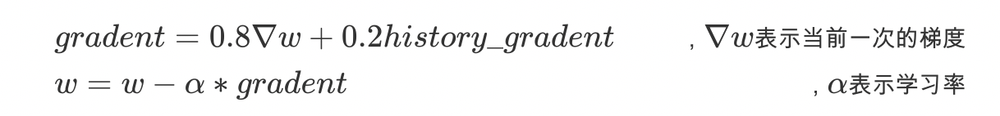

# 优化算法
## 3. 常见的优化算法介绍

### 3.1 梯度下降算法（batch gradient descent BGD）

每次迭代都需要把所有样本都送入，这样的好处是每次迭代都顾及了全部的样本，做的是全局最优化,但是有可能达到局部最优。

### 3.2 随机梯度下降法 (Stochastic gradient descent SGD)

针对梯度下降算法训练速度过慢的缺点，提出了随机梯度下降算法，随机梯度下降算法算法是从样本中随机抽出一组，训练后按梯度更新一次，然后再抽取一组，再更新一次，在样本量及其大的情况下，可能不用训练完所有的样本就可以获得一个损失值在可接受范围之内的模型了。

torch中的api为：`torch.optim.SGD()`

### 3.3 小批量梯度下降 (Mini-batch gradient descent MBGD）

SGD相对来说要快很多，但是也有存在问题，由于单个样本的训练可能会带来很多噪声，使得SGD并不是每次迭代都向着整体最优化方向，因此在刚开始训练时可能收敛得很快，但是训练一段时间后就会变得很慢。在此基础上又提出了小批量梯度下降法，它是每次从样本中随机抽取一小批进行训练，而不是一组，这样即保证了效果又保证的速度。

### 3.4 动量法

mini-batch SGD算法虽然这种算法能够带来很好的训练速度，但是在到达最优点的时候并不能够总是真正到达最优点，而是在最优点附近徘徊。

另一个缺点就是mini-batch SGD需要我们挑选一个合适的学习率，当我们采用小的学习率的时候，会导致网络在训练的时候收敛太慢；当我们采用大的学习率的时候，会导致在训练过程中优化的幅度跳过函数的范围，也就是可能跳过最优点。我们所希望的仅仅是网络在优化的时候网络的损失函数有一个很好的收敛速度同时又不至于摆动幅度太大。

所以Momentum优化器刚好可以解决我们所面临的问题，它主要是基于梯度的移动指数加权平均，对网络的梯度进行平滑处理的，让梯度的摆动幅度变得更小。

（注：t+1的的histroy_gradent 为第t次的gradent）

### 3.5 AdaGrad 

AdaGrad算法就是将每一个参数的每一次迭代的梯度取平方累加后在开方，用全局学习率除以这个数，作为学习率的动态更新，从而达到**自适应学习率**的效果

### 3.6 RMSProp

Momentum优化算法中，虽然初步解决了优化中摆动幅度大的问题,为了进一步优化损失函数在更新中存在摆动幅度过大的问题，并且进一步加快函数的收敛速度，RMSProp算法对参数的梯度使用了平方加权平均数。 

### 3.7 Adam

Adam（Adaptive Moment Estimation）算法是将Momentum算法和RMSProp算法结合起来使用的一种算法,能够达到防止梯度的摆幅多大，同时还能够加开收敛速度

torch中的api为：`torch.optim.Adam()`

### 3.8 效果演示：

## 4 深度学习避免过拟合/加速训练

### 4.1 Dropout

为了应对神经网络很容易过拟合的问题，2014年 Hinton 提出了一个神器: *Dropout: A Simple Way to Prevent Neural Networks from Overfitting*

实验结果：

dropout 是指在深度学习网络的训练过程中，按照一定的概率将一部分神经网络单元暂时从网络中丢弃，相当于从原始的网络中找到一个更瘦的网络

在大规模的神经网络中有这样两个缺点：1. 费时；2. 容易过拟合

对于一个有 N 个节点的神经网络，有了 dropout后，就可以看做是 2^N 个模型的集合了，但此时要训练的参数数目却是不变的，这就缓解了费时的问题。

论文中做了这样的类比，无性繁殖可以保留大段的优秀基因，而有性繁殖则将基因随机拆了又拆，破坏了大段基因的联合适应性，但是自然选择中选择了有性繁殖，物竞天择，适者生存，可见有性繁殖的强大。

dropout 也能达到同样的效果，它强迫一个神经单元，和随机挑选出来的其他神经单元共同工作，消除减弱了神经元节点间的联合适应性，增强了泛化能力。

### 4.2 Batch Normalization

Batch Normalization, 批标准化, 和普通的数据标准化类似, 是将分散的数据调整分布的一种做法, 也是优化神经网络的一种方法.

Batch Normalization是基于Mini-Batch SGD的一种优化方法。

虽然BN层还解释不清其理论原因，但是实践证明加入BN层可以显著提升模型收敛速度。

机器学习领域有个很重要的假设：**样本独立同分布假设**，就是假设训练数据和测试数据是满足相同分布的，这是通过训练数据获得的模型能够在测试集获得好的效果的一个基本保障。

但是随着模型的训练，各层网络参数的值一直在变化，各个隐藏层的输入数据的分布也会随之不停的变化，对于每个隐藏层来说，输入就不符合样本独立同分布的假设。

那BatchNorm的作用是什么呢？**BatchNorm就是在深度神经网络训练过程中使得每一层神经网络的输入保持相同分布的。**

每个隐层神经元的激活值做BN，可以想象成每个隐层又加上了一层BN操作层，它位于A=X*W+B激活值获得之后，非线性函数变换之前，其图示如下

