# HW11
## 任务介绍
- 通过使用Domain Adaptation的方法将有label的真实照片（5000）来预测没有label的黑白的图案（100000）物体的类别。
- 训练数据来自GTA-5的街景，测试数据来自真实世界的街景，要求将Feat-A和Feat-B越接近越好
- 
- 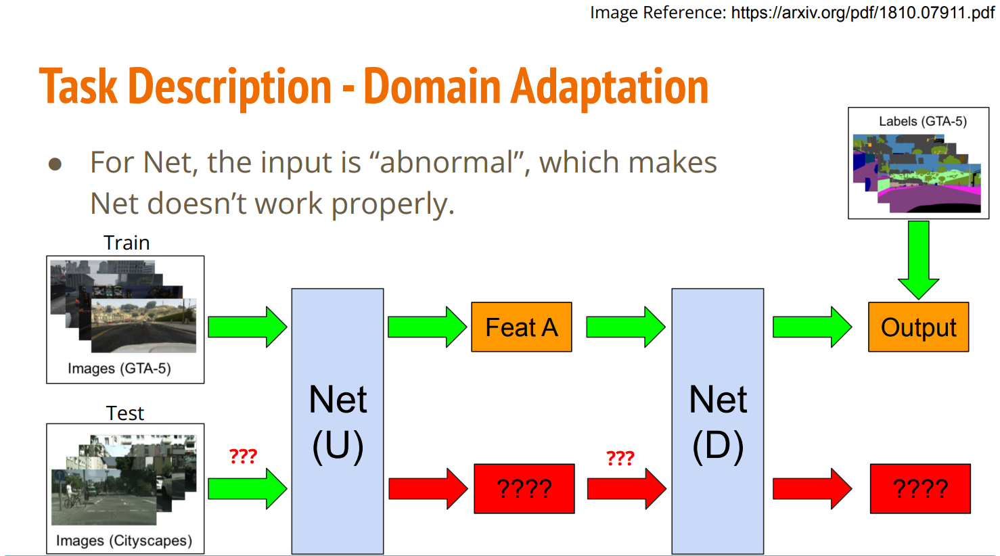
- 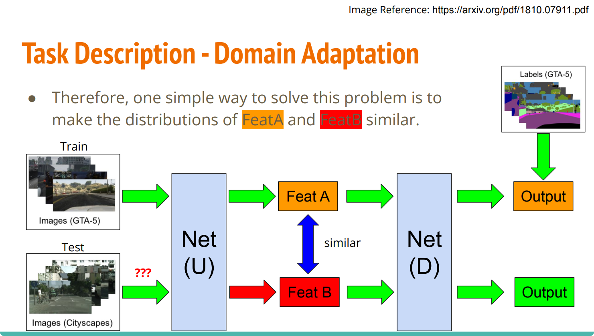
- 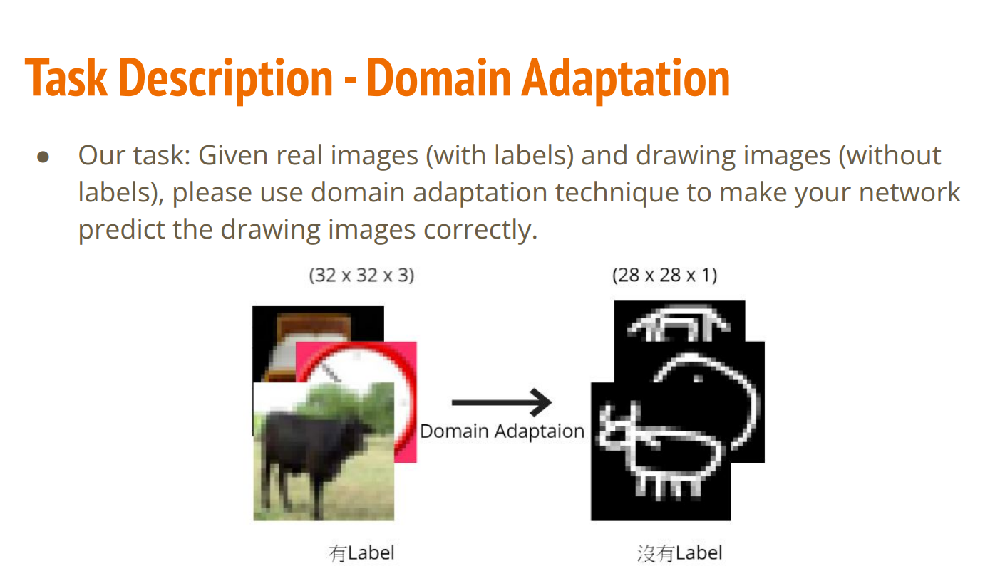

## baseline
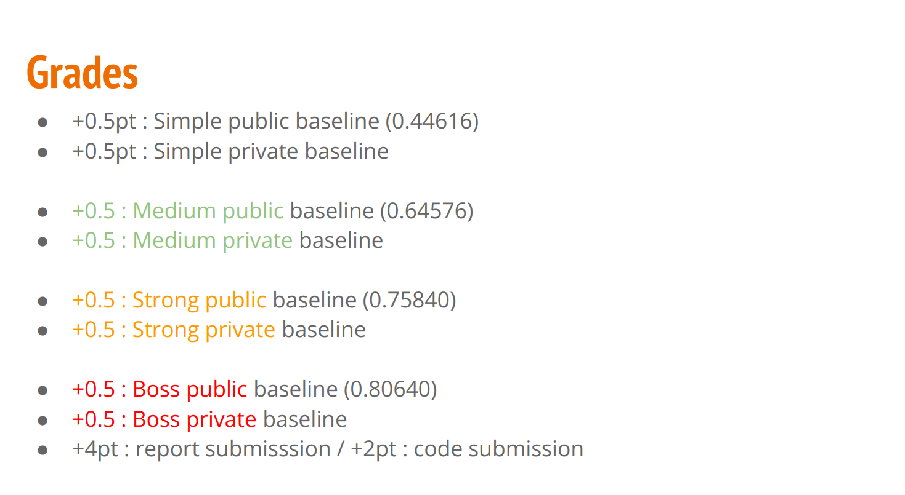

## 改进措施
- Set proper λ in DaNN algorithm.
- Training more epochs.
---
- The Test data is label-balanced, can you make use of this additional information?
---
- 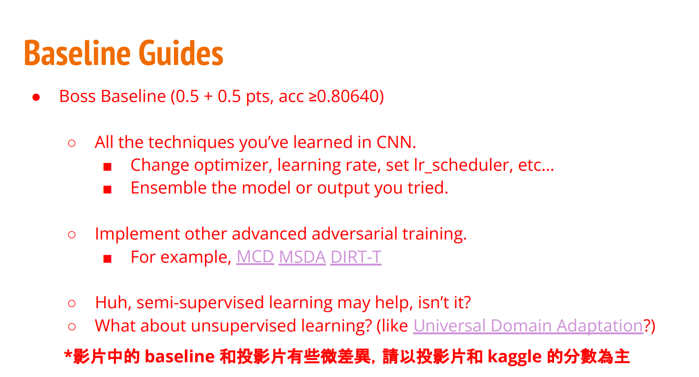

## 试验记录
### 初始记录 0.53894

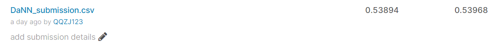

### Medium Baseline  Score: 0.65598
* Set proper λ in DaNN algorithm.
* Luck, Training more epochs.

DaNN（Domain Adaptive Neural Network）的结构仅由两层神经元组成：特征层和分类器层。

在特征层后加入了一项MMD适配层，用来计算源域和目标域的距离，并将其加入网络的损失中进行训练。

故而，整个网络的优化目标也相应地由两部分构成：在有label的源域数据上的分类误差(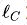)，以及对两个领域数据的判别误差(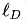 )。优化目标由下式形象地表示：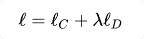

lambda是权衡网络适配的权重的一个参数，可以人工给定。很好理解，就是网络的分类误差； 表示两个领域的距离。

**换而言之：lambda在一定范围内越大，抽取公共特征的能力就会越强，带来的问题是降低抽取模型特征的能力**

### Strong Baseline  Score: 0.72638
动态调整的lamb值，前期可让label predictor更准确，后期更注重domain classifier的表现

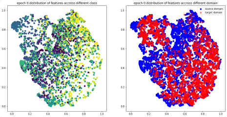
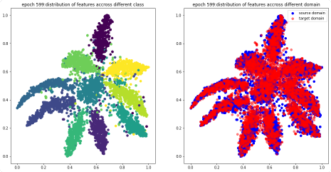
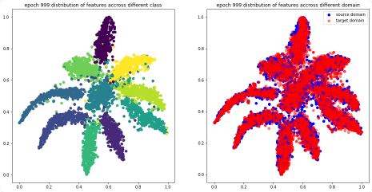

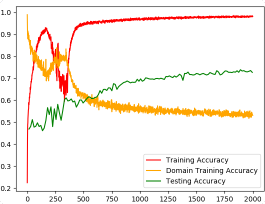
即使模型过度培养培训数据，测试准确性仍在提高，这就是为什么您需要训练更多时代的原因。

### Boss Baseline

* **Change optimizer, learning rate, set lr_scheduler, etc…**
* **Ensemble the model or output you tried.**

利用DANN模型生成伪标签，先采用adversarial的方法训练一个模型，这里我们使用strong baseline得到的模型

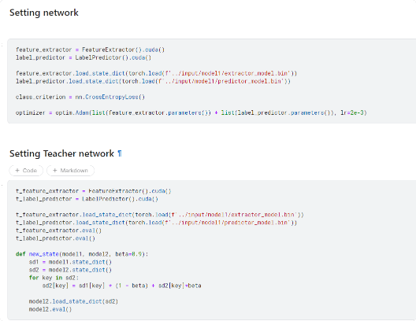

接着是利用第一步产生的模型，对target图片生成伪标签，有了标签，就可以对target做有监督学习，该方法能充分利用模型的潜在价值。

模型被训练了400个epoch,可以看出，**第0个epoch和strong baseline最后的效果差不多**，这跟我们网络的初始参数来自于strong baseline相呼应，第199个epoch，图形变动较大，source和target有了明显的区分，不过分类仍然清晰，第399个epoch，更进了一步，source和target的分布不同是因为二者来自不同的domain，即使同属一个类，他们的feature也会有所区分。

## Domain-Adversarial Training of Neural Networks（DANN）[思想](https://zhuanlan.zhihu.com/p/51499968)
想象一个分类任务，假设现在我们手里有源域数据和目标域数据，其中**源域数据是丰富并且有标记的**，而**目标域数据是充足但是没有标记的**，但是**源域和目标域的特征空间和标记空间相同**。很显然，我们可以轻松的利用源域数据为源域建立一个分类器，但是由于目标域数据本身没有标记，那么我们无法通过常规方法为目标域构建分类器，这时候Domain adaptation 就可以发挥作用了

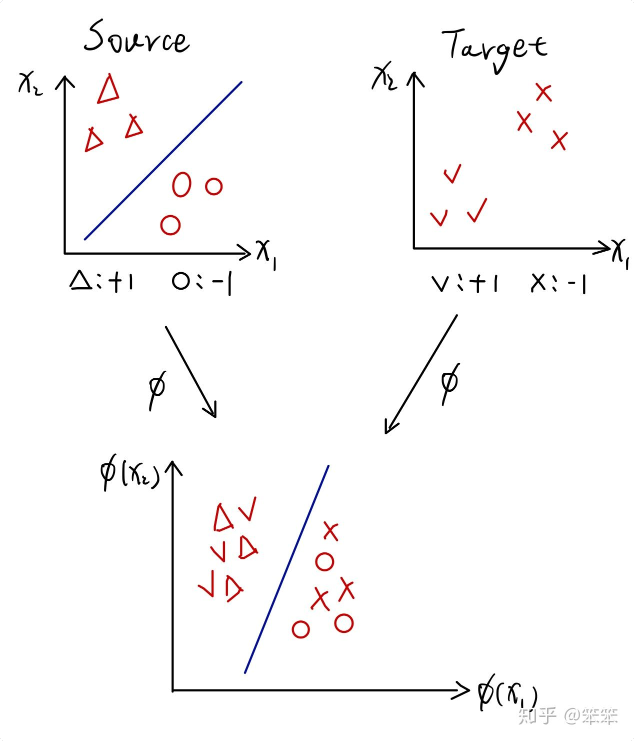

从图中可以看到，源域和目标域的**特征都是{ x1,x2 }**，并且有相**同的标记{-1，+1}**, 但是在目标域数据的标记是不可获得的。此外，虽然源域和目标域的特征空间相同，但是两者的特征分布却不同(两者的样本并不在特征空间的相同位置)。 那么我们如何做到利用源域数据来帮助目标域进行分类呢?

这里最关键的一点就是在同一个特征空间中源域和目标域的分布不同。

**假设两者分布相同**,那么我们就可以直接利用源域分类器对目标域数据进行分类了。

**Domain adaptation的思想**就是 ***通过消除源域和目标域的分布差异，使得源域数据和目标域数据能同时被分开。*** 在图一中，通过映射函数φ将源域数据和目标域数据映射到某个空间中，并且将属于+1的样本混合在一-起，属于-1的样本混合在一起。由于源域数据有标记，所以可以利用源域数据建立分类器。又因为源域数据和目标域数据混合在一起了，所以在分开源域样本的同时目标域样本也被分开了，这样任务就完成了。
