# Sequence to sequence
## Batch Normalization
## Transformer 
Transformer和Bert有很大联系
### Sequence-to-sequence (Seq2seq)
不知道output的长度，需要机器自行决定，例如语音辨识输入语音信号，输出是语音辨识的结果  

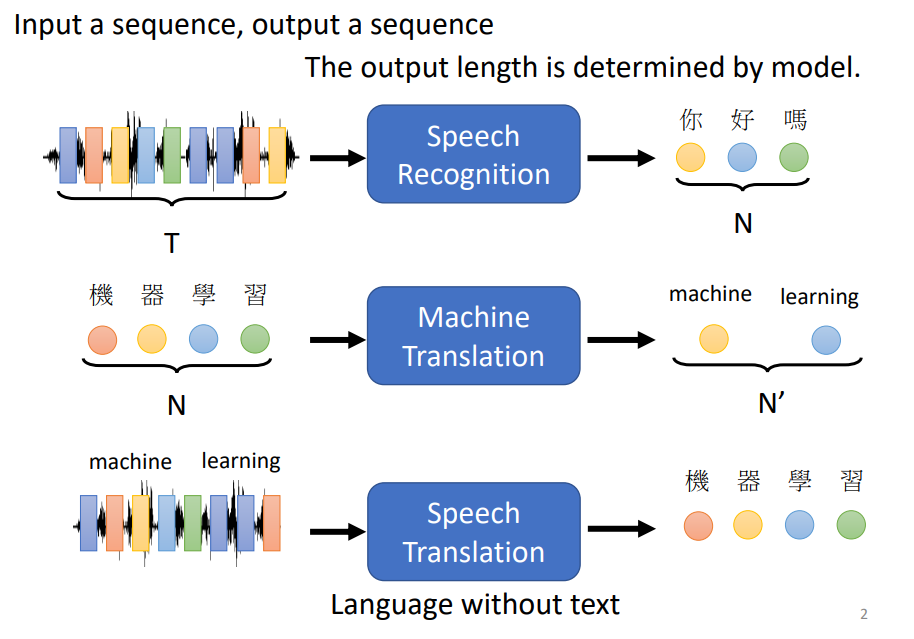

#### 语音合成
语音辨识反过来就是语音合成
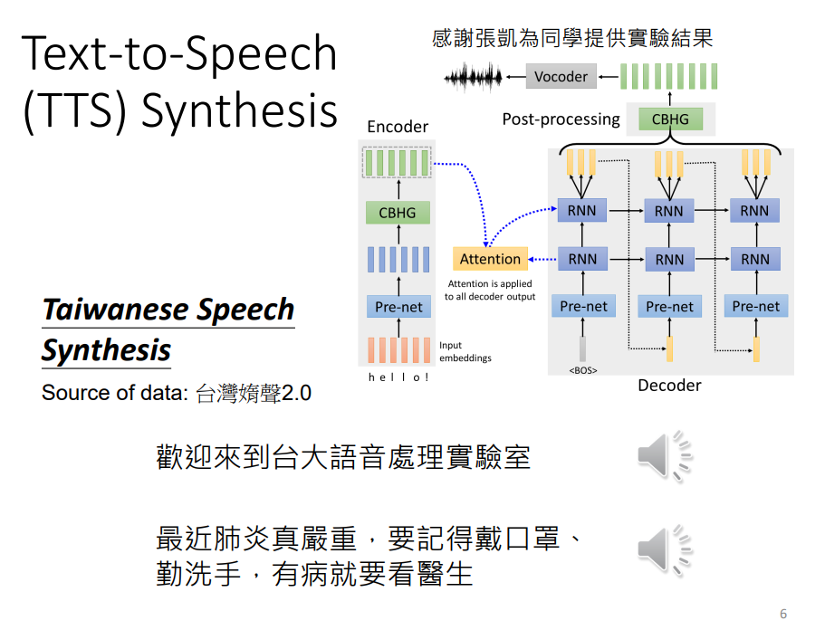

#### 聊天机器人
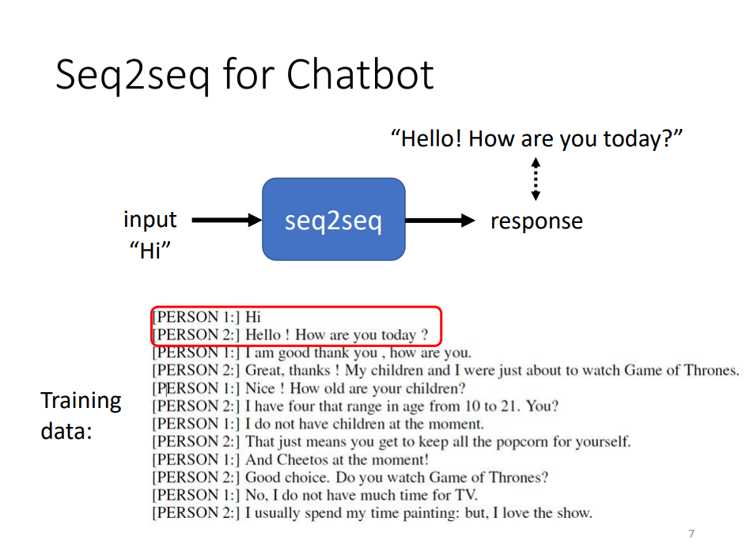

#### NLP任务
往往需要客制化模型
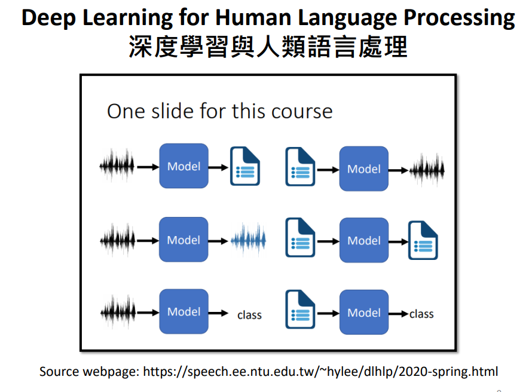

#### 文法剖析
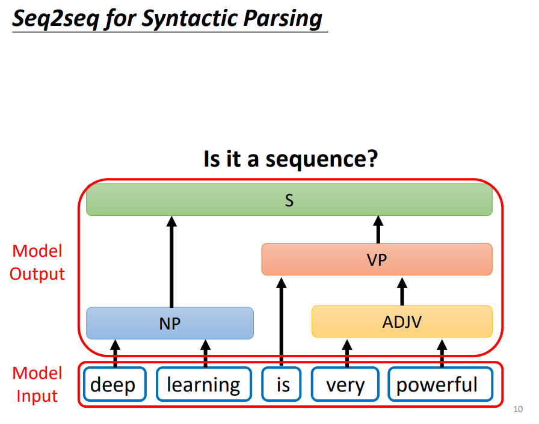
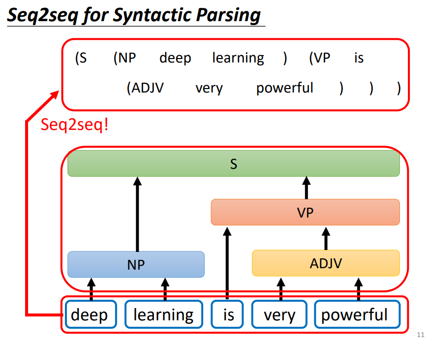

#### Encoder
给一排向量输出一排向量
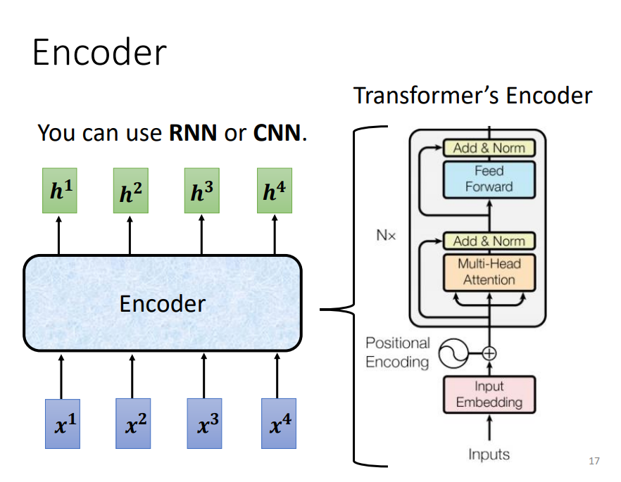

每一个block做的事情是好几个layer做的事情。先做一个self-attention，input一排vector，输出一排vector
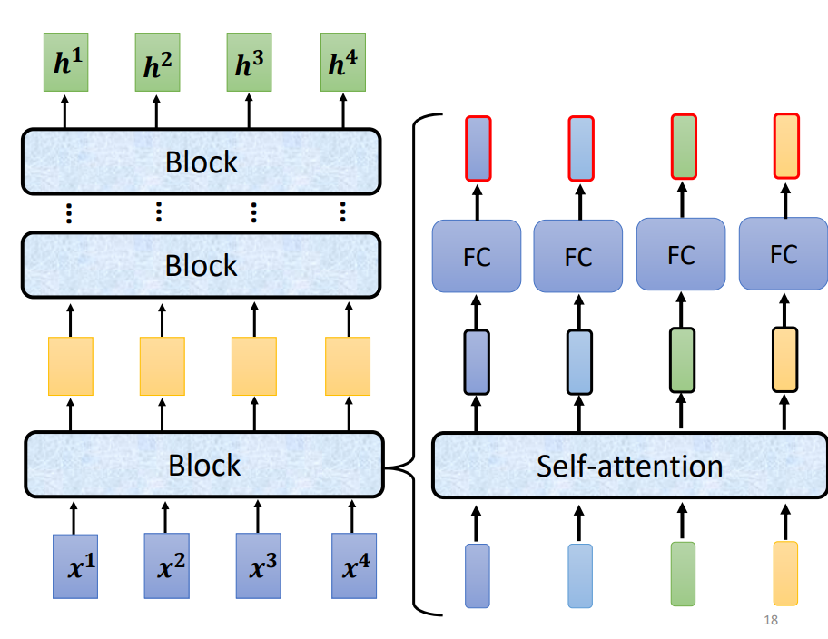

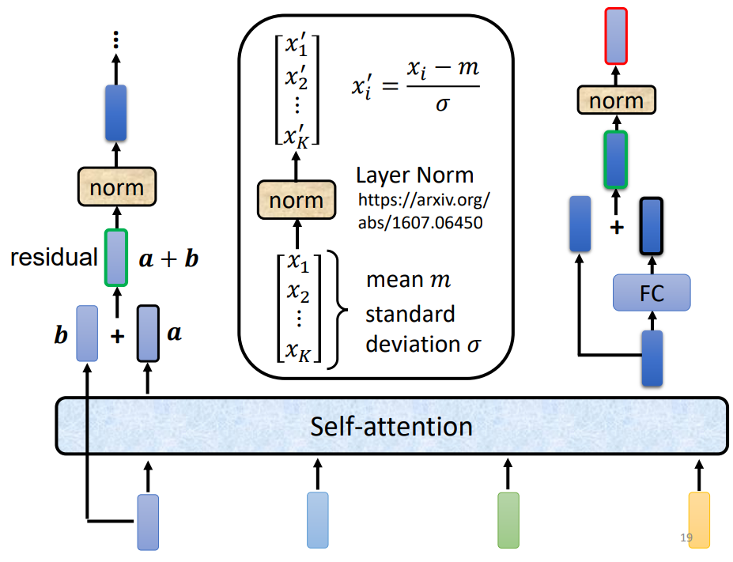

#### Decoder
（预测下一个输入）
先给特殊符号作为开始，decoder吐出一个很长的向量 

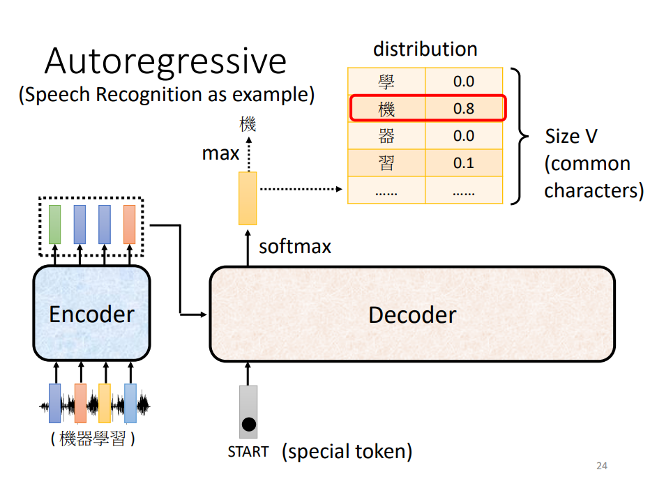
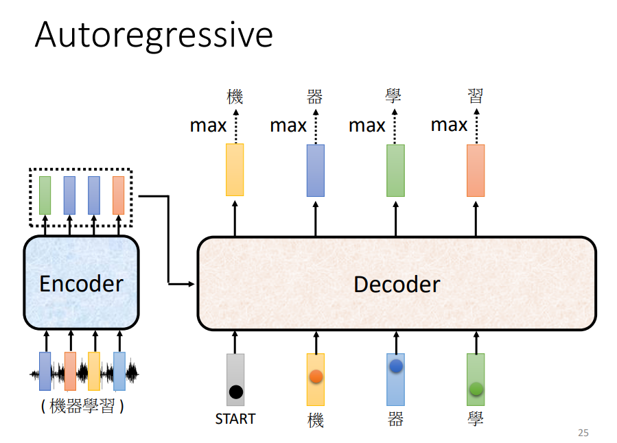

#### Encoder与Decoder架构区别

最后会做一个softmax，中间加了一个masked。  
Self-attention看完a1234后输出b1，而Masked Self-attention，则不能再看a234，看完a1输出b1
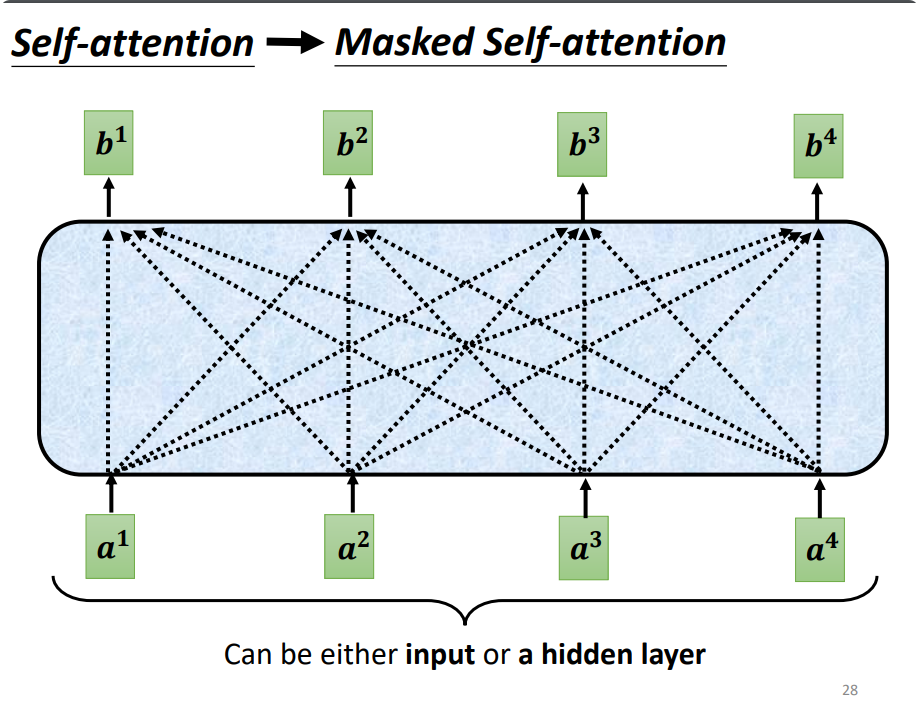

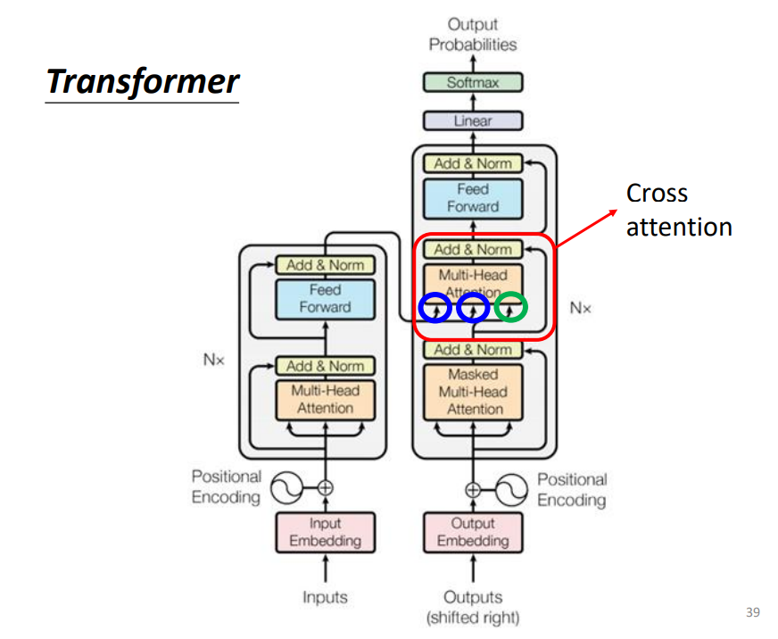

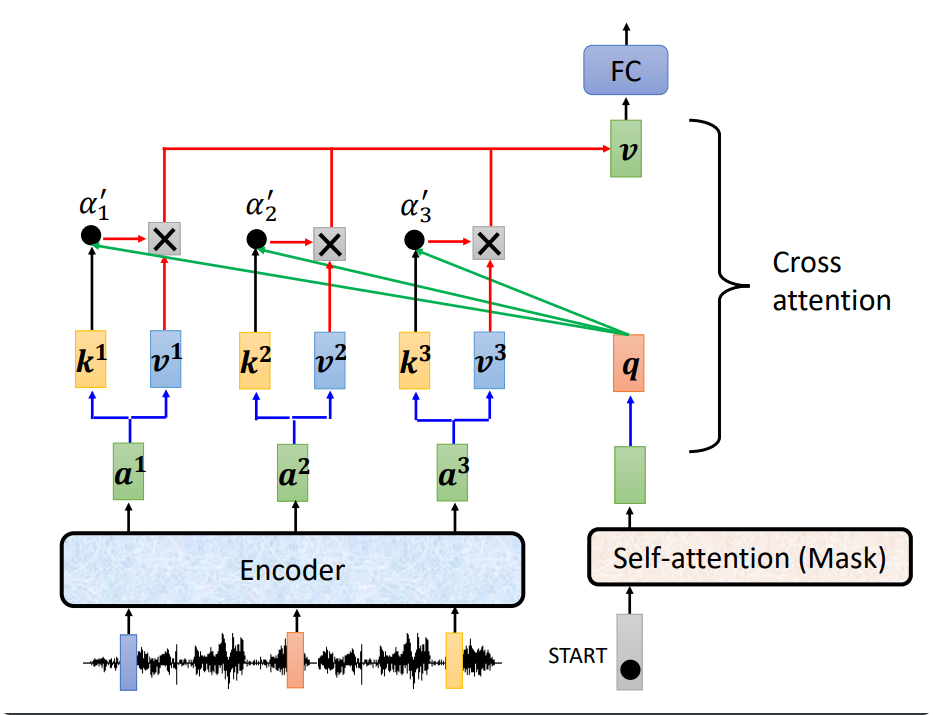

