# HW7 抽取式问答

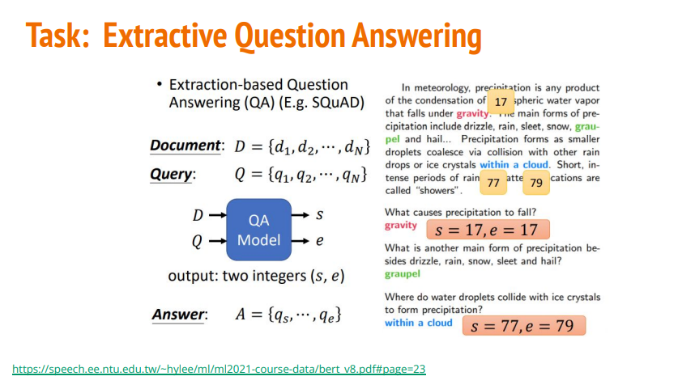

## Task description

* Chinese Extractive Question Answering
  * Input: Paragraph + Question
  * Output: Answer
* Objective: Learn how to fine tune a pretrained model on downstream task using transformers了解如何使用转换器对下游任务的预训练模型进行微调
* Todo
  * Fine tune a pretrained chinese BERT model 微调预训练的中文 BERT 模型
  * Change hyperparameters (e.g. doc_stride) 更改超参数（例如 doc_stride）
  * Apply linear learning rate decay 应用线性学习率衰减
  * Try other pretrained models 尝试其他预训练模型
  * Improve preprocessing 改进预处理
  * Improve postprocessing 改进后处理
* Training tips
  Automatic mixed precision 自动混合精度
  Gradient accumulation 梯度累积
  Ensemble
* Estimated training time (tesla t4 with automatic mixed precision enabled)
  * Simple: 8mins
  * Medium: 8mins
  * Strong: 25mins
  * Boss: 2.5hrs

## 修改策略


## Baseline

|  难易程度   | 精确度  |
|  ----  | ----  |
| simple  | Acc >= 0.45139 |
| medium  | Acc >= 0.65792 |
|strong | Acc >= 0.78136 |
|boss | Acc >= 0.84388 |


## 初始代码  Score: 0.53551

```
Epoch 1 | Step 900 | loss = 0.585, acc = 0.759
Evaluating Dev Set ...
100%
4131/4131 [02:56<00:00, 24.01it/s]
Validation | Epoch 1 | acc = 0.531
```

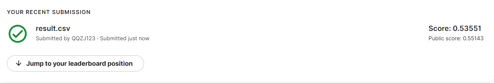

## Medium Baseline   Score: 0.62953   Score: 0.64245  Score: 0.67191

* Apply linear learning rate decay
* Change value of “doc_stride”

### Change value of “doc_stride”

doc_stride参数就是每次滑动的距离  

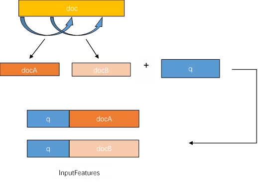

`self.doc_stride = 32`  Score: 0.62953

```
Epoch 1 | Step 900 | loss = 0.585, acc = 0.759
Evaluating Dev Set ...
100%
4131/4131 [11:32<00:00, 6.31it/s]
Validation | Epoch 1 | acc = 0.642
```

`self.doc_stride = 15`   Score: 0.64245
```
Epoch 1 | Step 900 | loss = 0.585, acc = 0.759
Evaluating Dev Set ...
100%
4131/4131 [23:42<00:00, 2.95it/s]
Validation | Epoch 1 | acc = 0.645
```

`self.doc_stride = 15`   Score: 0.64205

由此可见15是个不错的参数

### Apply linear learning rate decay
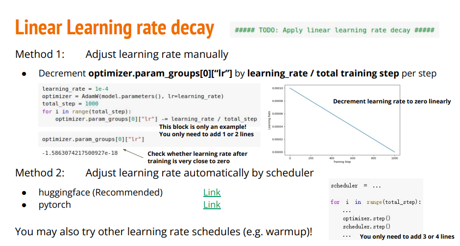
self.doc_stride = 15
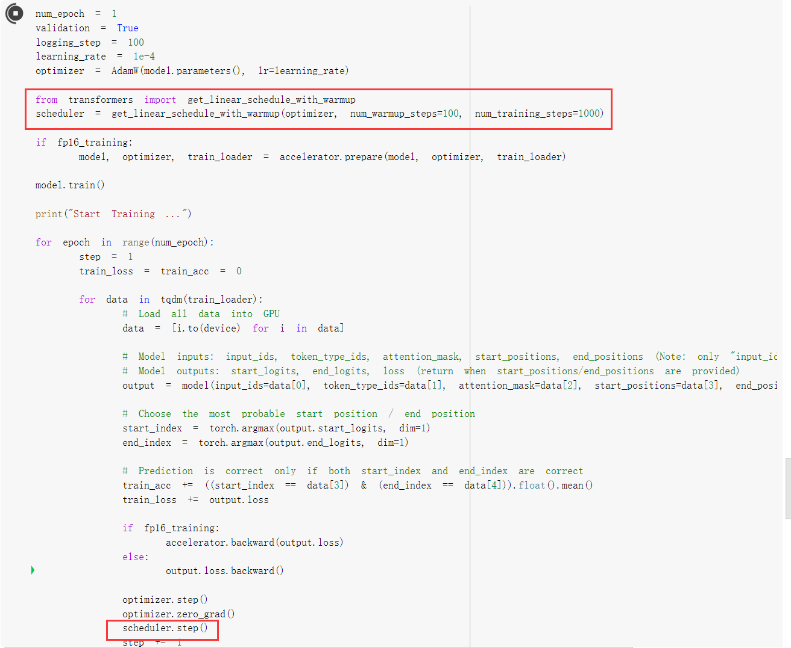

#### warmup  Private score: 0.67191
warmup是针对学习率learning rate优化的一种策略，主要过程是，在预热期间，学习率从0线性/非线性增加到优化器中的初始预设lr，之后使其学习率从优化器中的初始lr线性降低到0

**为什么使用[warmup](https://huggingface.co/docs/transformers/main_classes/optimizer_schedules#transformers.get_linear_schedule_with_warmup)？**  
由于刚开始训练时,模型的权重(weights)是随机初始化的，此时若选择一个较大的学习率,可能带来模型的不稳定(振荡)，选择Warmup预热学习率的方式，可以使得开始训练的几个epoches或者一些steps内学习率较小,在预热的小学习率下，模型可以慢慢趋于稳定,等模型相对稳定后再选择预先设置的学习率进行训练,使得模型收敛速度变得更快，模型效果更佳
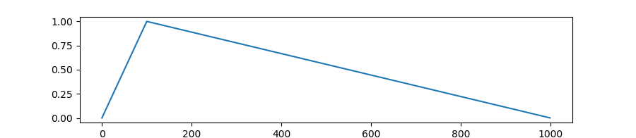
**Parameters：**
* **optimizer (Optimizer)** – The optimizer for which to schedule the learning rate.
* **num_warmup_steps (int)** – The number of steps for the warmup phase.
* **num_training_steps (int)** – The total number of training steps.
* **last_epoch (int, optional, defaults to -1)** – The index of the last epoch when resuming training.

```
991/991 [17:24<00:00, 1.17it/s]
Epoch 1 | Step 100 | loss = 2.518, acc = 0.290
Epoch 1 | Step 200 | loss = 0.959, acc = 0.627
Epoch 1 | Step 300 | loss = 0.730, acc = 0.694
Epoch 1 | Step 400 | loss = 0.669, acc = 0.722
Epoch 1 | Step 500 | loss = 0.629, acc = 0.737
Epoch 1 | Step 600 | loss = 0.547, acc = 0.770
Epoch 1 | Step 700 | loss = 0.491, acc = 0.782
Epoch 1 | Step 800 | loss = 0.473, acc = 0.788
Epoch 1 | Step 900 | loss = 0.472, acc = 0.803
Evaluating Dev Set ...
Validation | Epoch 1 | acc = 0.687
```
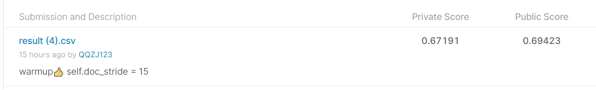

更改warmup版本的lr，发现学习率不宜过大
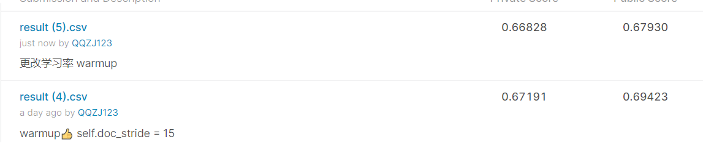


## Strong Baseline
* **Improve preprocessing**
* **Try other pretrained models**

### 代码修改
因为我们的下游任务是对中文文章进行阅读理解。所以我们在这个网站上要记得选用Chinese，这里的bert-base-chinese模型，是最初始的模型，我们在这里选用luhua/chinese_pretrain_mrc_roberta_wwm_ext_large作为我们的改进模型。


使用新的[Pre-train模型](https://huggingface.co/models)
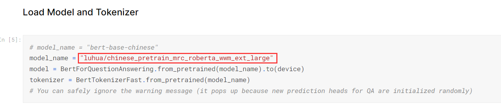

新模型内存很大，降低batch_size。（或者使用助教在视频中提到的技巧Gradient Accumulation来解决batch_size不够的情况）


preprocessing
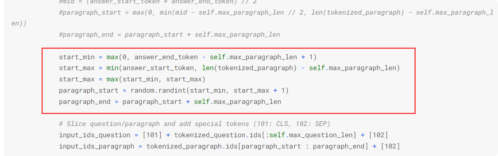
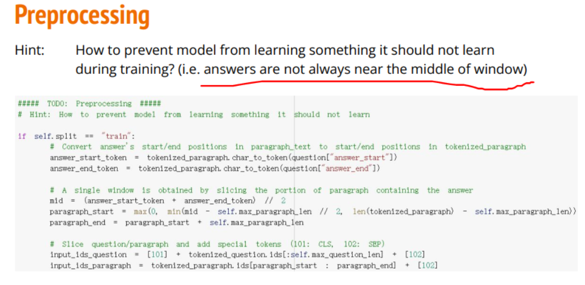
原代码中的训练集都是以answer为中心截取段落，这可能让模型学习到“答案在段落中央”这样的结论，为避免此问题，我将训练集变为随机抽取片段，并且片段包含答案


将训练集变为随机抽取片段，并且片段包含答案，意思就是answer在片段的any位置而非先前的只在中间。

postprocessing 


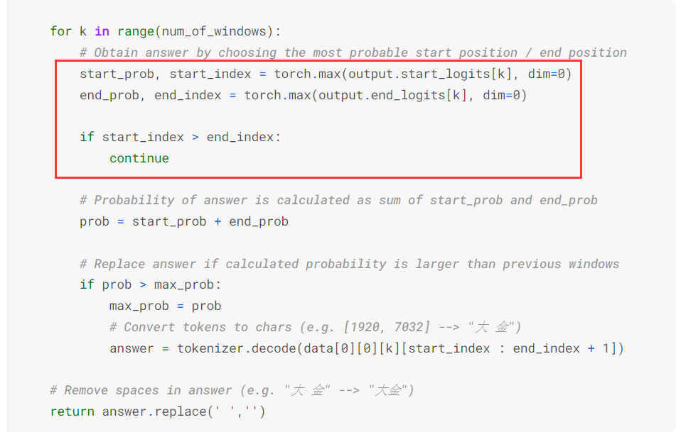


```
Epoch 1 | Step 1500 | loss = 0.431, acc = 0.820, lr=1.1392405063291139e-05
Epoch 1 | Step 1600 | loss = 0.391, acc = 0.834, lr=9.018987341772152e-06
Epoch 1 | Step 1700 | loss = 0.414, acc = 0.827, lr=6.645569620253164e-06
Epoch 1 | Step 1800 | loss = 0.378, acc = 0.827, lr=4.272151898734177e-06
Epoch 1 | Step 1900 | loss = 0.439, acc = 0.809, lr=1.8987341772151897e-06


Validation | Epoch 1 | acc = 0.778
Saving Model ...
```

对学习率进行微调，得出最好的结果为0.78006
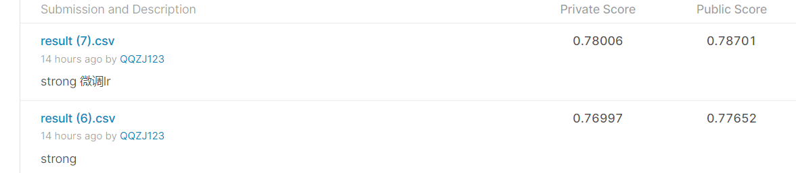


## Boss Baseline
* **Improve postprocessing**
* **Further improve the above hints**

在hugging face中搜索chinese + QA的模型，根据model card描述选择最好的模型。这里就直接选了同一个作者的另外一个模型

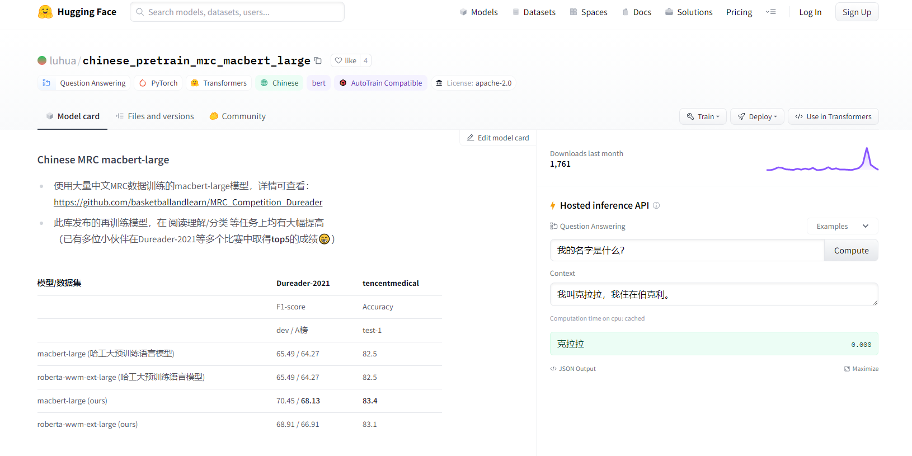

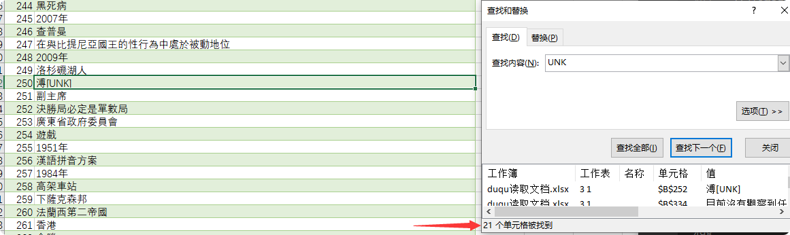
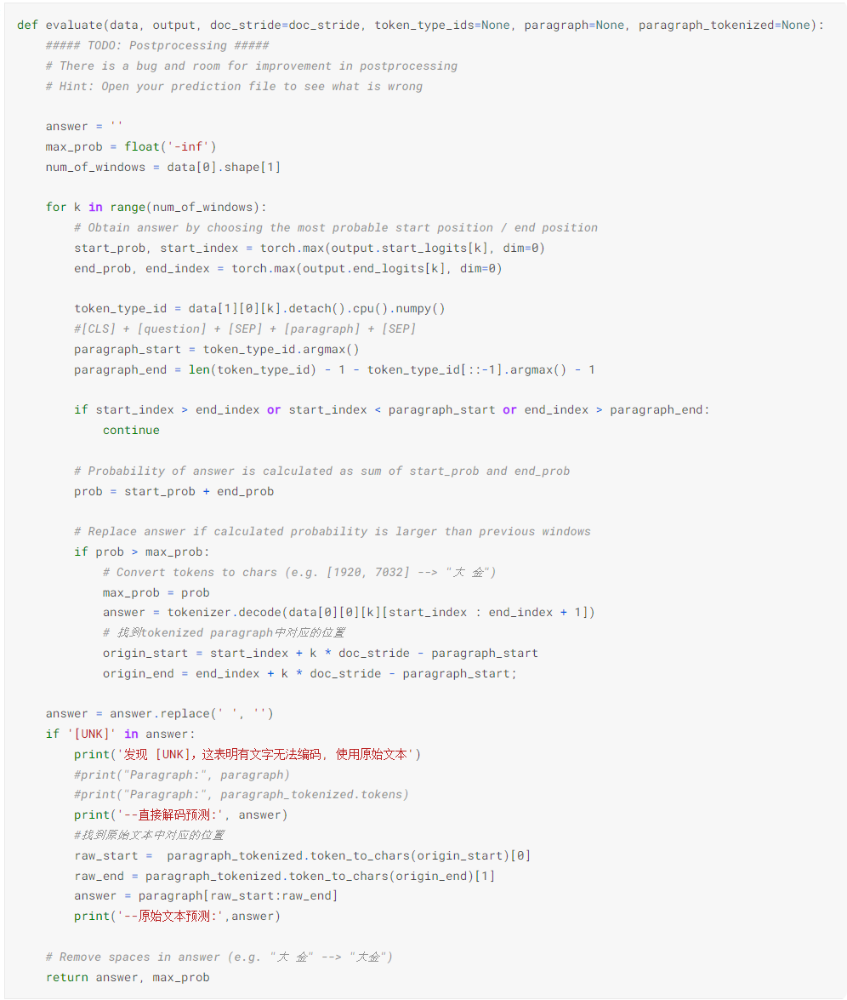

处理结果集中的特殊字符
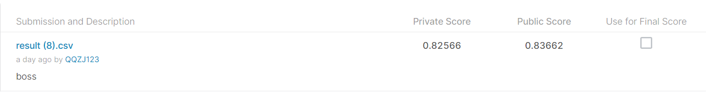
