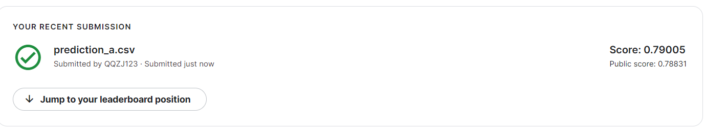

# HW8
## 任务介绍

无监督异常检测：Anomaly Detection异常图片的识别，输入一张图片，判别这张图片时异常还是正常


## baseline


| 难易程度 | 精确度          |
|--------|----------------|
| simple | AUC >= 0.52970 |
| medium | AUC >= 0.72895 |
| strong | AUC >= 0.77196 |
| boss   | AUC >= 0.79506 |


AUC（Area Under Curve）被定义为ROC曲线下与坐标轴围成的面积，显然这个面积的数值不会大于1。又由于ROC曲线一般都处于y=x这条直线的上方，所以AUC的取值范围在0.5和1之间。AUC越接近1.0，检测方法真实性越高;等于0.5时，则真实性最低，无应用价值。


## 初始代码 Score: 0.52966

loss较小且下降太慢
---

调大学习率，显然学习率不是主要矛盾，查看模型，发现提供了三个模型

```
class fcn_autoencoder(nn.Module):
    def __init__(self):
        super(fcn_autoencoder, self).__init__()
        self.encoder = nn.Sequential(
            nn.Linear(64 * 64 * 3, 128),
            nn.ReLU(),
            nn.Linear(128, 64),
            nn.ReLU(), 
            nn.Linear(64, 12), 
            nn.ReLU(), 
            nn.Linear(12, 3)
        )
        
        self.decoder = nn.Sequential(
            nn.Linear(3, 12),
            nn.ReLU(), 
            nn.Linear(12, 64),
            nn.ReLU(),
            nn.Linear(64, 128),
            nn.ReLU(), 
            nn.Linear(128, 64 * 64 * 3), 
            nn.Tanh()
        )

    def forward(self, x):
        x = self.encoder(x)
        x = self.decoder(x)
        return x
```

```
class conv_autoencoder(nn.Module):
    def __init__(self):
        super(conv_autoencoder, self).__init__()
        self.encoder = nn.Sequential(
            nn.Conv2d(3, 12, 4, stride=2, padding=1),         
            nn.ReLU(),
            nn.Conv2d(12, 24, 4, stride=2, padding=1),        
            nn.ReLU(),
			      nn.Conv2d(24, 48, 4, stride=2, padding=1),         
            nn.ReLU(),
        )
        self.decoder = nn.Sequential(
			      nn.ConvTranspose2d(48, 24, 4, stride=2, padding=1),
            nn.ReLU(),
			      nn.ConvTranspose2d(24, 12, 4, stride=2, padding=1), 
            nn.ReLU(),
            nn.ConvTranspose2d(12, 3, 4, stride=2, padding=1),
            nn.Tanh(),
        )

    def forward(self, x):
        x = self.encoder(x)
        x = self.decoder(x)
        return x
```

```
class VAE(nn.Module):
    def __init__(self):
        super(VAE, self).__init__()
        self.encoder = nn.Sequential(
            nn.Conv2d(3, 12, 4, stride=2, padding=1),            
            nn.ReLU(),
            nn.Conv2d(12, 24, 4, stride=2, padding=1),    
            nn.ReLU(),
        )
        self.enc_out_1 = nn.Sequential(
            nn.Conv2d(24, 48, 4, stride=2, padding=1),  
            nn.ReLU(),
        )
        self.enc_out_2 = nn.Sequential(
            nn.Conv2d(24, 48, 4, stride=2, padding=1),
            nn.ReLU(),
        )
        self.decoder = nn.Sequential(
			      nn.ConvTranspose2d(48, 24, 4, stride=2, padding=1), 
            nn.ReLU(),
			      nn.ConvTranspose2d(24, 12, 4, stride=2, padding=1), 
            nn.ReLU(),
            nn.ConvTranspose2d(12, 3, 4, stride=2, padding=1), 
            nn.Tanh(),
        )

    def encode(self, x):
        h1 = self.encoder(x)
        return self.enc_out_1(h1), self.enc_out_2(h1)

    def reparametrize(self, mu, logvar):
        std = logvar.mul(0.5).exp_()
        if torch.cuda.is_available():
            eps = torch.cuda.FloatTensor(std.size()).normal_()
        else:
            eps = torch.FloatTensor(std.size()).normal_()
        eps = Variable(eps)
        return eps.mul(std).add_(mu)

    def decode(self, z):
        return self.decoder(z)

    def forward(self, x):
        mu, logvar = self.encode(x)
        z = self.reparametrize(mu, logvar)
        return self.decode(z), mu, logvar
```

## Medium Baseline
选用fcn_autoencoder模型，结果有个很大的提升，同时也能看到loss初始很低  
  
修改fcn层数，增加特征表示的向量  

**为什么采用fcn？**  
* CNN 的输入是图像，输出是一个结果，或者说是一个值，一个概率值。
* FCN输入是一张图片，输出也是一张**图片**，学习像素到像素的映射。


```
class fcn_autoencoder(nn.Module):
    def __init__(self):
        super(fcn_autoencoder, self).__init__()
        self.encoder = nn.Sequential(
            nn.Linear(64 * 64 * 3, 2048),
            nn.ReLU(), 
            nn.Linear(2048, 1024), 
            nn.ReLU(), 
            nn.Linear(1024, 512), 
        )
        
        self.decoder = nn.Sequential(
            nn.Linear(512, 1024),
            nn.ReLU(),
            nn.Linear(1024, 2048),
            nn.ReLU(),
            nn.Linear(2048, 64 * 64 * 3), 
            nn.Tanh()
        )
```

修改层数，分数继续提高 Score: 0.76865  
  


  
从loss来看，感觉这个模型优化也无法再继续了  


## Strong Baseline 
从fcn模型的loss来看，感觉得换个模型，采用ResNet模型

**为什么采用ResNet？**  
更深层的网络可能会出现梯度爆炸/消失，[会带来更错误的答案](https://blog.csdn.net/u010159842/article/details/115580284)。图像本身局部相关，处理图像分类的问题上梯度也局部相关，如果梯度接近白噪声，那梯度更新可能根本就是在做随机扰动。而resnet在保持梯度相关性方面很优秀。


```
class ensemble(nn.Module):
    def __init__(self):
        super().__init__()
        self.encoder_1 = nn.Sequential(
            nn.Flatten(),
            nn.Linear(64 * 64 * 3, 1024),
            nn.BatchNorm1d(1024),
            nn.ReLU(),
            nn.Dropout(0.2),
            nn.Linear(1024, 256),
            nn.BatchNorm1d(256),
            nn.ReLU(), 
            nn.Dropout(0.2),
            nn.Linear(256, 64), 
            nn.BatchNorm1d(64),
            nn.ReLU(), 
        )
        
        self.encoder_2 = nn.Sequential(
            nn.Conv2d(3, 128, 4, stride=2, padding=1),
            nn.BatchNorm2d(128),
            nn.ReLU(),
            nn.Conv2d(128, 256, 4, stride=2, padding=1),
            nn.BatchNorm2d(256),
            nn.ReLU(),
            nn.Conv2d(256, 256, 4, stride=2, padding=1),
            nn.BatchNorm2d(256),
            nn.ReLU(),
            nn.Conv2d(256, 128, 4, stride=2, padding=1),
            nn.BatchNorm2d(128),
            nn.ReLU(),
            nn.Flatten(),
            nn.Dropout(0.2),
            nn.Linear(128*4*4, 128),
            nn.BatchNorm1d(128),
            nn.ReLU(),
        )
        
        self.decoder = nn.Sequential(
                nn.Linear(192, 128*4*4),
                nn.BatchNorm1d(128*4*4),
                nn.ReLU(),
                nn.Unflatten(1, (128, 4, 4)),
                nn.ConvTranspose2d(128, 256, 4, stride=2, padding=1),
                nn.BatchNorm2d(256),
                nn.ReLU(),
                nn.ConvTranspose2d(256, 256, 4, stride=2, padding=1),
                nn.BatchNorm2d(256),
                nn.ReLU(),
                nn.ConvTranspose2d(256, 128, 4, stride=2, padding=1),
                nn.BatchNorm2d(128),
                nn.ReLU(),
                nn.ConvTranspose2d(128, 3, 4, stride=2, padding=1),
                nn.Tanh(),
        )
        
    def encoder(self, x):
        x1 = self.encoder_1(x)
        x2 = self.encoder_2(x)
        return torch.cat((x1, x2), 1)
        
    def forward(self, x):
        x = self.encoder(x)
        x = self.decoder(x)
        return x
```

```
class Residual_Block(nn.Module):
    def __init__(self, ic, oc, stride=1):
        super().__init__()
        self.conv1 = nn.Sequential(
            nn.Conv2d(ic, oc, kernel_size=3, stride=stride, padding=1),
            nn.BatchNorm2d(oc),
            nn.ReLU(inplace=True)
        )
        
        self.conv2 = nn.Sequential(
            nn.Conv2d(oc, oc, kernel_size=3, stride=1, padding=1),
            nn.BatchNorm2d(oc),
        )
        
        self.relu = nn.ReLU(inplace=True)
    
        self.downsample = None
        if stride != 1 or (ic != oc):
            self.downsample = nn.Sequential(
                nn.Conv2d(ic, oc, kernel_size=1, stride=stride),
                nn.BatchNorm2d(oc),
            )
        
    def forward(self, x):
        residual = x
        out = self.conv1(x)
        out = self.conv2(out)
        
        if self.downsample:
            residual = self.downsample(x)
            
        out += residual
        return self.relu(out)
    
class ResNet(nn.Module):
    def __init__(self, block=Residual_Block, num_layers=[2, 1, 1, 1]):
        super().__init__()
        self.preconv = nn.Sequential(
            nn.Conv2d(3, 32, kernel_size=3, stride=1, padding=1, bias=False),
            nn.BatchNorm2d(32),
            nn.ReLU(inplace=True),
        )
        self.layer0 = self.make_residual(block, 32, 64,  num_layers[0], stride=2)
        self.layer1 = self.make_residual(block, 64, 128, num_layers[1], stride=2)
        self.layer2 = self.make_residual(block, 128, 128, num_layers[2], stride=2)
        self.layer3 = self.make_residual(block, 128, 64, num_layers[3], stride=2)
        
        self.fc = nn.Sequential(
            nn.Flatten(),
            nn.Dropout(0.2),
            nn.Linear(64*4*4, 64),
            nn.BatchNorm1d(64),
            nn.ReLU(inplace=True),
        )
        
        self.decoder = nn.Sequential(
            nn.Linear(64, 64*4*4),
            nn.BatchNorm1d(64*4*4),
            nn.ReLU(),
            nn.Unflatten(1, (64, 4, 4)),
            nn.ConvTranspose2d(64, 128, 4, stride=2, padding=1),
            nn.BatchNorm2d(128),
            nn.ReLU(),
            nn.ConvTranspose2d(128, 128, 4, stride=2, padding=1),
            nn.BatchNorm2d(128),
            nn.ReLU(),
            nn.ConvTranspose2d(128, 128, 4, stride=2, padding=1),
            nn.BatchNorm2d(128),
            nn.ReLU(),
            nn.ConvTranspose2d(128, 3, 4, stride=2, padding=1),
            nn.Tanh(),
        )
    def make_residual(self, block, ic, oc, num_layer, stride=1):
        layers = []
        layers.append(block(ic, oc, stride))
        for i in range(1, num_layer):
            layers.append(block(oc, oc))
        return nn.Sequential(*layers)
    
    def encoder(self, x):
        x = self.preconv(x)
        x = self.layer0(x) #64*64 --> 32*32
        x = self.layer1(x) #32*32 --> 16*16
        x = self.layer2(x) #16*16 --> 8*8
        x = self.layer3(x) #8*8 --> 4*4
        x = self.fc(x)
        return x
    
    def forward(self, x):
        x = self.encoder(x)
        x = self.decoder(x)
        return x
```


## Boss Baseline (Acc>0.79506)
ResNet模型基础上引入辅助网络是为了将低分辨率的编码特征图映射成输入分辨率的特征图来完成逐像素的分类  

使用了额外的一个decoder辅助网络,decoder网络的损失函数受resnet控制，结果也比resnet更强

```
class Auxiliary(nn.Module):
    def __init__(self):
        super().__init__()
        self.decoder = nn.Sequential(
            nn.Linear(64, 64*4*4),
            nn.BatchNorm1d(64*4*4),
            nn.ReLU(),
            nn.Unflatten(1, (64, 4, 4)),
            nn.ConvTranspose2d(64, 128, 4, stride=2, padding=1),
            nn.BatchNorm2d(128),
            nn.ReLU(),
            nn.ConvTranspose2d(128, 128, 4, stride=2, padding=1),
            nn.BatchNorm2d(128),
            nn.ReLU(),
            nn.ConvTranspose2d(128, 128, 4, stride=2, padding=1),
            nn.BatchNorm2d(128),
            nn.ReLU(),
            nn.ConvTranspose2d(128, 3, 4, stride=2, padding=1),
            nn.Tanh(),
        )
        
    def forward(self, x):
        return self.decoder(x)
```


