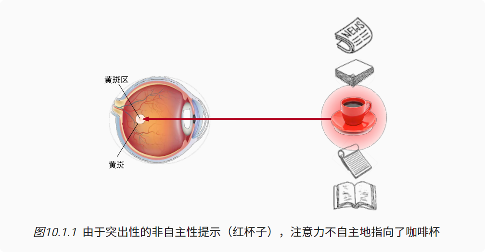
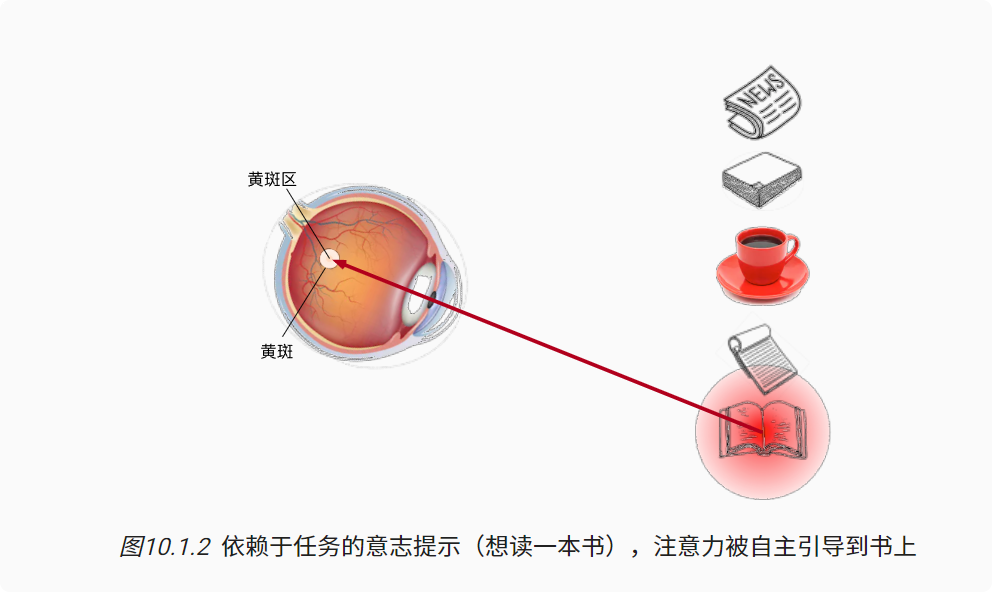
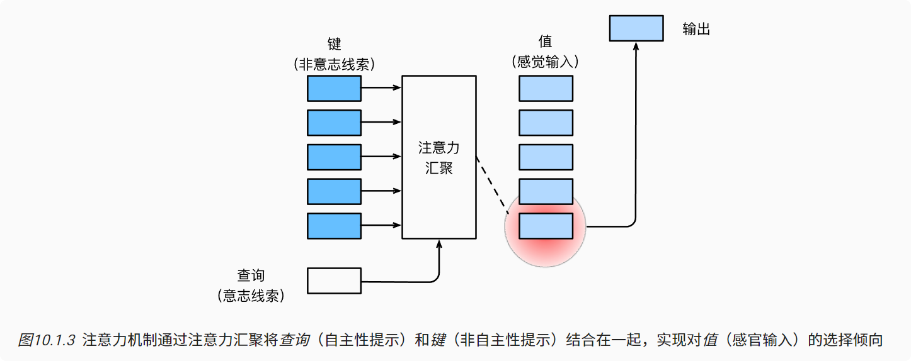

# 注意力提示
### 生物学中的注意力提示

非自主性提示和自主性提示

---
**非自主性提示是基于环境中物体的突出性和易见性。** 想象一下，假如你面前有五个物品： 一份报纸、一篇研究论文、一杯咖啡、一本笔记本和一本书， 所有纸制品都是黑白印刷的，但咖啡杯是红色的。 换句话说，这个咖啡杯在这种视觉环境中是突出和显眼的， 不由自主地引起人们的注意。 所以你把视力最敏锐的地方放到咖啡上。

---
喝咖啡后，你会变得兴奋并想读书。 所以你转过头，重新聚焦你的眼睛，然后看看书，由于突出性导致的选择不同， 此时选择书是受到了认知和意识的控制， 因此注意力在**基于自主性提示**去辅助选择时将更为谨慎。 受试者的主观意愿推动，选择的力量也就更强大。


### 查询、键和值
首先，考虑一个相对简单的状况， 即只使用非自主性提示。 要想将选择偏向于感官输入， 我们可以简单地使用参数化的全连接层， 甚至是非参数化的最大汇聚层或平均汇聚层。

在注意力机制的背景下，我们将自主性提示称为查询（query）

给定任何查询，注意力机制通过注意力汇聚（attention pooling） 将选择引导至感官输入（sensory inputs，例如中间特征表示）

在注意力机制中，这些感官输入被称为值（value）

设计注意力汇聚， 以便给定的查询（自主性提示）可以与键（非自主性提示）进行匹配， 这将引导得出最匹配的值（感官输入）。



### 注意力的可视化

```
import torch
from d2l import torch as d2l

# @save 要显示的行数，要显示的列数，查询的数目，键的数目
def show_heatmaps(matrices, xlabel, ylabel, titles=None, figsize=(2.5, 2.5),
                  cmap='Reds'):
    """显示矩阵热图"""
    d2l.use_svg_display()
    num_rows, num_cols = matrices.shape[0], matrices.shape[1]
    fig, axes = d2l.plt.subplots(num_rows, num_cols, figsize=figsize,
                                 sharex=True, sharey=True, squeeze=False)
    for i, (row_axes, row_matrices) in enumerate(zip(axes, matrices)):
        for j, (ax, matrix) in enumerate(zip(row_axes, row_matrices)):
            pcm = ax.imshow(matrix.detach().numpy(), cmap=cmap)
            if i == num_rows - 1:
                ax.set_xlabel(xlabel)
            if j == 0:
                ax.set_ylabel(ylabel)
            if titles:
                ax.set_title(titles[j])
    fig.colorbar(pcm, ax=axes, shrink=0.6);
    
    
attention_weights = torch.eye(10).reshape((1, 1, 10, 10))
show_heatmaps(attention_weights, xlabel='Keys', ylabel='Queries')
```

### 小结
* 人类的注意力是有限的、有价值和稀缺的资源。

* 受试者使用非自主性和自主性提示有选择性地引导注意力。前者基于突出性，后者则依赖于意识。

* 注意力机制与全连接层或者汇聚层的区别源于增加的自主提示。

* 由于包含了自主性提示，注意力机制与全连接的层或汇聚层不同。

* 注意力机制通过注意力汇聚使选择偏向于值（感官输入），其中包含查询（自主性提示）和键（非自主性提示）。键和值是成对的。

* 我们可以可视化查询和键之间的注意力权重。