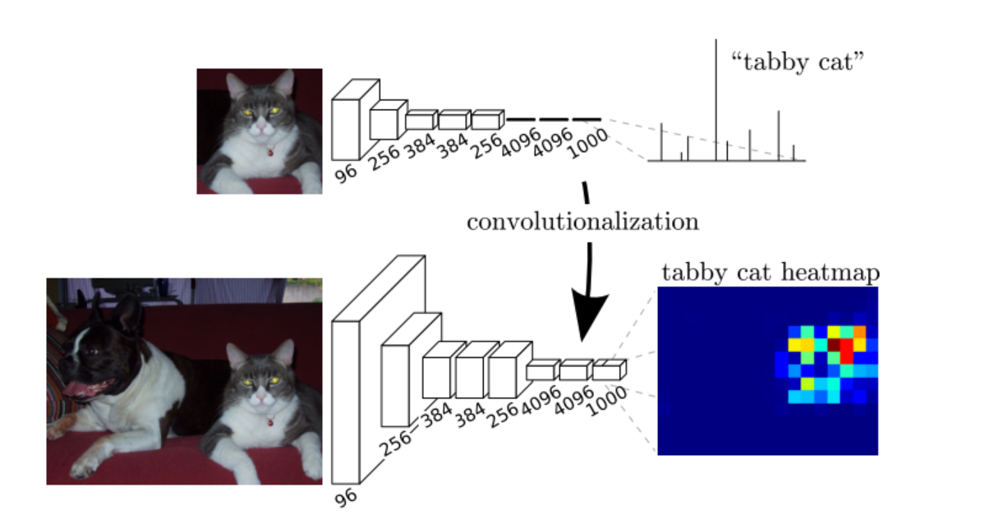

# 全卷积网络FCN

### FCN与CNN


FCN:FCN是对图像进行像素级的分类（也就是每个像素点都进行分类），从而解决了语义级别的图像分割问题。将这3层表示为卷积层，卷积核的大小(通道数，宽，高)分别为（4096,1,1）、（4096,1,1）、（1000,1,1）  
CNN: 在最后的卷积层之后会连接上若干个全连接层，将卷积层产生的特征图（feature map）映射成为一个固定长度的特征向量。一般的CNN结构适用于图像级别的分类和回归任务，因为它们最后都期望得到输入图像的分类的概率

### FCN 构造模型
在ImageNet数据集上预训练的ResNet-18模型来提取图像特征，并将该网络记为pretrained_net
```python
pretrained_net = torchvision.models.resnet18(pretrained=True)
list(pretrained_net.children())[-3:]
```
```python
打印结果：
[Sequential(
   (0): BasicBlock(
     (conv1): Conv2d(256, 512, kernel_size=(3, 3), stride=(2, 2), padding=(1, 1), bias=False)
     (bn1): BatchNorm2d(512, eps=1e-05, momentum=0.1, affine=True, track_running_stats=True)
     (relu): ReLU(inplace=True)
     (conv2): Conv2d(512, 512, kernel_size=(3, 3), stride=(1, 1), padding=(1, 1), bias=False)
     (bn2): BatchNorm2d(512, eps=1e-05, momentum=0.1, affine=True, track_running_stats=True)
     (downsample): Sequential(
       (0): Conv2d(256, 512, kernel_size=(1, 1), stride=(2, 2), bias=False)
       (1): BatchNorm2d(512, eps=1e-05, momentum=0.1, affine=True, track_running_stats=True)
     )
   )
   (1): BasicBlock(
     (conv1): Conv2d(512, 512, kernel_size=(3, 3), stride=(1, 1), padding=(1, 1), bias=False)
     (bn1): BatchNorm2d(512, eps=1e-05, momentum=0.1, affine=True, track_running_stats=True)
     (relu): ReLU(inplace=True)
     (conv2): Conv2d(512, 512, kernel_size=(3, 3), stride=(1, 1), padding=(1, 1), bias=False)
     (bn2): BatchNorm2d(512, eps=1e-05, momentum=0.1, affine=True, track_running_stats=True)
   )
 ),
 AdaptiveAvgPool2d(output_size=(1, 1)),
 Linear(in_features=512, out_features=1000, bias=True)]
```
---
创建一个全卷积网络net。 它复制了ResNet-18中大部分的预训练层，除了最后的全局平均汇聚层和最接近输出的全连接层。
```python
net = nn.Sequential(*list(pretrained_net.children())[:-2])
```
---
给定高度为320和宽度为480的输入，net的前向传播将输入的高和宽减小至原来的1/32
```python
X = torch.rand(size=(1, 3, 320, 480))
net(X).shape

输出结果：
torch.Size([1, 512, 10, 15])
```
### 初始化卷积层
双线性插值（bilinear interpolation） 是常用的上采样方法之一，它也经常用于初始化转置卷积层。  
双线性插值的上采样可以通过转置卷积层实现，内核由以下bilinear_kernel函数构造。
```python
def bilinear_kernel(in_channels, out_channels, kernel_size):
    factor = (kernel_size + 1) // 2
    if kernel_size % 2 == 1:
        center = factor - 1
    else:
        center = factor - 0.5
    og = (torch.arange(kernel_size).reshape(-1, 1),
          torch.arange(kernel_size).reshape(1, -1))
    filt = (1 - torch.abs(og[0] - center) / factor) * \
           (1 - torch.abs(og[1] - center) / factor)
    weight = torch.zeros((in_channels, out_channels,
                          kernel_size, kernel_size))
    weight[range(in_channels), range(out_channels), :, :] = filt
    return weight
```
---
构造一个将输入的高和宽放大2倍的转置卷积层，并将其卷积核用bilinear_kernel函数初始化。
```python
conv_trans = nn.ConvTranspose2d(3, 3, kernel_size=4, padding=1, stride=2,
                                bias=False)
conv_trans.weight.data.copy_(bilinear_kernel(3, 3, 4));
```

读取图像X，将上采样的结果记作Y。为了打印图像，我们需要调整通道维的位置。
```python
img = torchvision.transforms.ToTensor()(d2l.Image.open('../img/catdog.jpg'))
X = img.unsqueeze(0)
Y = conv_trans(X)
out_img = Y[0].permute(1, 2, 0).detach()
```

转置卷积层将图像的高和宽分别放大了2倍
```python
d2l.set_figsize()
print('input image shape:', img.permute(1, 2, 0).shape)
d2l.plt.imshow(img.permute(1, 2, 0));
print('output image shape:', out_img.shape)
d2l.plt.imshow(out_img);

输出结果：
input image shape: torch.Size([561, 728, 3])
output image shape: torch.Size([1122, 1456, 3])
```

### FCN的优点和不足
* 可以接受任意大小的输入图像，而不用要求所有的训练图像和测试图像具有同样的尺寸。
* 更加高效，因为避免了由于使用像素块而带来的重复存储和计算卷积的问题。
---
* 得到的结果还是不够精细。采样的结果还是比较模糊和平滑，对图像中的细节不敏感。
* 对各个像素进行分类，没有充分考虑像素与像素之间的关系，忽略了在通常的基于像素分类的分割方法中使用的空间规整（spatial regularization）步骤，缺乏空间一致性。

