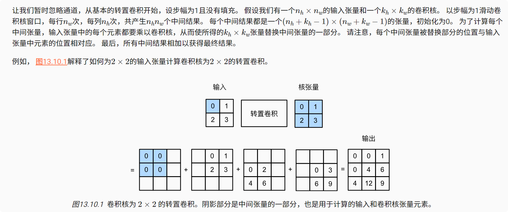
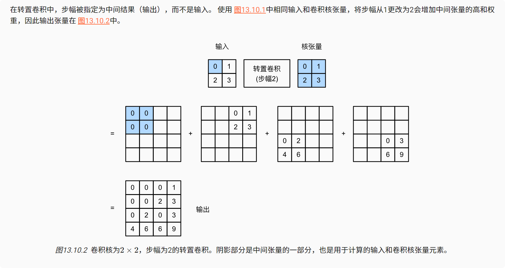
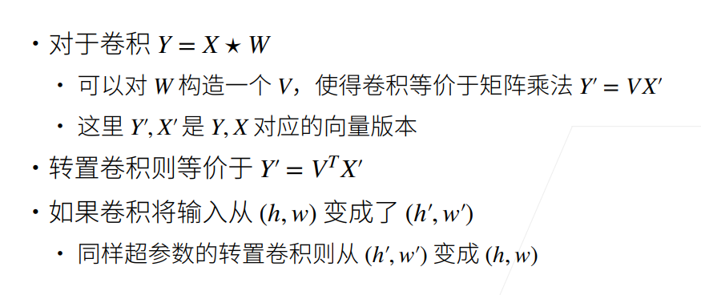

# 转置卷积
在空间维度被卷积神经网络层缩小后，可以使用转置卷积用于逆转下采样导致的空间尺寸减小。

### 基本操作

### 填充、步幅和多通道

### 与矩阵变换的联系

### 小结
* 与通过卷积核减少输入元素的常规卷积相反，转置卷积通过卷积核广播输入元素，从而产生形状大于输入的输出。

* 

* 我们可以使用矩阵乘法来实现卷积。转置卷积层能够交换卷积层的正向传播函数和反向传播函数。