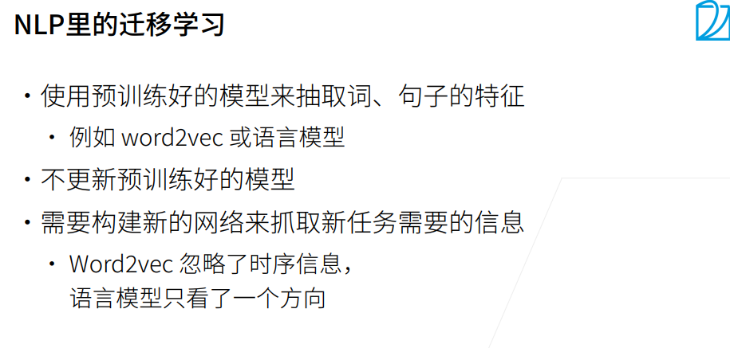
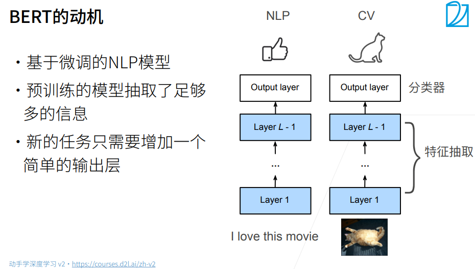
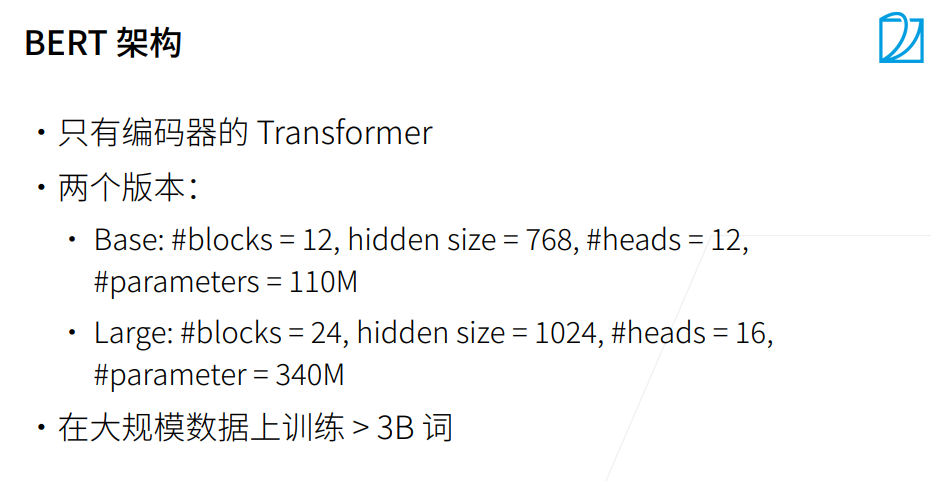
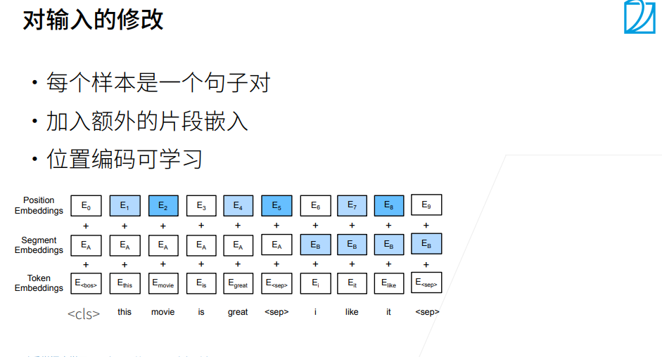
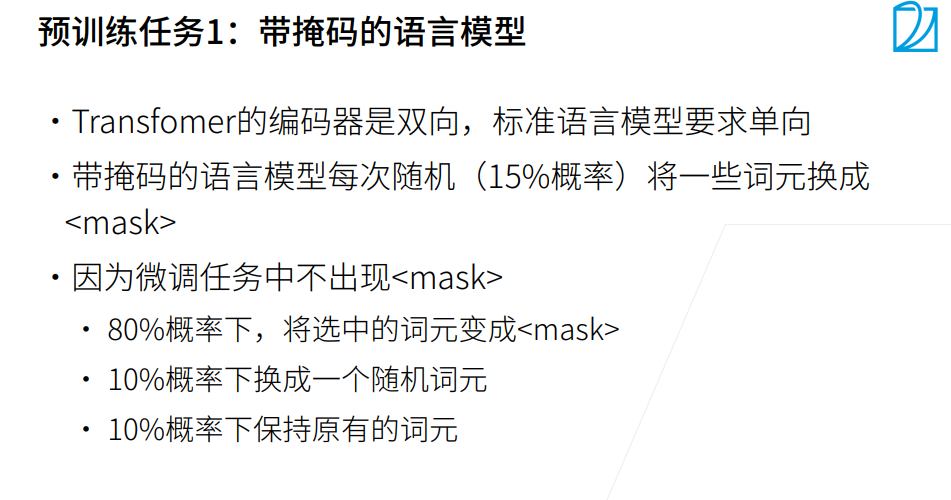
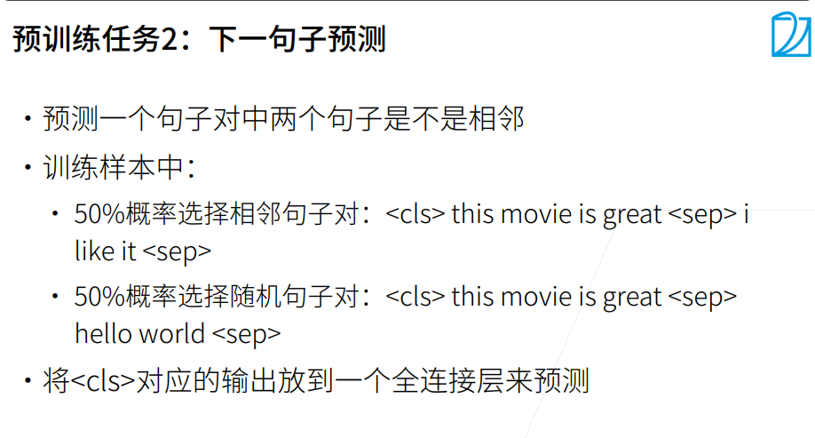

# BERT来自Transformers的双向编码器表示

1. 在预训练之后，输出可以被认为是一个矩阵，其中每一行都是一个表示预定义词表中词的向量。事实上，这些词嵌入模型都是与上下文无关的。
2. BERT 是“Bidirectional Encoder Representations from Transformers”的首字母缩写，整体是一个自编码语言模型（Autoencoder LM），并且其设计了两个任务来预训练该模型。

* 第一个任务是采用 MaskLM 的方式来训练语言模型，通俗地说就是在输入一句话的时候，随机地选一些要预测的词，然后用一个特殊的符号[MASK]来代替它们，之后让模型根据所给的标签去学习这些地方该填的词。

* 第二个任务在双向语言模型的基础上额外增加了一个句子级别的连续性预测任务，即预测输入 BERT 的两段文本是否为连续的文本，引入这个任务可以更好地让模型学到连续的文本片段之间的关系。

### 小结

* word2vec和GloVe等词嵌入模型与上下文无关。它们将相同的预训练向量赋给同一个词，而不考虑词的上下文（如果有的话）。它们很难处理好自然语言中的一词多义或复杂语义。

* 对于上下文敏感的词表示，如ELMo和GPT，词的表示依赖于它们的上下文。

* ELMo对上下文进行双向编码，但使用特定于任务的架构（然而，为每个自然语言处理任务设计一个特定的体系架构实际上并不容易）；而GPT是任务无关的，但是从左到右编码上下文。

* BERT结合了这两个方面的优点：它对上下文进行双向编码，并且需要对大量自然语言处理任务进行最小的架构更改。

* BERT输入序列的嵌入是词元嵌入、片段嵌入和位置嵌入的和。

* 预训练包括两个任务：掩蔽语言模型和下一句预测。前者能够编码双向上下文来表示单词，而后者则显式地建模文本对之间的逻辑关系。