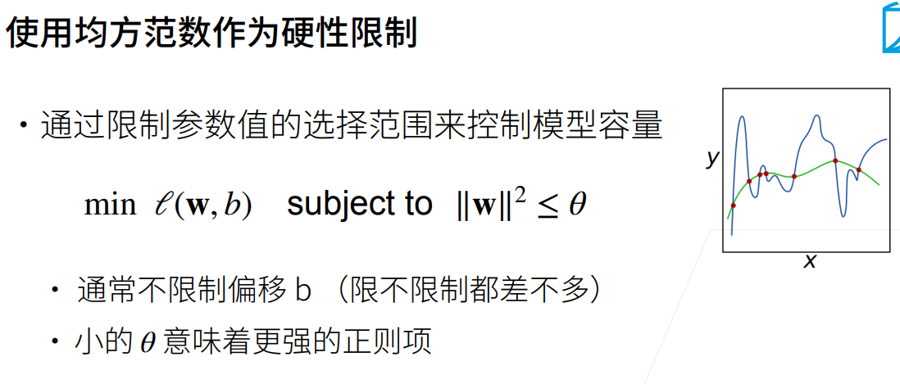
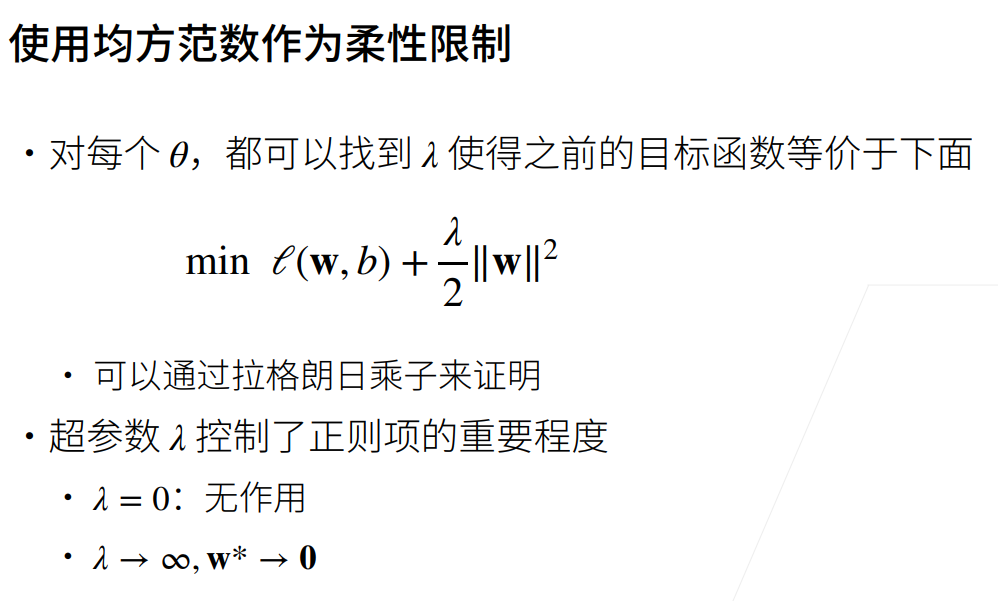
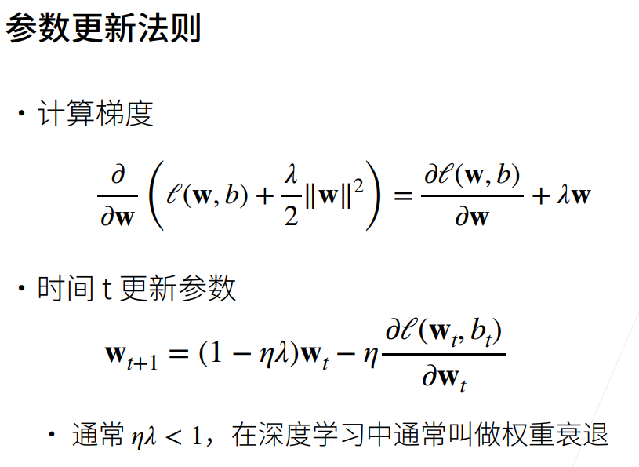
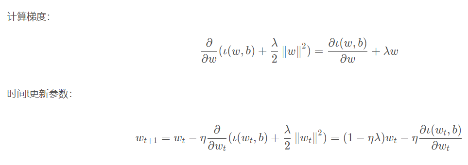

# 权重衰退

一种常见的处理过拟合的方法。

### 使用均方范数作为硬性限制

**控制模型容量的两种方式：参数的数量、参数的选择范围。**
该方法是通过限制参数值的选择范围，来控制模型容量的。

∥w∥^2 代表权重中每一项的平方和。通常不限制偏移b，小的θ意味着更强的正则项。这种方法很少用，一般转化为下面这种柔性限制。

### 使用均方范数作为柔性限制

### 参数更新法则  
  
  
  
一般来说，ηλ比1要小，和之前参数更新公式相比，每次更新的时候，先把当前的权重wt乘以一个小于1的数，把wt的值缩小了一点点，再沿着梯度的反方向走一点点，所以在深度学习通常叫做权重衰退。

---

* 权重衰退通过L2正则项使得模型参数不会过大，从而控制模型复杂度。
* 正则项权重是控制模型复杂度的超参数，一般在深度学习框架中的优化器（SGD等）中可以设置Weight Decay：λ的值，通常0.001，不会选到1等很大的数值。
