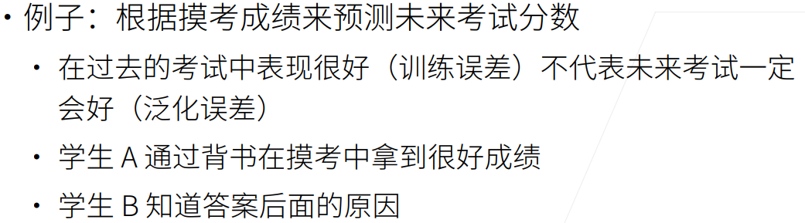
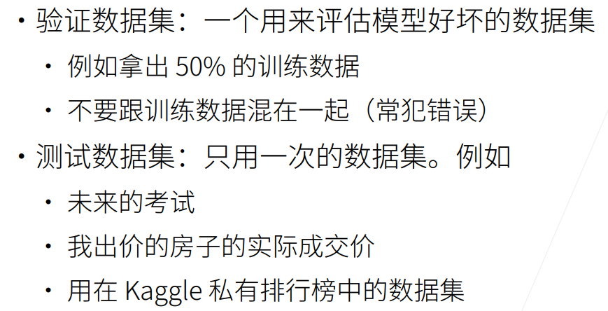
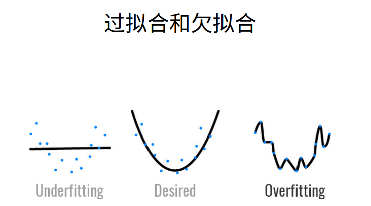
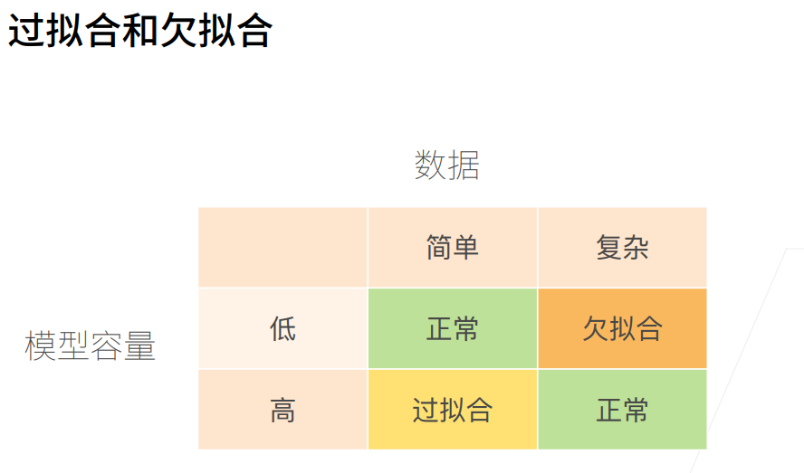
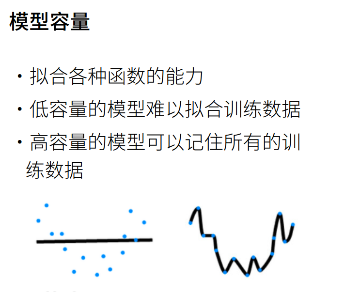
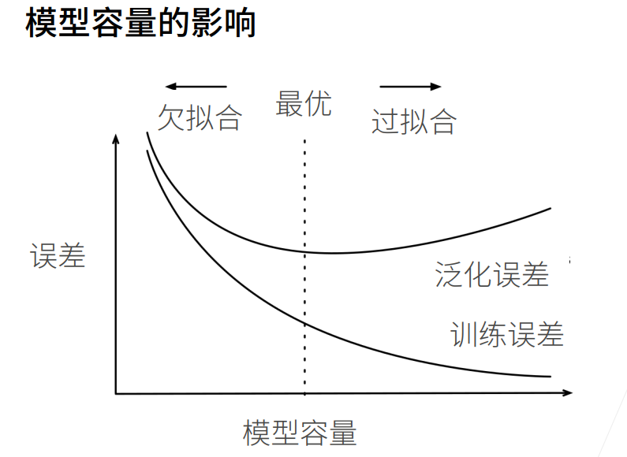
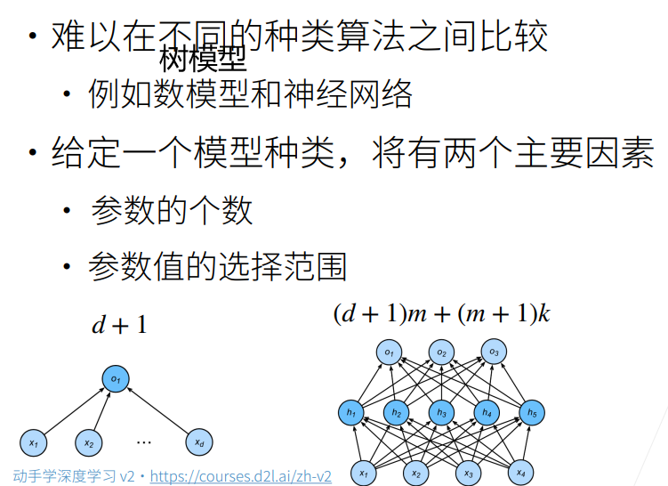
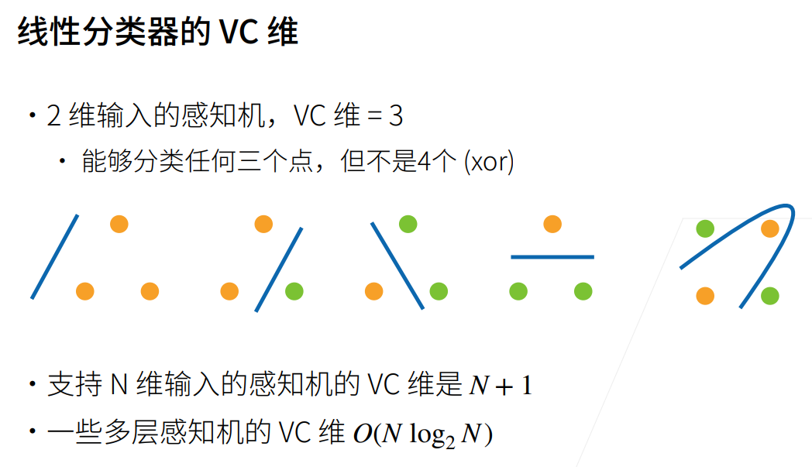
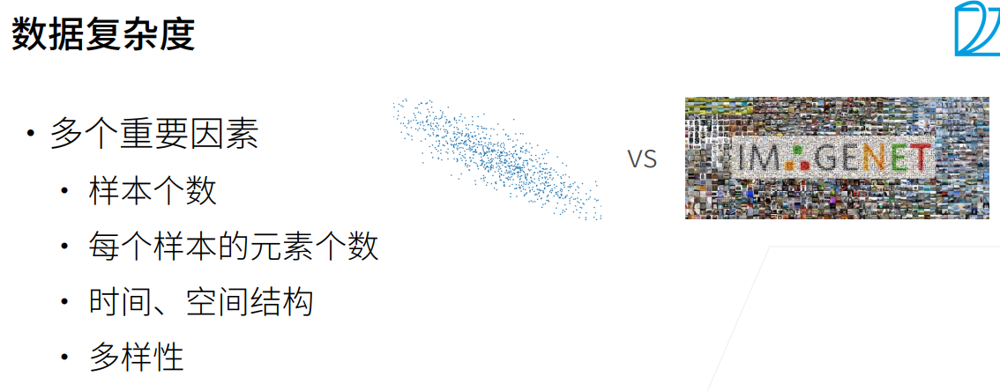
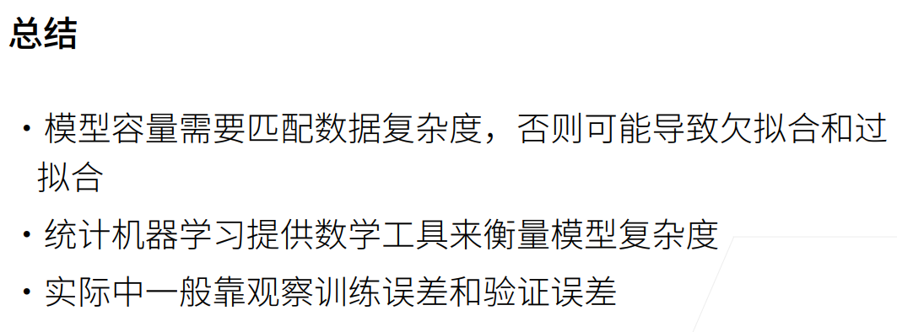

# 模型选择、⽋拟合和过拟合 
 ### 训练误差与泛化误差
* 训练误差(training error)是指模型在训练数据集上计算得到的误差。即为模**型在训练数据上的误差**   
* 泛化误差(generalization error)是指模型应用在同样从原始样本的分布中抽取的无限多数据样本时，模型误差的期望。即为**模型在新数据上的误差**  

### 验证数据集和测试数据集
* 验证数据集：一个用于评估模型好坏的数据集
* 测试数据集：只用一次的数据集

### k折交叉验证（K-Fold 交叉验证）
K-Fold 交叉验证：它将原始数据分成K组(K-Fold)，将每个子集数据分别做一次验证集，其余的K-1组子集数据作为训练集，这样会得到K个模型。这K个模型分别在验证集中评估结果，最后的误差MSE(Mean Squared Error)加和平均就得到交叉验证误差。
### 过拟合与欠拟合

### 模型容量

模型的容量是指它拟合各种函数的能力。比如，模型是3次多项式构成的函数：y=w_{3}x^{3}+w_{2}x^{2}+w_{1}x+b，其中权重w和偏置b的含义大家应该都很清楚了。那么它拟合函数的能力有：一次函数（w3,w2=0）、二次函数(w3=0)、三次函数(w1,2,3≠0)。如果它是更高次的表达式，显然，它就可以拟合更多阶次的函数。

### VC维
VC维是模型的复杂程度，模型假设空间越大，VC维越高。

### 数据复杂度

