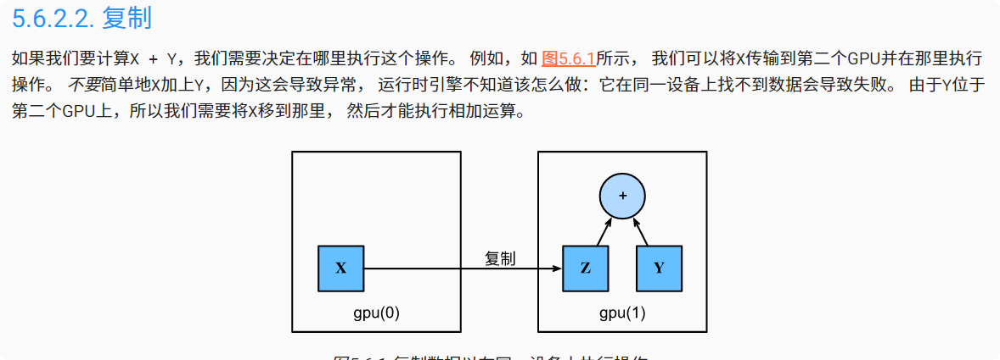

# 自定义层、读写文件、GPU
## 自定义曾
深度学习成功背后的一个因素是神经网络的灵活性： 我们可以用创造性的方式组合不同的层，从而设计出适用于各种任务的架构。 例如，研究人员发明了专门用于处理图像、文本、序列数据和执行动态规划的层。 未来，你会遇到或要自己发明一个现在在深度学习框架中还不存在的层。 
### 不带参数的层
CenteredLayer类要从其输入中减去均值。 要构建它，我们只需继承基础层类并实现前向传播功能。
```jupyterpython
import torch
import torch.nn.functional as F
from torch import nn


class CenteredLayer(nn.Module):
    def __init__(self):
        super().__init__()

    def forward(self, X):
        return X - X.mean()
```
传入以下数据测试是否按预期工作  
```
layer = CenteredLayer()  
layer(torch.FloatTensor([1, 2, 3, 4, 5]))  
```

`结果：tensor([-2., -1.,  0.,  1.,  2.])`

将层作为组件合并到更复杂的模型中。  
`net = nn.Sequential(nn.Linear(8, 128), CenteredLayer())`
作为额外的健全性检查，我们可以在向该网络发送随机数据后，检查均值是否为0。 由于我们处理的是浮点数，因为存储精度的原因，我们仍然可能会看到一个非常小的非零数。
```jupyterpython
Y = net(torch.rand(4, 8))
Y.mean()
结果：tensor(9.3132e-10, grad_fn=<MeanBackward0>)
```
### 带参数的层
层需要两个参数，一个用于表示权重，另一个用于表示偏置项。 在此实现中，我们使用修正线性单元作为激活函数。 该层需要输入参数：in_units和units，分别表示输入数和输出数。
```jupyterpython
class MyLinear(nn.Module):
    def __init__(self, in_units, units):
        super().__init__()
        self.weight = nn.Parameter(torch.randn(in_units, units))
        self.bias = nn.Parameter(torch.randn(units,))
    def forward(self, X):
        linear = torch.matmul(X, self.weight.data) + self.bias.data
        return F.relu(linear)
```
实例化类并访问其参数模型
```jupyterpython
linear = MyLinear(5, 3)
linear.weight

Parameter containing:
tensor([[ 1.9054, -3.4102, -0.9792],
        [ 1.5522,  0.8707,  0.6481],
        [ 1.0974,  0.2568,  0.4034],
        [ 0.1416, -1.1389,  0.5875],
        [-0.7209,  0.4432,  0.1222]], requires_grad=True)
```
使用自定义层直接执行前向传播计算
`linear(torch.rand(2, 5))`
`tensor([[2.4784, 0.0000, 0.8991],
        [3.6132, 0.0000, 1.1160]])`

使用自定义层构建模型，就像使用内置的全连接层一样使用自定义层。
```jupyterpython
net = nn.Sequential(MyLinear(64, 8), MyLinear(8, 1))
net(torch.rand(2, 64))

tensor([[0.],
        [0.]])
```

### 小结
1. 我们可以通过基本层类设计自定义层。这允许我们定义灵活的新层，其行为与深度学习框架中的任何现有层不同。

2. 在自定义层定义完成后，我们就可以在任意环境和网络架构中调用该自定义层。

3. 层可以有局部参数，这些参数可以通过内置函数创建。

## 读写文件
**定期保存中间结果**， 以确保在服务器电源被不小心断掉时，我们不会损失几天的计算结果。 因此，现在是时候学习如何**加载和存储权重向量和整个模型**了。
### 加载和保存张量
```jupyterpython
import torch
from torch import nn
from torch.nn import functional as F

x = torch.arange(4)
torch.save(x, 'x-file')

x2 = torch.load('x-file')
x2

tensor([0, 1, 2, 3])
```
我们可以存储一个张量列表，然后把它们读回内存。
```jupyterpython
y = torch.zeros(4)
torch.save([x, y],'x-files')
x2, y2 = torch.load('x-files')
(x2, y2)
```

### 加载和保存模型参数

保存单个权重向量（或其他张量）确实有用， 但是如果我们想保存整个模型，并在以后加载它们， 单独保存每个向量则会变得很麻烦。 毕竟，我们可能有数百个参数散布在各处。 因此，深度学习框架提供了内置函数来保存和加载整个网络。 需要注意的一个重要细节是，这将保存模型的参数而不是保存整个模型。 例如，如果我们有一个3层多层感知机，我们需要单独指定架构。 因为模型本身可以包含任意代码，所以模型本身难以序列化。 因此，为了恢复模型，我们需要用代码生成架构， 然后从磁盘加载参数。 让我们从熟悉的多层感知机开始尝试一下。

```python
class MLP(nn.Module):
    def __init__(self):
        super().__init__()
        self.hidden = nn.Linear(20, 256)
        self.output = nn.Linear(256, 10)

    def forward(self, x):
        return self.output(F.relu(self.hidden(x)))


net = MLP()
X = torch.randn(size=(2, 20))
Y = net(X)
# 将模型的参数存储在一个叫做“mlp.params”的文件中
torch.save(net.state_dict(), 'mlp.params')

# 实例化了原始多层感知机模型的一个备份。 这里我们不需要随机初始化模型参数，而是直接读取文件中存储的参数。
clone = MLP()
clone.load_state_dict(torch.load('mlp.params'))
print(clone.eval())

Y_clone = clone(X)
print(Y_clone)
print(Y_clone == Y)


MLP(
  (hidden): Linear(in_features=20, out_features=256, bias=True)
  (output): Linear(in_features=256, out_features=10, bias=True)
)
tensor([[ 0.2291,  0.0090,  0.1826,  0.1715,  0.1762, -0.1144,  0.0808,  0.2551,
         -0.1886,  0.1172],
        [ 0.0557, -0.1638,  0.1451,  0.1020,  0.2601, -0.1456, -0.0237,  0.1354,
          0.1411, -0.0969]], grad_fn=<AddmmBackward0>)
tensor([[True, True, True, True, True, True, True, True, True, True],
        [True, True, True, True, True, True, True, True, True, True]])
```

### 小结
* save和load函数可用于张量对象的文件读写。

* 我们可以通过参数字典保存和加载网络的全部参数。

* 保存架构必须在代码中完成，而不是在参数中完成。
## GPU
### 计算设备
默认情况下，张量是在内存中创建的，然后使用CPU计算它。
在PyTorch中，CPU和GPU可以用torch.device('cpu') 和torch.device('cuda')表示。 应该注意的是，cpu设备意味着所有物理CPU和内存， 这意味着PyTorch的计算将尝试使用所有CPU核心。 然而，gpu设备只代表一个卡和相应的显存。 如果有多个GPU，我们使用torch.device(f'cuda:{i}') 来表示第块GPU（从0开始）。 另外，cuda:0和cuda是等价的。
```jupyterpython
def try_gpu(i=0):  #@save
    """如果存在，则返回gpu(i)，否则返回cpu()"""
    if torch.cuda.device_count() >= i + 1:
        return torch.device(f'cuda:{i}')
    return torch.device('cpu')

def try_all_gpus():  #@save
    """返回所有可用的GPU，如果没有GPU，则返回[cpu(),]"""
    devices = [torch.device(f'cuda:{i}')
             for i in range(torch.cuda.device_count())]
    return devices if devices else [torch.device('cpu')]

try_gpu(), try_gpu(10), try_all_gpus()

输出：
(device(type='cuda', index=0),
 device(type='cpu'),
 [device(type='cuda', index=0), device(type='cuda', index=1)])
```

###  张量与GPU
```jupyterpython
x = torch.tensor([1, 2, 3])
x.device

tensor([[1., 1., 1.],
        [1., 1., 1.]], device='cuda:0')

```

#### 复制

```python
Z = X.cuda(1)
print(X)
print(Z)

tensor([[1., 1., 1.],
        [1., 1., 1.]], device='cuda:0')
tensor([[1., 1., 1.],
        [1., 1., 1.]], device='cuda:1')


Y + Z
tensor([[1.1206, 1.2283, 1.4548],
        [1.9806, 1.9616, 1.0501]], device='cuda:1')

Z.cuda(1) is Z
True

```

### 神经网络与GPU
类似地，神经网络模型可以指定设备。 下面的代码将模型参数放在GPU上。
```jupyterpython
net = nn.Sequential(nn.Linear(3, 1))
net = net.to(device=try_gpu())

# 当输入为GPU上的张量时，模型将在同一GPU上计算结果。
net(X)
tensor([[-0.7803],
        [-0.7803]], device='cuda:0', grad_fn=<AddmmBackward0>)

net[0].weight.data.device
device(type='cuda', index=0)
# 总之，只要所有的数据和参数都在同一个设备上， 我们就可以有效地学习模型。
```

### 小结
* 我们可以指定用于存储和计算的设备，例如CPU或GPU。默认情况下，数据在主内存中创建，然后使用CPU进行计算。

* 深度学习框架要求计算的所有输入数据都在同一设备上，无论是CPU还是GPU。

* 不经意地移动数据可能会显著降低性能。一个典型的错误如下：计算GPU上每个小批量的损失，并在命令行中将其报告给用户（或将其记录在NumPy ndarray中）时，将触发全局解释器锁，从而使所有GPU阻塞。最好是为GPU内部的日志分配内存，并且只移动较大的日志。