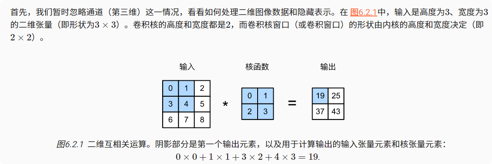
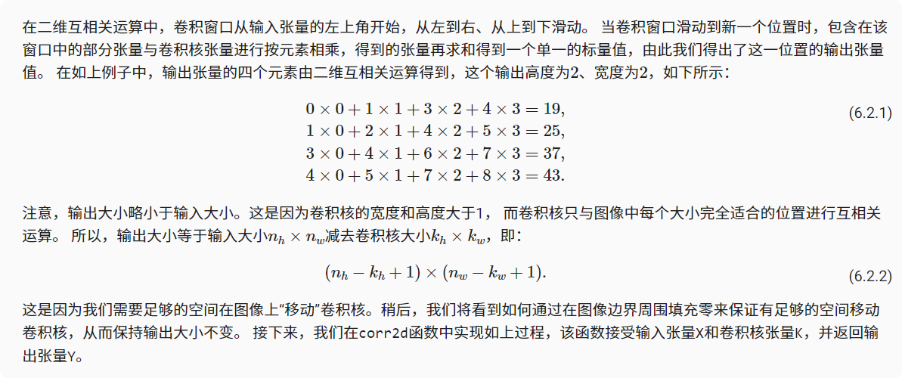
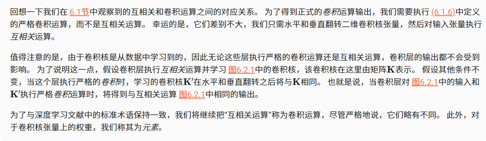
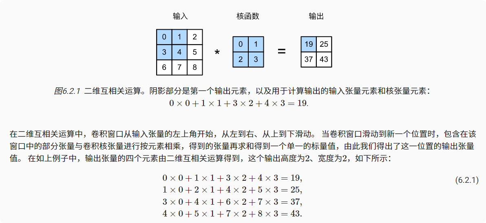

# 图像卷积

## 互相关运算
严格来说，卷积层是个错误的叫法，因为它所表达的运算其实是互相关运算（cross-correlation），而不是卷积运算。在卷积层中，输入张量和核张量通过互相关运算产生输出张量。


```python
import torch
from torch import nn
from d2l import torch as d2l

def corr2d(X, K):  #@save
    """计算二维互相关运算"""
    h, w = K.shape
    Y = torch.zeros((X.shape[0] - h + 1, X.shape[1] - w + 1))
    for i in range(Y.shape[0]):
        for j in range(Y.shape[1]):
            Y[i, j] = (X[i:i + h, j:j + w] * K).sum()
    return Y

X = torch.tensor([[0.0, 1.0, 2.0], [3.0, 4.0, 5.0], [6.0, 7.0, 8.0]])
K = torch.tensor([[0.0, 1.0], [2.0, 3.0]])
corr2d(X, K)

# tensor([[19., 25.],
#         [37., 43.]])
```


## 卷积层
卷积层对输入和卷积核权重进行互相关运算，并在添加标量偏置之后产生输出。 所以，卷积层中的两个被训练的参数是卷积核权重和标量偏置。 就像我们之前随机初始化全连接层一样，在训练基于卷积层的模型时，我们也随机初始化卷积核权重。

基于上面定义的corr2d函数实现二维卷积层。在__init__构造函数中，将weight和bias声明为两个模型参数。前向传播函数调用corr2d函数并添加偏置。
```python
class Conv2D(nn.Module):
    def __init__(self, kernel_size):
        super().__init__()
        self.weight = nn.Parameter(torch.rand(kernel_size))
        self.bias = nn.Parameter(torch.zeros(1))

    def forward(self, x):
        return corr2d(x, self.weight) + self.bias
```
高度和宽度分别为h和w的卷积核可以被称为h×w卷积或h×w卷积核。 我们也将带有h×w卷积核的卷积层称为h×w卷积层。

## 图像中目标的边缘检测
如下是卷积层的一个简单应用：通过找到像素变化的位置，来检测图像中不同颜色的边缘。 首先，我们构造一个像素6*8的黑白图像。中间四列为黑色（0），其余像素为白色（1）。

```python
X = torch.ones((6, 8))
X[:, 2:6] = 0
print(X)
输出结果：
tensor([[1., 1., 0., 0., 0., 0., 1., 1.],
        [1., 1., 0., 0., 0., 0., 1., 1.],
        [1., 1., 0., 0., 0., 0., 1., 1.],
        [1., 1., 0., 0., 0., 0., 1., 1.],
        [1., 1., 0., 0., 0., 0., 1., 1.],
        [1., 1., 0., 0., 0., 0., 1., 1.]])

# 接下来，我们构造一个高度为1、宽度为2的卷积核K。当进行互相关运算时，如果水平相邻的两元素相同，则输出为零，否则输出为非零。

K = torch.tensor([[1.0, -1.0]])
# 现在，我们对参数X（输入）和K（卷积核）执行互相关运算。 如下所示，输出Y中的1代表从白色到黑色的边缘，-1代表从黑色到白色的边缘，其他情况的输出为0。
Y = corr2d(X, K)
print(Y)
输出结果：
tensor([[ 0.,  1.,  0.,  0.,  0., -1.,  0.],
        [ 0.,  1.,  0.,  0.,  0., -1.,  0.],
        [ 0.,  1.,  0.,  0.,  0., -1.,  0.],
        [ 0.,  1.,  0.,  0.,  0., -1.,  0.],
        [ 0.,  1.,  0.,  0.,  0., -1.,  0.],
        [ 0.,  1.,  0.,  0.,  0., -1.,  0.]])

corr2d(X.t(), K)

tensor([[0., 0., 0., 0., 0.],
        [0., 0., 0., 0., 0.],
        [0., 0., 0., 0., 0.],
        [0., 0., 0., 0., 0.],
        [0., 0., 0., 0., 0.],
        [0., 0., 0., 0., 0.],
        [0., 0., 0., 0., 0.],
        [0., 0., 0., 0., 0.]])
```
## 学习卷积核
如果只需寻找黑白边缘，那么以上[1, -1]的边缘检测器足以。构造一个卷积层，并将其卷积核初始化为随机张量。接下来，在每次迭代中，我们比较Y与卷积层输出的平方误差，然后计算梯度来更新卷积核。此处使用内置的二维卷积层，并忽略偏置。
```python
# 构造一个二维卷积层，它具有1个输出通道和形状为（1，2）的卷积核
conv2d = nn.Conv2d(1,1, kernel_size=(1, 2), bias=False)

# 这个二维卷积层使用四维输入和输出格式（批量大小、通道、高度、宽度），
# 其中批量大小和通道数都为1
X = X.reshape((1, 1, 6, 8))
Y = Y.reshape((1, 1, 6, 7))
lr = 3e-2  # 学习率

for i in range(10):
    Y_hat = conv2d(X)
    l = (Y_hat - Y) ** 2
    conv2d.zero_grad()
    l.sum().backward()
    # 迭代卷积核
    conv2d.weight.data[:] -= lr * conv2d.weight.grad
    if (i + 1) % 2 == 0:
        print(f'epoch {i+1}, loss {l.sum():.3f}')

epoch 2, loss 1.618
epoch 4, loss 0.298
epoch 6, loss 0.061
epoch 8, loss 0.015
epoch 10, loss 0.004
```
在10次迭代之后，误差已经降到足够低。卷积核的权重张量`conv2d.weight.data.reshape((1, 2))`
输出结果：`tensor([[ 0.9879, -0.9993]])`
## 互相关和卷积


## 特征映射和感受野

图中输出的卷积层有时被称为特征映射（feature map），因为它可以被视为一个输入映射到下一层的空间维度的转换器。

在卷积神经网络中，对于某一层的任意元素x，其感受野（receptive field）是指在前向传播期间可能影响计算的所有元素（来自所有先前层）。**感受野可能大于输入的实际大小。**
## 小结
* 二维卷积层的核心计算是二维互相关运算。最简单的形式是，对二维输入数据和卷积核执行互相关操作，然后添加一个偏置。

* 我们可以设计一个卷积核来检测图像的边缘。

* 我们可以从数据中学习卷积核的参数。

* 学习卷积核时，无论用严格卷积运算或互相关运算，卷积层的输出不会受太大影响。

* 当需要检测输入特征中更广区域时，我们可以构建一个更深的卷积网络。