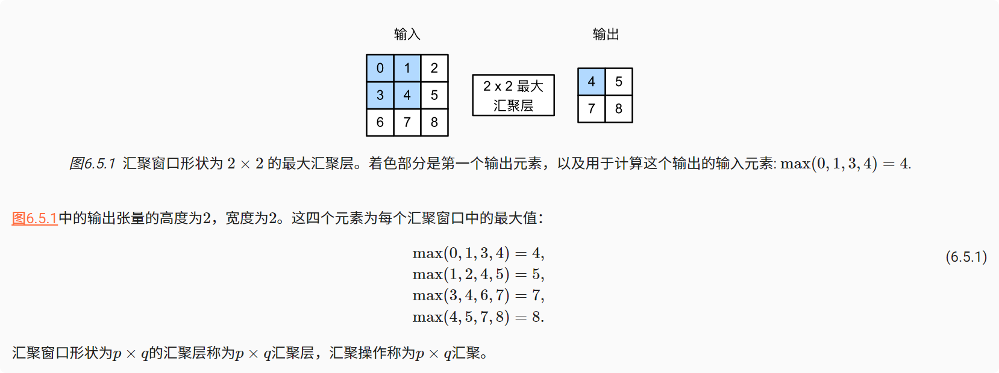
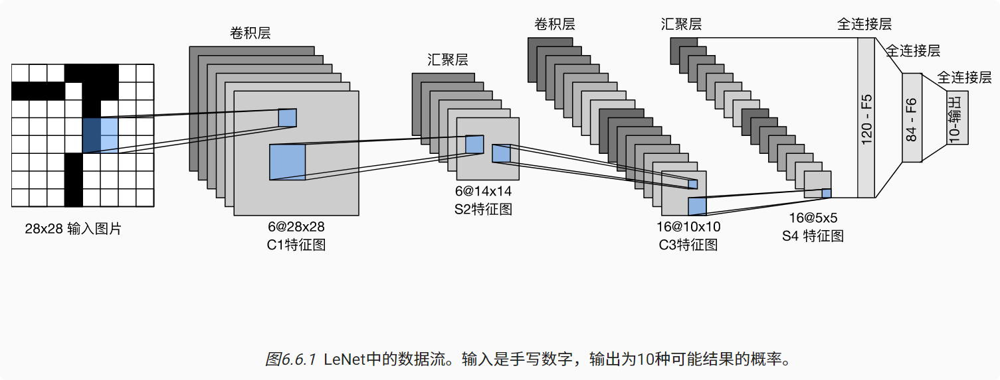

# 汇聚层与卷积神经网络LeNet

## 汇聚层

**双重目的**：降低卷积层对位置的敏感性，同时降低对空间降采样表示的敏感性。

### 最大汇聚层和平均汇聚层

与卷积层类似，汇聚层运算符由一个固定形状的窗口组成，该窗口根据其步幅大小在输入的所有区域上滑动，为固定形状窗口（有时称为汇聚窗口）遍历的每个位置计算一个输出。 不同于卷积层中的输入与卷积核之间的互相关计算，汇聚层不包含参数。 相反，池运算是确定性的，我们通常计算汇聚窗口中所有元素的最大值或平均值。这些操作分别称为最大汇聚层（maximum pooling）和平均汇聚层（average pooling）。

在这两种情况下，与互相关运算符一样，汇聚窗口从输入张量的左上角开始，从左往右、从上往下的在输入张量内滑动。在汇聚窗口到达的每个位置，它计算该窗口中输入子张量的最大值或平均值。计算最大值或平均值是取决于使用了最大汇聚层还是平均汇聚层。



设置**卷积层输入为X**，**汇聚层输出为Y**。 无论X[i, j]和X[i, j + 1]的值相同与否，或X[i, j + 1]和X[i, j + 2]的值相同与否，汇聚层始终输出Y[i, j] = 1。 也就是说，使用最大汇聚层，即使在高度或宽度上移动一个元素，卷积层仍然可以识别到模式。

```python
import torch
from torch import nn
from d2l import torch as d2l


def pool2d(X, pool_size, mode='max'):
    p_h, p_w = pool_size
    Y = torch.zeros((X.shape[0] - p_h + 1, X.shape[1] - p_w + 1))
    for i in range(Y.shape[0]):
        for j in range(Y.shape[1]):
            if mode == 'max':
                Y[i, j] = X[i:i + p_h, j:j + p_w].max()
            elif mode == 'avg':
                Y[i, j] = X[i:i + p_h, j:j + p_w].mean()
    return Y


X = torch.tensor([[0.0, 1.0, 2.0], [3.0, 4.0, 5.0], [6.0, 7.0, 8.0]])
print(pool2d(X, (2, 2)))
print(pool2d(X, (2, 2), 'avg'))

输出：
tensor([[4., 5.],
        [7., 8.]])
tensor([[2., 3.],
        [5., 6.]])

```

### 汇聚层的填充、步幅、多通道

与卷积层一样，汇聚层也可以改变输出形状。

```python
X = torch.arange(16, dtype=torch.float32).reshape((1, 1, 4, 4))
print(X)
pool2d = nn.MaxPool2d(3)
print(pool2d(X))
pool2d = nn.MaxPool2d(3, padding=1, stride=2)
print(pool2d(X))
输出：
tensor([[[[ 0.,  1.,  2.,  3.],
          [ 4.,  5.,  6.,  7.],
          [ 8.,  9., 10., 11.],
          [12., 13., 14., 15.]]]])
tensor([[[[10.]]]])
tensor([[[[ 5.,  7.],
          [13., 15.]]]])
```

在处理多通道输入数据时，汇聚层在每个输入通道上单独运算，而不是像卷积层一样在通道上对输入进行汇总
汇聚层的输出通道数与输入通道数相同。

### 汇聚层小结

* 对于给定输入元素，最大汇聚层会输出该窗口内的最大值，平均汇聚层会输出该窗口内的平均值。
* 汇聚层的主要优点之一是减轻卷积层对位置的过度敏感。
* 我们可以指定汇聚层的填充和步幅。
* 使用最大汇聚层以及大于1的步幅，可减少空间维度（如高度和宽度）。
* 汇聚层的输出通道数与输入通道数相同。

## 卷积神经网络LeNet

为了能够应用softmax回归和多层感知机，我们首先将每个大小为的图像展平为一个784维的固定长度的一维向量，然后用全连接层对其进行处理。 而现在，我们已经掌握了**卷积层**的处理方法，我们**可以在图像中保留空间结构。** 同时，用卷积层代替全连接层的另一个好处是：模型更简洁、所需的参数更少。

---
### LeNet
组成：
* 卷积编码器：由两个卷积层组成;
* 全连接层密集块：由三个全连接层组成。



每个卷积块中的基本单元是一个卷积层、一个sigmoid激活函数和平均汇聚层。

这些层将输入映射到多个二维特征输出，通常同时增加通道的数量。第一卷积层有6个输出通道，而第二个卷积层有16个输出通道。

每个2×2池操作（步骤2）通过空间下采样将维数减少4倍。卷积的输出形状由批量大小、通道数、高度、宽度决定。

为了将卷积块的输出传递给稠密块，我们必须在小批量中展平每个样本。  
换言之，我们将这个四维输入转换成全连接层所期望的二维输入。这里的二维表示的第一个维度索引小批量中的样本，第二个维度给出每个样本的平面向量表示。LeNet的稠密块有三个全连接层，分别有120、84和10个输出。因为我们在执行分类任务，所以输出层的10维对应于最后输出结果的数量。

```python
import torch
from d2l import torch as d2l
from torch import nn

net = nn.Sequential(
    nn.Conv2d(1, 6, kernel_size=5, padding=2, ), nn.Sigmoid(),
    nn.AvgPool2d(kernel_size=2, stride=2),
    nn.Conv2d(6, 16, kernel_size=5), nn.Sigmoid(),
    nn.AvgPool2d(kernel_size=2, stride=2),
    nn.Flatten(),
    nn.Linear(16 * 5 * 5, 120), nn.Sigmoid(),
    nn.Linear(120, 84), nn.Sigmoid(),
    nn.Linear(84, 10)
)

X = torch.rand(size=(1, 1, 28, 28), dtype=torch.float32)
for layer in net:
    X = layer(X)
    print(layer.__class__.__name__, 'output shape: \t', X.shape)

# LeNet在Fashion-MNIST数据集上的表现
batch_size = 256
train_iter, test_iter = d2l.load_data_fashion_mnist(batch_size=batch_size)


# 评估函数
def evaluate_accuracy_gpu(net, data_iter, device=None):  # @save
    """使用GPU计算模型在数据集上的精度"""
    if isinstance(net, nn.Module):
        net.eval()  # 设置为评估模式
        if not device:
            device = next(iter(net.parameters())).device
    # 正确预测的数量，总预测的数量
    metric = d2l.Accumulator(2)
    with torch.no_grad():
        for X, y in data_iter:
            if isinstance(X, list):
                # BERT微调所需的（之后将介绍）
                X = [x.to(device) for x in X]
            else:
                X = X.to(device)
            y = y.to(device)
            metric.add(d2l.accuracy(net(X), y), y.numel())
    return metric[0] / metric[1]


# 训练函数，以下训练函数假定从高级API创建的模型作为输入，并进行相应的优化。使用交叉熵损失函数和小批量随机梯度下降。
def train_ch6(net, train_iter, test_iter, num_epochs, lr, device):  # @save
    """用GPU训练模型(在第六章定义)"""

    def init_weights(m):
        if type(m) == nn.Linear or type(m) == nn.Conv2d:
            nn.init.xavier_uniform_(m.weight)

    net.apply(init_weights)
    print('training on', device)
    net.to(device)
    optimizer = torch.optim.SGD(net.parameters(), lr=lr)
    loss = nn.CrossEntropyLoss()
    animator = d2l.Animator(xlabel='epoch', xlim=[1, num_epochs],
                            legend=['train loss', 'train acc', 'test acc'])
    timer, num_batches = d2l.Timer(), len(train_iter)
    for epoch in range(num_epochs):
        # 训练损失之和，训练准确率之和，样本数
        metric = d2l.Accumulator(3)
        net.train()
        for i, (X, y) in enumerate(train_iter):
            timer.start()
            optimizer.zero_grad()
            X, y = X.to(device), y.to(device)
            y_hat = net(X)
            l = loss(y_hat, y)
            l.backward()
            optimizer.step()
            with torch.no_grad():
                metric.add(l * X.shape[0], d2l.accuracy(y_hat, y), X.shape[0])
            timer.stop()
            train_l = metric[0] / metric[2]
            train_acc = metric[1] / metric[2]
            if (i + 1) % (num_batches // 5) == 0 or i == num_batches - 1:
                animator.add(epoch + (i + 1) / num_batches,
                             (train_l, train_acc, None))
        test_acc = evaluate_accuracy_gpu(net, test_iter)
        animator.add(epoch + 1, (None, None, test_acc))
    print(f'loss {train_l:.3f}, train acc {train_acc:.3f}, '
          f'test acc {test_acc:.3f}')
    print(f'{metric[2] * num_epochs / timer.sum():.1f} examples/sec '
          f'on {str(device)}')


lr, num_epochs = 0.9, 10
train_ch6(net, train_iter, test_iter, num_epochs, lr, 'cuda:0')
# train_ch6(net, train_iter, test_iter, num_epochs, lr, device='cpu')
```

### LeNet小结
* 卷积神经网络（CNN）是一类使用卷积层的网络。

* 在卷积神经网络中，我们组合使用卷积层、非线性激活函数和汇聚层。

* 为了构造高性能的卷积神经网络，我们通常对卷积层进行排列，逐渐降低其表示的空间分辨率，同时增加通道数。

* 在传统的卷积神经网络中，卷积块编码得到的表征在输出之前需由一个或多个全连接层进行处理。

* LeNet是最早发布的卷积神经网络之一。