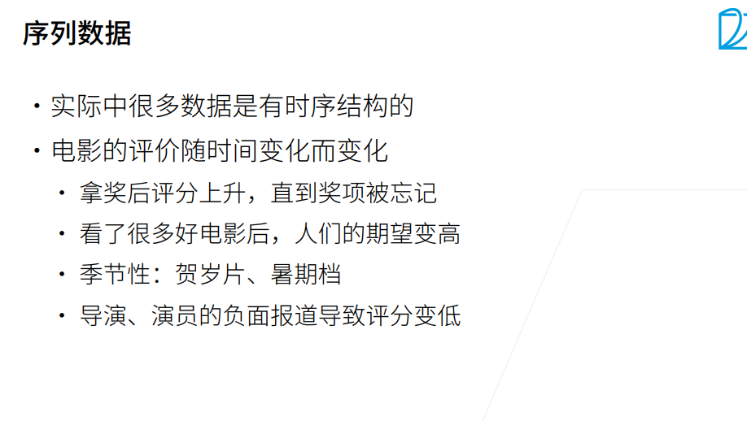
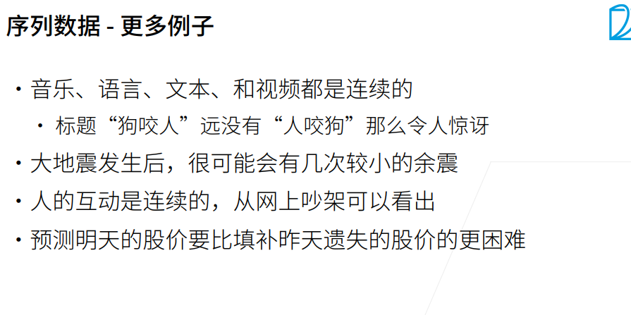
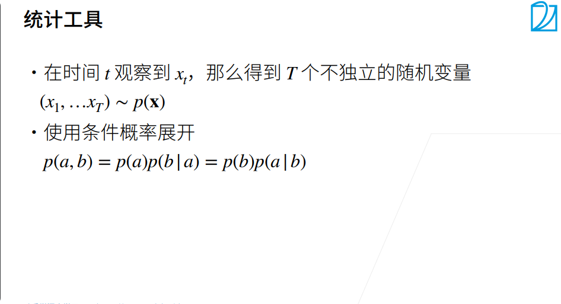
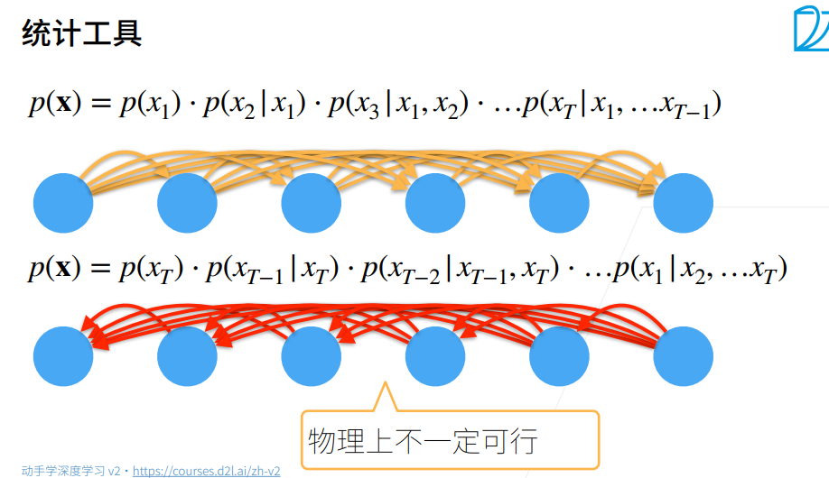
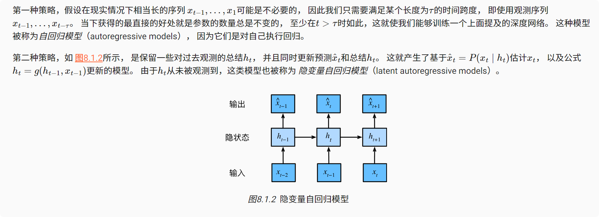
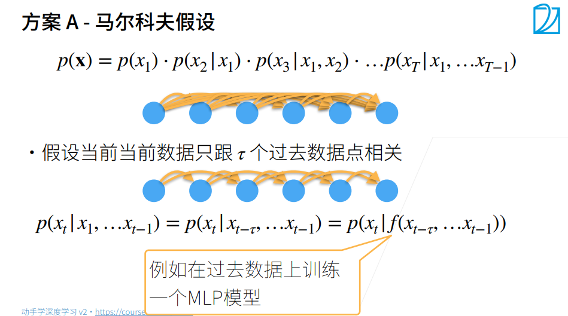
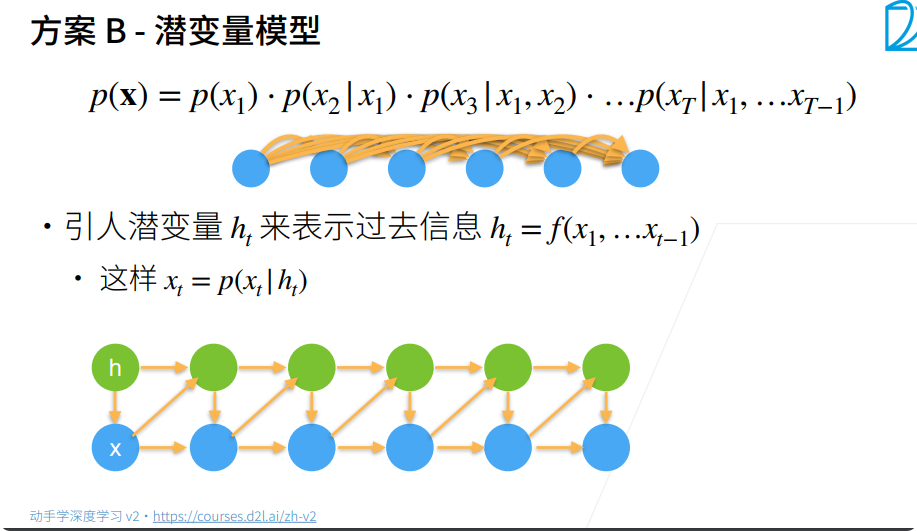

# 序列模型
输入或者输出中包含有序列数据的模型叫做序列模型。

* 语音识别： 输入输出都为序列。

* 音乐生成： 输出为序列。

* 情感分析：输入为序列。

* DNA序列分析：输入为序列。

* 机器翻译：输入输出都为序列。

* 视频行为识别：输入为序列。

* 命名实体识别：输入输出都为序列。
### 序列数据举例

### 统计工具

### 如何求p

### 小结
* 内插法（在现有观测值之间进行估计）和外推法（对超出已知观测范围进行预测）在实践的难度上差别很大。因此，对于你所拥有的序列数据，在训练时始终要尊重其时间顺序，即最好不要基于未来的数据进行训练。
* 序列模型的估计需要专门的统计工具，两种较流行的选择是自回归模型和隐变量自回归模型。
* 对于时间是向前推进的因果模型，正向估计通常比反向估计更容易。
* 对于直到时间步的观测序列，其在时间步的预测输出是“步预测”。随着我们对预测时间值的增加，会造成误差的快速累积和预测质量的极速下降。