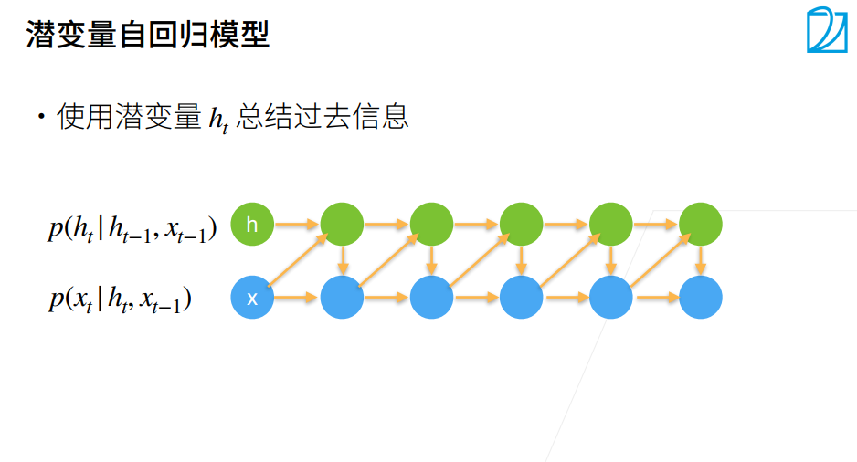
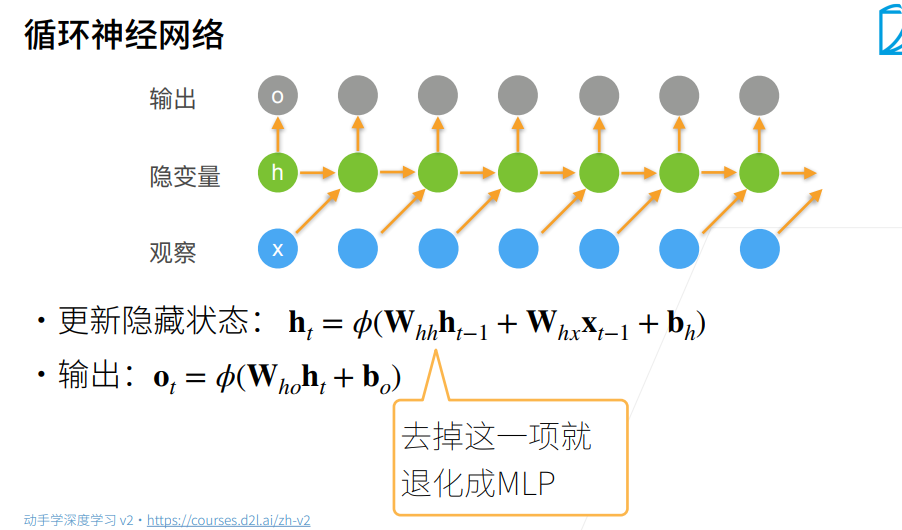
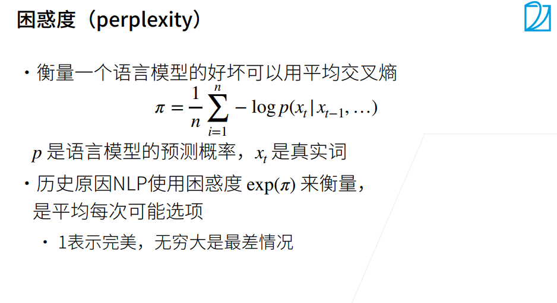
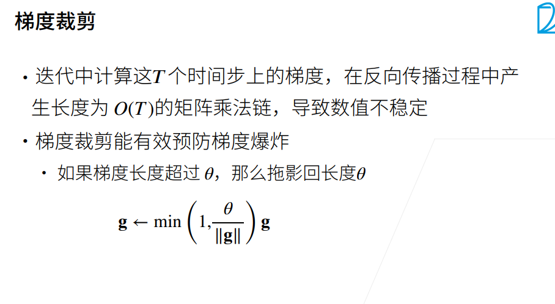
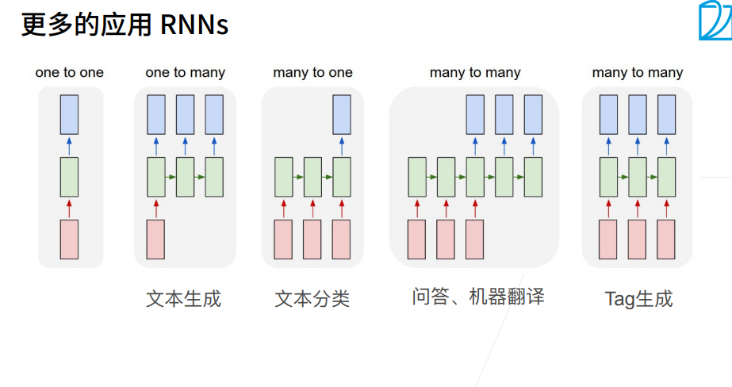

# 循环神经网络

输出发生在观察之前
预测输出

n次交叉熵的平均值

语言模型本质是分类模型 判断下一个词是词典中的类别

困惑度对平均交叉熵做个指数

### 小结
* 对隐状态使用循环计算的神经网络称为循环神经网络（RNN）。
* 循环神经网络的隐状态可以捕获直到当前时间步序列的历史信息。
* 循环神经网络模型的参数数量不会随着时间步的增加而增加。
* 我们可以使用循环神经网络创建字符级语言模型。
* 我们可以使用困惑度来评价语言模型的质量。
* RNN的输出取决于当下输入和前一时间的隐变量
* 应用到语言模型中，RNN根据当前词预测下一时刻词
* 通常使用困惑度来衡量语言模型的好坏