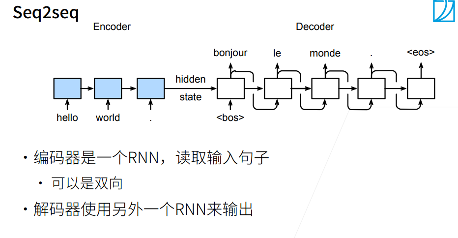
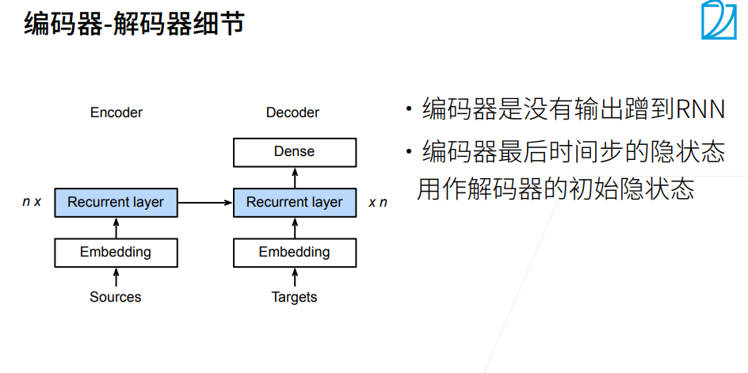
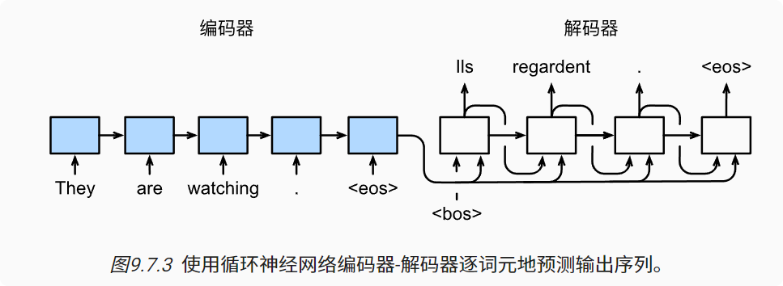
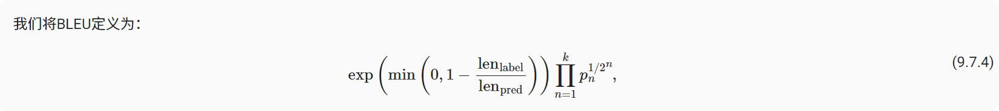

# 序列到序列学习（seq2seq）
 
循环神经网络编码器使用长度可变的序列作为输入， 将其转换为固定形状的隐状态。  
 为了连续生成输出序列的词元， 独立的循环神经网络解码器是基于输入序列的编码信息 和输出序列已经看见的或者生成的词元来预测下一个词元。

---

---

为了采用一个接着一个词元的方式预测输出序列， 每个解码器当前时间步的输入都将来自于前一时间步的预测词元。 与训练类似，序列开始词元（“<bos>”） 在初始时间步被输入到解码器中。 

### 预测序列的评估

BLEU（bilingual evaluation understudy） 最先是用于评估机器翻译的结果， 但现在它已经被广泛用于测量许多应用的输出序列的质量。 原则上说，对于预测序列中的任意n元语法（n-grams）， BLEU的评估都是这个n元语法是否出现在标签序列中。

### 小结
* 根据“编码器-解码器”架构的设计， 我们可以使用两个循环神经网络来设计一个序列到序列学习的模型。

* 在实现编码器和解码器时，我们可以使用多层循环神经网络。

* 我们可以使用遮蔽来过滤不相关的计算，例如在计算损失时。

* 在“编码器－解码器”训练中，强制教学方法将原始输出序列（而非预测结果）输入解码器。

* BLEU是一种常用的评估方法，它通过测量预测序列和标签序列之间的元语法的匹配度来评估预测。